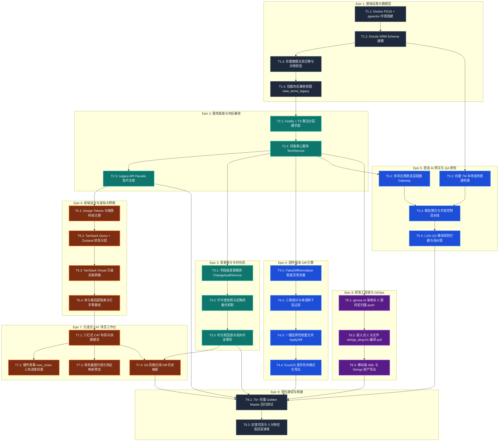
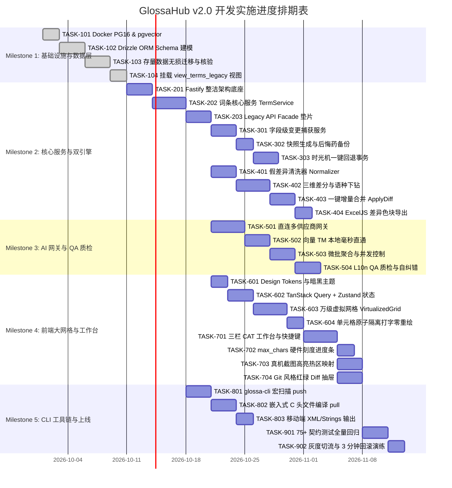

# GlossaHub 下一代平台 开发任务分解规格书 (Development Tasks Spec v2.0)

> **文档标识**：`GLOSSA-SPEC-DEV-TASKS-V2.0`  
> **文档版本**：v2.0 (Engineering Execution Release)  
> **编写日期**：2026-09-28  
> **归档路径**：`design/DEVELOPMENT_TASKS_SPECIFICATION.md`  
> **对齐文档**：
> - [产品需求规格说明书 (PRD v2.0)](./PRODUCT_REQUIREMENTS_DOCUMENT.md)
> - [系统技术规格说明书 (Tech Spec v2.0)](./TECHNICAL_SPECIFICATION.md)

---

## 1. 任务拆分总览与拓扑依赖 (Execution Overview & Topology)

根据 PRD 与 Tech Spec 的架构设计，系统划分为 **9 大核心 Epic、共 26 个细粒度子任务（Tasks）**。各任务按垂直切片（Vertical Slice）与依赖关系组织，支持部分模块并行交付。

---

## 2. 细粒度任务分解与开发规范 (Task Breakdown)

---

### Epic 1: 基础设施与数据持久化层 (Infrastructure & Database Persistence)

#### 【TASK-101】Docker PostgreSQL 16 与 pgvector 扩展环境搭建
*   **优先级**：`P0`（前置阻塞项）
*   **负责人**：后端/运维工程师
*   **依赖关系**：无
*   **目标与工作项**：
    1. 编写根目录 `docker-compose.yml`，采用官方 `pgvector/pgvector:pg16` 镜像；
    2. 配置数据持久化卷 `pgdata`，设置数据库名为 `glossa_hub`，默认端口 `5432`；
    3. 编写数据库初始化 SQL 脚本，容器启动时自动激活 `CREATE EXTENSION IF NOT EXISTS vector;` 与 `pg_trgm`；
    4. 编写本地数据库连接健康自检脚本 `server/scripts/check-db.ts`。
*   **产出文件**：
    - `docker-compose.yml`
    - `server/scripts/init-extensions.sql`
    - `server/scripts/check-db.ts`
*   **验收条件 (AC)**：
    - [ ] `docker compose up -d` 成功启动并在 3 秒内处于 Healthy 状态；
    - [ ] 执行 `psql -c "\dx"` 能看到 `vector` 与 `uuid-ossp` 扩展。

---

#### 【TASK-102】Drizzle ORM 数据模型与迁移机制构建
*   **优先级**：`P0`
*   **依赖关系**：TASK-101
*   **目标与工作项**：
    1. 初始化 Drizzle 配置 `drizzle.config.ts`，配置 PostgreSQL 驱动连接池；
    2. 严格按技术规格书构建 7 大核心表 Schema：
       - `projects`（项目空间表，支持硬件产品线隔离）
       - `versions`（固件版本表，含 `is_sealed` 封板锁）
       - `terms`（词条主表，含 `kw`, `zh_cn`, `max_chars`, `is_locked`, `sort_order`）
       - `term_translations`（细粒度语种翻译表，独立存储 `language_code`, `translation_text`, `source_type`）
       - `term_snapshots`（不可变快照表，存储全量镜像 JSON 与操作人）
       - `audit_change_logs`（细粒度字段级审计日志表，记录前后新旧值 Diff）
       - `translation_memories`（向量化 TM 库，含 1536 维 embedding 字段）
    3. 为 `(version_id, kw)`、`(term_id, language_code)`、`(project_id, version_name)` 建立唯一复合索引；
    4. 运行 `drizzle-kit generate:pg` 生成标准化初始迁移文件。
*   **产出文件**：
    - `server/drizzle.config.ts`
    - `server/src/common/database/schema/schema.ts`
    - `server/src/common/database/db.client.ts`
    - `server/drizzle/0000_initial_schema.sql`
*   **验收条件 (AC)**：
    - [ ] 执行 `npm run db:migrate` 成功在 PostgreSQL 中创建全部数据表与复合索引；
    - [ ] TypeScript 编译无类型报错，Schema 类型可正确推导（`$inferSelect` / `$inferInsert`）。

---

#### 【TASK-103】存量数据平滑迁移与对账校验脚本
*   **优先级**：`P0`
*   **依赖关系**：TASK-102
*   **目标与工作项**：
    1. 编写迁移 SQL 脚本 `migration_v1_to_v2.sql`；
    2. 使用 `LATERAL jsonb_each_text` 语法，将旧版 `terms.translations` 单列 JSON 字段安全拆解并写入 `term_translations` 行级子表；
    3. 处理空值、非法 JSON 格式兼容，将来源标记 `translations_meta` 映射至 `source_type`；
    4. 编写自动化对账核验 PL/pgSQL 过程，比对迁移前后词条总数与语种翻译条目数；
    5. 实现冲突保护（`ON CONFLICT (term_id, language_code) DO NOTHING`）。
*   **产出文件**：
    - `server/drizzle/migration_v1_to_v2.sql`
    - `server/scripts/verify-migration.ts`
*   **验收条件 (AC)**：
    - [ ] 在包含历史数据的数据库中运行迁移脚本，所有 translations JSON 均被拆解为子表行；
    - [ ] 对账脚本输出校验报告：`V1 原始词条数 == V2 主表词条数`，子表条目数与 JSON 键总数完全一致；
    - [ ] 重复运行脚本幂等，不报错、不产生重复脏数据。

---

#### 【TASK-104】向后兼容视图 `view_terms_legacy` 挂载
*   **优先级**：`P0`
*   **依赖关系**：TASK-103
*   **目标与工作项**：
    1. 在 PostgreSQL 中创建视图 `view_terms_legacy`；
    2. 利用 `jsonb_object_agg` 将 `term_translations` 的行级数据实时聚合为 `{"en": "...", "de": "..."}` 格式的 `translations` JSON 字段；
    3. 利用 `jsonb_object_agg` 将来源类型汇聚为 `translations_meta` JSON 字段；
    4. 针对 `term_translations` 表建立 `(term_id, language_code)` 组合查询索引，优化视图聚合性能。
*   **产出文件**：
    - `server/drizzle/views/view_terms_legacy.sql`
*   **验收条件 (AC)**：
    - [ ] 执行 `SELECT * FROM view_terms_legacy LIMIT 10`，其返回字段名称与数据结构与旧版 `terms` 表 100% 相同；
    - [ ] 10,000 条词条大表下查询视图聚合耗时 < 30ms。

---

### Epic 2: 服务底座与向后兼容垫片层 (Core Server & Legacy Facade)

#### 【TASK-201】Fastify 4.x + TypeScript 5.x 分层整洁架构脚手架
*   **优先级**：`P0`
*   **依赖关系**：TASK-102
*   **目标与工作项**：
    1. 搭建 Fastify 服务器实例，配置环境变量 Zod 校验（`PORT`, `DATABASE_URL`, `AI_API_KEYS` 等）；
    2. 注册标准中间件插件：`@fastify/cors`, `@fastify/helmet`, `@fastify/sensible`；
    3. 实现统一全局错误拦截器 `GlobalErrorHandler`，将领域异常统一映射为标准 HTTP 状态码与统一 JSON 错误结构；
    4. 挂载认证与操作人识别钩子 `auth.guard.ts`，从 Header / Token 提取操作人工号与姓名并注入 `FastifyRequest.user`；
    5. 实现进程监听信号与安全优雅停机（`SIGINT`/`SIGTERM` 时等待连接释放后关闭连接池）。
*   **产出文件**：
    - `server/src/app.ts`
    - `server/src/server.ts`
    - `server/src/config/env.config.ts`
    - `server/src/common/errors/error-handler.ts`
    - `server/src/common/guards/auth.guard.ts`
*   **验收条件 (AC)**：
    - [ ] 启动服务冷启动时间 < 80ms；
    - [ ] 请求未捕获异常返回统一结构 `{"statusCode": 500, "error": "...", "message": "..."}`；
    - [ ] 发送 `kill -SIGTERM`，日志输出连接池已安全释放，进程干净退出。

---

#### 【TASK-202】词条核心服务与领域用例实现 (TermService)
*   **优先级**：`P0`
*   **依赖关系**：TASK-201
*   **目标与工作项**：
    1. 编写 `TermRepository` 与 `TermService`；
    2. 实现词条单条增删改查、批量多语言同步与列表检索（支持按 KW 模糊、按语种有无翻译过滤）；
    3. 实现乐观锁与防修改保护：若词条 `is_locked=true` 或所属版本 `is_sealed=true`，拦截写入并抛出 `LockViolationError`；
    4. 支持词条批量拖拽排序更新（`sort_order` 批量重排）；
    5. 集成 TypeBox 请求体契约校验（`term.schema.ts`）。
*   **产出文件**：
    - `server/src/modules/term/term.schema.ts`
    - `server/src/modules/term/term.repository.ts`
    - `server/src/modules/term/term.service.ts`
    - `server/src/modules/term/term.controller.ts`
    - `server/src/modules/term/term.routes.ts`
*   **验收条件 (AC)**：
    - [ ] 针对词条增删改查编写完整单元测试，接口 P95 响应延迟 < 30ms；
    - [ ] 当对锁定词条执行修改时，返回 403 明确提示“词条已加锁，禁止修改”。

---

#### 【TASK-203】历史 API 兼容垫片层 (Legacy API Facade)
*   **优先级**：`P0`
*   **依赖关系**：TASK-202, TASK-104
*   **目标与工作项**：
    1. 在 `compat/` 模块注册历史路由：
       - `POST /api/tables/:tableId/sync`（历史前端与测试调用的批量同步接口）
       - `POST /api/sync-table`（兼容历史旧测试）
       - `GET /api/tables/:tableId/terms`（按旧 JSON 结构返回）
    2. 实现报文适配器：将旧请求中的 `added`, `updated`, `deletedIds` 转换为新版本领域调用；
    3. 保证返回的响应体与 HTTP 状态码与旧版 Express 逻辑 100% 保持幂等。
*   **产出文件**：
    - `server/src/compat/legacy-facade.ts`
    - `server/src/compat/legacy-adapter.ts`
*   **验收条件 (AC)**：
    - [ ] 使用历史接口请求数据，词条及其多语种成功拆解存入底层子表；
    - [ ] 返回的 JSON 包含历史预期的 `updatedRecords` 字段与成功文案。

---

### Epic 3: 全维度细粒度变更审计与时光机 (Audit Trail & Snapshots)

#### 【TASK-301】字段级变更精准捕获服务 (ChangeAuditService)
*   **优先级**：`P0`
*   **依赖关系**：TASK-202
*   **目标与工作项**：
    1. 编写变更捕获引擎，在词条主属性或任一语言翻译变更时计算差异：
       - 区分主属性变动（如中文原文、KW、`max_chars`）与单语种译文变动（如 `de`、`fr`）；
       - 严格记录 `old_value` 与 `new_value`；
    2. 支持 Myers 字符级 Diff 算法，计算字符增删片段；
    3. 写入 `audit_change_logs` 表，支持按版本、词条 KW、操作人、时间范围分页检索。
*   **产出文件**：
    - `server/src/modules/audit/audit.service.ts`
    - `server/src/modules/audit/audit.controller.ts`
    - `server/src/modules/audit/audit.routes.ts`
*   **验收条件 (AC)**：
    - [ ] 修改一次德语翻译，`audit_change_logs` 准确新增一条 `target_lang='de'`、记录变动前后的记录；
    - [ ] 批量修改 10 条词条时，单事务内生成对应的 10 条细粒度审计日志。

---

#### 【TASK-302】不可变快照生成与“后悔药”备份机制
*   **优先级**：`P0`
*   **依赖关系**：TASK-301
*   **目标与工作项**：
    1. 编写快照服务 `SnapshotService`，在每次词条变更事务中捕获词条当前全量镜像并存入 `term_snapshots`；
    2. 实现核心安全机制——**“后悔药备份”**：
       - 在执行任何回退（Rollback）操作前，强制读取回退前的“当前最新数据”，生成一条标记为 `reason='ROLLBACK_BACKUP'` 的快照；
    3. 确保快照数据在数据库层面只允许 `INSERT`，物理禁止 `UPDATE` 与 `DELETE`。
*   **产出文件**：
    - `server/src/modules/audit/snapshot.service.ts`
*   **验收条件 (AC)**：
    - [ ] 任何保存或批量翻译操作均会产生不可变快照；
    - [ ] 回退操作前自动生成一条 `ROLLBACK_BACKUP` 快照，确保支持二次撤销。

---

#### 【TASK-303】时光机一键回退事务与二次撤销
*   **优先级**：`P0`
*   **依赖关系**：TASK-302
*   **目标与工作项**：
    1. 提供时光机回退端点 `POST /api/audit/snapshots/:id/rollback`；
    2. 开启单个数据库事务，顺序执行：
       - 步骤 1：捕获后悔药快照；
       - 步骤 2：用历史快照中的原文及全部语言覆盖现有主表与子表；
       - 步骤 3：写入一条 `action='ROLLBACK'` 的审计记录；
    3. 支持时光机反向回退（将当前数据回退到后悔药快照，实现“撤销回退”）。
*   **产出文件**：
    - `server/src/modules/audit/rollback.service.ts`
    - `server/src/modules/audit/audit.routes.ts`
*   **验收条件 (AC)**：
    - [ ] 回退成功后，词条及其所有语言恢复为该快照时刻的状态；
    - [ ] 可立即从快照列表中选择刚刚生成的后悔药快照再次回退，数据 100% 无损复原。

---

### Epic 4: 固件版本对比 Diff 引擎 (Version Diff Engine)

#### 【TASK-401】假差异智能归一化清洗管道 (FalseDiffNormalizer)
*   **优先级**：`P0`
*   **依赖关系**：TASK-202
*   **目标与工作项**：
    1. 实现深度文本清洗管道：
       - 换行统一：`\r\n` 与 `\r` 转换为 `\n`；
       - 不可见字符剔除：过滤零宽空格 `\u200B`、`\uFEFF` 等；
       - 引号归一化：中文弯单/双引号 `“”‘’` 转换为半角直引号 `"'`；
       - 省略号归一化：`…` 转换为 `...`；
       - 标点归一化：全角冒号 `：`、逗号 `，`、分号 `；` 与半角对齐；
       - 空白字符清洗：修剪首尾空格，连续空格合并为单个半角空格；
    2. 编写独立的高性能工具类 `FalseDiffNormalizer.hasRealDiff(a, b)`。
*   **产出文件**：
    - `server/src/modules/diff/normalizer.ts`
    - `server/test/modules/diff/normalizer.test.ts`
*   **验收条件 (AC)**：
    - [ ] 对比 `"结束骑行： "` 与 `"结束骑行:"`，判定为无实质差异（`hasRealDiff === false`）；
    - [ ] 针对 10,000 对字符串的清洗比对测试耗时 < 15ms。

---

#### 【TASK-402】三维差分计算与多语种下钻过滤 (VersionDiffEngine)
*   **优先级**：`P0`
*   **依赖关系**：TASK-401
*   **目标与工作项**：
    1. 实现双版本三维差分核心算法：
       - **新增 (ADD)**：仅在源版本存在；
       - **删除 (DEL)**：仅在目标版本存在；
       - **修改 (MOD)**：同时存在但经清洗后存在实质差异；
       - **未改变 (UNCHANGED)**：清洗后完全相同；
    2. 细分到语言级别标记：计算每个指定语种的独立变动状态；
    3. 支持参数下钻过滤：`onlyLang=de`（仅返回德语发生变动的词条）或 `diffType=MOD`。
*   **产出文件**：
    - `server/src/modules/diff/diff.service.ts`
    - `server/src/modules/diff/diff.controller.ts`
    - `server/src/modules/diff/diff.routes.ts`
*   **验收条件 (AC)**：
    - [ ] 对比两个包含 2000 词条的固件版本，差分计算总耗时 < 80ms；
    - [ ] 筛选 `onlyLang=de` 时，准确排除德语未修改但其他语言修改的词条。

---

#### 【TASK-403】一键选择性增量合并同步 (Selective Apply Diff)
*   **优先级**：`P0`
*   **依赖关系**：TASK-402, TASK-302
*   **目标与工作项**：
    1. 实现增量合并端点 `POST /api/diff/apply`；
    2. 支持按选中的 `kw` 列表执行定向合并：
       - 若目标版本不存在该 KW，执行新增插入；
       - 若目标版本已存在，仅覆盖变更语言的翻译与元数据；
    3. 全程由数据库单一事务保障原子性；
    4. 自动为受影响的词条生成 `DIFF_APPLY` 快照与审计记录。
*   **产出文件**：
    - `server/src/modules/diff/apply-diff.service.ts`
*   **验收条件 (AC)**：
    - [ ] 勾选 5 条新增与 3 条修改词条执行合并，目标版本精准更新，其余词条不受影响；
    - [ ] 事务异常时自动回滚，目标版本数据零污染。

---

#### 【TASK-404】差异高亮持久化 Excel 导出管道
*   **优先级**：`P1`
*   **依赖关系**：TASK-402
*   **目标与工作项**：
    1. 集成 `exceljs` 库，实现流式 Excel 报表构建；
    2. 设置专业表头：标明比对版本、对比发起人与导出时间；
    3. 样式规则：
       - 新增词条整行填充淡绿底色（`#E8F5E9`）；
       - 删除词条整行填充淡红底色并添加中划线（`#FFEBEE`）；
       - 修改过的具体语言单元格填充淡黄底色（`#FFF9C4`）；
    4. 内存优化：支持 5000+ 词条大报表极速下载。
*   **产出文件**：
    - `server/src/modules/export/excel-diff-exporter.ts`
    - `server/src/modules/export/export.controller.ts`
*   **验收条件 (AC)**：
    - [ ] 导出的 `.xlsx` 文件用 Microsoft Excel / WPS 打开无格式损毁提示；
    - [ ] 视觉色块准确，新增、删除与修改标记清晰无误。

---

### Epic 5: 直连多供应商 AI 网关与 QA 质检 (AI Translation & QA Engine)

#### 【TASK-501】多供应商直连网关与故障熔断降级调度
*   **优先级**：`P0`
*   **依赖关系**：TASK-201
*   **目标与工作项**：
    1. 定义统一适配器接口 `ITranslationProvider`；
    2. 实现直连提供商：
       - `DeepSeekProvider`（主通道，模型 `deepseek-chat`，强制 JSON 格式）；
       - `ClaudeProvider`（高精度通道，模型 `claude-3-5-sonnet-20241022`）；
       - `OpenAiProvider`（保底极速通道，模型 `gpt-4o-mini`）；
       - `OllamaProvider`（私有化内网通道，模型 `qwen2.5:72b`）；
    3. 实现智能调度与熔断器：单次请求超时阈值 3500ms，失败或超限自动无缝降级至下一优先级通道。
*   **产出文件**：
    - `server/src/modules/ai-gateway/providers/provider.interface.ts`
    - `server/src/modules/ai-gateway/providers/deepseek.provider.ts`
    - `server/src/modules/ai-gateway/providers/claude.provider.ts`
    - `server/src/modules/ai-gateway/providers/openai.provider.ts`
    - `server/src/modules/ai-gateway/gateway.service.ts`
*   **验收条件 (AC)**：
    - [ ] 直连 DeepSeek 单次翻译 P95 耗时 < 400ms；
    - [ ] Mock DeepSeek 模拟 500 报错时，网关在 100ms 内自动切换至 Claude 成功返回。

---

#### 【TASK-502】向量化 TM 翻译记忆库本地毫秒直通检索
*   **优先级**：`P1`
*   **依赖关系**：TASK-102
*   **目标与工作项**：
    1. 实现基于 `pgvector` 的向量记忆检索；
    2. 词条翻译请求前置拦截：
       - **100% 精确文本匹配**：直接返回本地记忆库译文，耗时 < 20ms，标记 `source_type='tm'`，API 消耗为 0；
       - **语义模糊匹配（相似度 > 90%）**：将高置信度译文作为 Few-Shot 样本注入 Prompt 上下文；
    3. 提供词库更新机制：人工审校封板词条自动同步至 `translation_memories`。
*   **产出文件**：
    - `server/src/modules/ai-gateway/tm/tm-vector.service.ts`
*   **验收条件 (AC)**：
    - [ ] 精确命中已存在的词条时，接口在 20ms 内直接返回，不消耗任何外部大模型 Token。

---

#### 【TASK-503】微批聚合 (Micro-Batching) 与并发控制调度器
*   **优先级**：`P0`
*   **依赖关系**：TASK-501
*   **目标与工作项**：
    1. 实现微批聚合缓冲区：将 100ms 窗口期内发起的批量翻译聚合成单个结构化 Prompt 批量发送；
    2. 集成 `p-limit`，设置并发滑动窗口阈值为 8，跑满带宽同时防止触发上游 HTTP 429 速率限制；
    3. 实现分批流式入库，前置完成的批次立即落库并通知前端进度。
*   **产出文件**：
    - `server/src/modules/ai-gateway/batch/micro-batcher.ts`
    - `server/src/modules/ai-gateway/batch/concurrency-pool.ts`
*   **验收条件 (AC)**：
    - [ ] 勾选 50 条词条批量翻译，整体执行耗时从原先 3 分钟降至 4 秒内完成。

---

#### 【TASK-504】自动化 L10n QA 质检拦截与自纠错引擎 (Self-Correction)
*   **优先级**：`P0`
*   **依赖关系**：TASK-501
*   **目标与工作项**：
    1. 编写静态质检扫描器 `L10nQaEngine`：
       - 占位符严密性比对（`%s`, `%d`, `%02d`, `%1$s`, `{0}`, `{name}` 等）；
       - 硬件屏幕物理字长上限（`max_chars`）；
       - 成对符号校验（中英文引号、括号等）；
       - 空译文检测；
    2. 实现自纠错重试（Self-Correction）：若大模型输出存在质检违规，自动组织带惩罚提示的轻量纠错请求二次微调，确保最终入库质量。
*   **产出文件**：
    - `server/src/modules/ai-gateway/qa-engine/l10n-qa.engine.ts`
    - `server/src/modules/ai-gateway/qa-engine/self-correction.ts`
*   **验收条件 (AC)**：
    - [ ] 构造缺失 `%s` 或超出字长上限的测试用例，QA 引擎 100% 准确拦截；
    - [ ] 触发纠错机制后，模型能在二次交互中自动缩短词长并补齐占位符。

---

### Epic 6: 前端设计系统与虚拟大网格 (Design System & Virtual Grid)

#### 【TASK-601】现代化 Design System Tokens 与深邃暗黑主题构建
*   **优先级**：`P1`
*   **依赖关系**：无
*   **目标与工作项**：
    1. 搭建 Tailwind CSS 现代设计变量体系；
    2. 主题底色：Dark Canvas（`#020617` / `#0f172a`），Light Canvas（`#f8fafc` / `#ffffff`）；
    3. 品牌强调色：迈金橙（`#f97316`）与极光青（`#06b6d4`）；
    4. 字体规则：界面文字采用 Inter / PingFang SC，KW 键名采用 JetBrains Mono 等宽字体；
    5. 实现高斯模糊玻璃质感与微交互过渡曲线。
*   **产出文件**：
    - `client/src/styles/design-tokens.css`
    - `client/tailwind.config.js`
*   **验收条件 (AC)**：
    - [ ] 支持暗黑/明亮主题一键无缝切换，界面质感具备高级 IDE 风格。

---

#### 【TASK-602】前端状态管理架构 (TanStack Query + Zustand)
*   **优先级**：`P0`
*   **依赖关系**：TASK-202, TASK-601
*   **目标与工作项**：
    1. 配置 TanStack Query v5，管理词条列表、版本列表、审计历史与 Diff 结果的服务端缓存；
    2. 配置基于 Mutation 的精准缓存失效（`invalidateQueries`）；
    3. 搭建 Zustand 局部原子 Store，管理 CAT 工作台状态、当前选中词条、字符统计与快捷键状态。
*   **产出文件**：
    - `client/src/stores/query-client.ts`
    - `client/src/stores/cat-studio.store.ts`
    - `client/src/stores/grid-selection.store.ts`
*   **验收条件 (AC)**：
    - [ ] 修改单条词条翻译后，自动静默更新前端缓存，无整页重拉白屏。

---

#### 【TASK-603】万级数据量零卡顿虚拟网格 (TanStack Virtual)
*   **优先级**：`P0`
*   **依赖关系**：TASK-602
*   **目标与工作项**：
    1. 集成 `@tanstack/react-virtual` 构建虚拟滚动容器；
    2. 支持固定列粘性布局（前置固定选择框、KW 键名、中文原文，右侧横向平滑滚动）；
    3. 视口外缓冲行设为 10 行（`overscan: 10`），万级词条 DOM 节点维持在 30 个以内；
    4. 支持单元格来源标记徽章（`ai`, `tm`, `human` 状态图标）。
*   **产出文件**：
    - `client/src/components/grid/VirtualizedTermGrid.tsx`
    - `client/src/components/grid/TermRowItem.tsx`
    - `client/src/components/grid/TermCell.tsx`
*   **验收条件 (AC)**：
    - [ ] 载入 10,000 条词条数据，快速上下滚动帧率稳定在 58~60 FPS，无丢帧白块。

---

#### 【TASK-604】单元格局部原子状态隔离与打字零重绘
*   **优先级**：`P0`
*   **依赖关系**：TASK-603
*   **目标与工作项**：
    1. 在 `TermCell` 中封装内部独立 `useState`，高频键盘输入仅触发当前单元格重绘；
    2. 配置 1.5 秒防抖（Debounce）同步至上层 Zustand Store 与后端持久化接口；
    3. 使用 `React.memo` 阻断非活跃行及其他 20+ 语种单元格的无效重渲染。
*   **产出文件**：
    - `client/src/components/grid/TermCell.tsx`
*   **验收条件 (AC)**：
    - [ ] 使用 React Profiler 录制高频打字输入，仅当前活跃 Cell 发生重渲染，其余所有行渲染耗时为 0ms，打字延迟 < 8ms。

---

### Epic 7: 沉浸式 CAT 译员工作台与硬件上下文 (CAT Studio & In-Context)

#### 【TASK-701】三栏式 CAT 工作台布局与流式快捷键体系
*   **优先级**：`P0`
*   **依赖关系**：TASK-604
*   **目标与工作项**：
    1. 构建三栏科学布局：
       - **左栏**：词条导航与快速过滤（待办/包含QA告警）；
       - **中栏**：原文、译文输入、字长刻度与真机截图；
       - **右栏**：Glossary 术语、TM 推荐、AI 候选与最近变更流；
    2. 注册全键盘快捷键：
       - `Ctrl + Enter`：保存当前翻译、触发 QA 扫描、自动跳转下一条未完成；
       - `Alt + 1` / `Alt + 2`：采纳候选翻译；
       - `Alt + H`：就地滑出审计历史抽屉；
       - `Alt + D`：快速查看版本对比。
*   **产出文件**：
    - `client/src/pages/CatStudioPage.tsx`
    - `client/src/components/cat/CatEditorMain.tsx`
    - `client/src/components/cat/CatSidebarLeft.tsx`
    - `client/src/components/cat/CatSidebarRight.tsx`
*   **验收条件 (AC)**：
    - [ ] 译员使用纯键盘完成词条翻译、快捷键采纳建议与下一条切换，操作连贯无卡顿。

---

#### 【TASK-702】硬件屏幕 `max_chars` 动态三色刻度指示器
*   **优先级**：`P0`
*   **依赖关系**：TASK-701
*   **目标与工作项**：
    1. 输入框右下方动态计算字符数：`当前 / 上限`；
    2. 动态刻度条视觉反馈：
       - $\le 70\%$：绿色安全；
       - $70\% \sim 95\%$：黄色警告；
       - $> 100\%$：红色告警边框闪烁，弹出物理截断警告。
*   **产出文件**：
    - `client/src/components/cat/HardwareConstraintBar.tsx`
*   **验收条件 (AC)**：
    - [ ] 超过预设最大字符数时，边框变红并提示 `已超出屏幕设计上限`。

---

#### 【TASK-703】真机截图与高亮热区映射组件 (In-Context Preview)
*   **优先级**：`P1`
*   **依赖关系**：TASK-701
*   **目标与工作项**：
    1. 实现码表真机界面图片预览画布，支持滚轮缩放与平移拖拽；
    2. 根据词条坐标元数据 `(x, y, width, height)` 在真机截图上绘制呼吸光晕矩形高亮框；
    3. 点击高亮框自动聚焦中栏对应的词条输入。
*   **产出文件**：
    - `client/src/components/cat/VisualContextViewer.tsx`
*   **验收条件 (AC)**：
    - [ ] 真机截图准确显示高亮标注选区，译员可直观知晓文案在码表屏幕的具体方位。

---

#### 【TASK-704】Git 风格红绿 Diff 抽屉与统一模态窗 GlossaModal v2
*   **优先级**：`P0`
*   **依赖关系**：TASK-301, TASK-701
*   **目标与工作项**：
    1. 构建右侧滑出的历史审计抽屉，左侧红色删除线、右侧绿色新增高亮显示变动详情；
    2. 封装 `GlossaModal` 组件，严格遵循 WAI-ARIA：焦点捕获陷阱（Focus Trap）、禁止背景滚动（Body Scroll Lock）与长事务禁用退出。
*   **产出文件**：
    - `client/src/components/common/GlossaModal.tsx`
    - `client/src/components/audit/AuditHistoryDrawer.tsx`
*   **验收条件 (AC)**：
    - [ ] 弹窗打开时焦点锁死在弹窗内部，`Tab` 键循环不穿透，按 ESC 正常关闭（长事务时锁定）。

---

### Epic 8: 研发工程闭环与 `glossa-cli` 命令行 (Developer Tooling & GitOps)

#### 【TASK-801】`glossa-cli` 架构构建与 C 源码宏静态扫描 (`glossa push`)
*   **优先级**：`P0`
*   **依赖关系**：TASK-202
*   **目标与工作项**：
    1. 基于 Node.js Commander 构建 CLI 脚手架 `glossa`；
    2. 实现 `glossa push` 命令：
       - 正则/AST 静态分析 C 源码文件目录（如 `./src/ui/`）；
       - 识别 `KW_[A-Z0-9_]+` 宏定义与其关联的中文注释；
       - 调用后端 API，将本地新增的 KW 增量提交至云端对应版本的词库中。
*   **产出文件**：
    - `cli/bin/glossa.ts`
    - `cli/src/commands/push.ts`
    - `cli/src/scanners/c-macro-scanner.ts`
*   **验收条件 (AC)**：
    - [ ] 在示例 C 代码目录下执行 `glossa push`，成功识别全部宏并增量录入云端，不产生重复词条。

---

#### 【TASK-802】嵌入式 C 语言代码自动编译生成 (`glossa pull --format=c-header`)
*   **优先级**：`P0`
*   **依赖关系**：TASK-801
*   **目标与工作项**：
    1. 实现 `glossa pull` 编译导出逻辑；
    2. 从云端拉取已封板的词条数据，格式化编译输出：
       - `strings_lang.h`：语言枚举 `firmware_lang_t`、键名枚举 `string_kw_id_t`、二维查找表声明；
       - `strings_lang.c`：二维静态常量查找表，自动转义特殊字符；
    3. 支持写入指定目录（如 `./src/generated/`）。
*   **产出文件**：
    - `cli/src/commands/pull.ts`
    - `cli/src/generators/c-header-generator.ts`
*   **验收条件 (AC)**：
    - [ ] 导出的 `strings_lang.h` 和 `strings_lang.c` 使用 GCC / Clang / ARM-GCC 编译零 Warning 零 Error。

---

#### 【TASK-803】移动端多语言资产编译输出 (Android XML & iOS Strings)
*   **优先级**：`P1`
*   **依赖关系**：TASK-802
*   **目标与工作项**：
    1. 支持 `--format=android-xml`：生成标准 `values-*/strings.xml`（自动转义单双引号与特殊符号）；
    2. 支持 `--format=ios-strings`：生成标准 `*.lproj/Localizable.strings`；
    3. 支持 CI/CD 自动化集成。
*   **产出文件**：
    - `cli/src/generators/android-generator.ts`
    - `cli/src/generators/ios-generator.ts`
*   **验收条件 (AC)**：
    - [ ] 导出的 XML 和 strings 文件可直接被 Android Studio 和 Xcode 工程识别编译。

---

### Epic 9: 自动化契约测试网与上线割接 (Testing & Cutover)

#### 【TASK-901】75+ 存量 Golden Master 回归契约测试网
*   **优先级**：`P0`
*   **依赖关系**：TASK-203, TASK-303, TASK-404, TASK-504
*   **目标与工作项**：
    1. 配置自动化契约测试套件，执行现有全部 75+ 基于 `supertest` 的测试；
    2. 覆盖范围：`auth.test`, `terms.test`, `sync.test`, `difyGlossary.test`, `security-and-admin.test`；
    3. 修复兼容垫片中的细微边界差异，确保全量绿色通过。
*   **产出文件**：
    - `server/test/golden-master-regression.test.ts`
*   **验收条件 (AC)**：
    - [ ] 运行 `npm test`，75+ 自动化用例 100% 绿色通过。

---

#### 【TASK-902】灰度切流演练与 3 分钟应急回滚预案验证
*   **优先级**：`P0`
*   **依赖关系**：TASK-901
*   **目标与工作项**：
    1. 配置灰度切流路由规则（10% 影子流量验证 $\rightarrow$ 单个项目试运行 $\rightarrow$ 全量切流）；
    2. 编写应急回滚演练 Runbook，验证 Vercel 环境变量切换回旧单体 Express 后的业务行为；
    3. 验证在发生回滚时，老系统通过 `view_terms_legacy` 视图读取数据的完整性，确认零数据丢失。
*   **产出文件**：
    - `server/docs/RUNBOOK_ROLLBACK_DRILL.md`
*   **验收条件 (AC)**：
    - [ ] 演练从触发回滚到完全切回老服务并在老系统读写数据，全流程在 3 分钟内完成，数据零损坏。

---

## 3. 开发排期、里程碑与工时估算 (Milestone Schedule)

### 里程碑摘要表

| 里程碑编号 | 里程碑阶段 | 任务区间 | 预期周期 | 交付物清单 |
| :---: | :--- | :--- | :---: | :--- |
| **M1** | 基础设施与数据无损平移 | TASK-101 ~ 104 | 10 天 | Docker Compose 环境、Drizzle Schema、数据迁移脚本与 `view_terms_legacy` 兼容视图 |
| **M2** | 核心服务、审计与版本 Diff | TASK-201 ~ 404 | 21 天 | Fastify 脚手架、TermService、API 兼容垫片、审计时光机、假差异清洗器与 Excel 差异导出 |
| **M3** | 直连 AI 网关与 QA 质检中枢 | TASK-501 ~ 504 | 13 天 | 多供应商直连适配器（DeepSeek/Claude）、向量 TM 直通、微批聚合与 L10n QA 拦截网 |
| **M4** | 前端虚拟网格与 CAT 工作台 | TASK-601 ~ 704 | 18 天 | 60FPS 虚拟大网格、打字原子隔离、三栏沉浸式 CAT 工作台、真机截图预览与红绿 Diff 抽屉 |
| **M5** | 研发 CLI 工具链与切流上线 | TASK-801 ~ 902 | 11 天 | `glossa-cli` 命令行、嵌入式 C 头文件编译器、75+ 契约测试回归绿网与 3 分钟应急回滚预案 |
