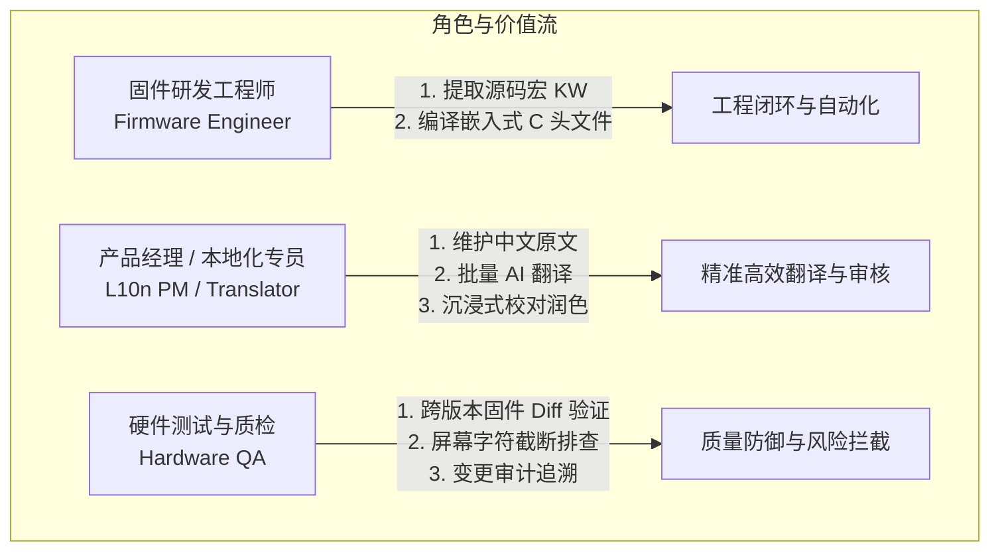
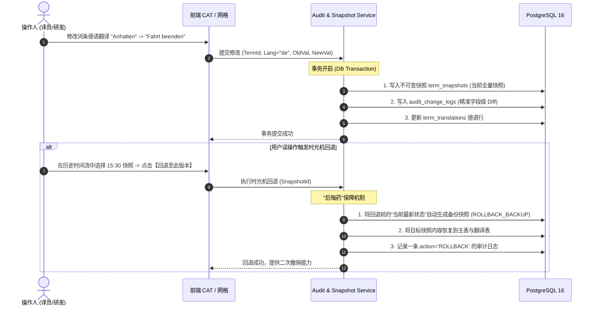
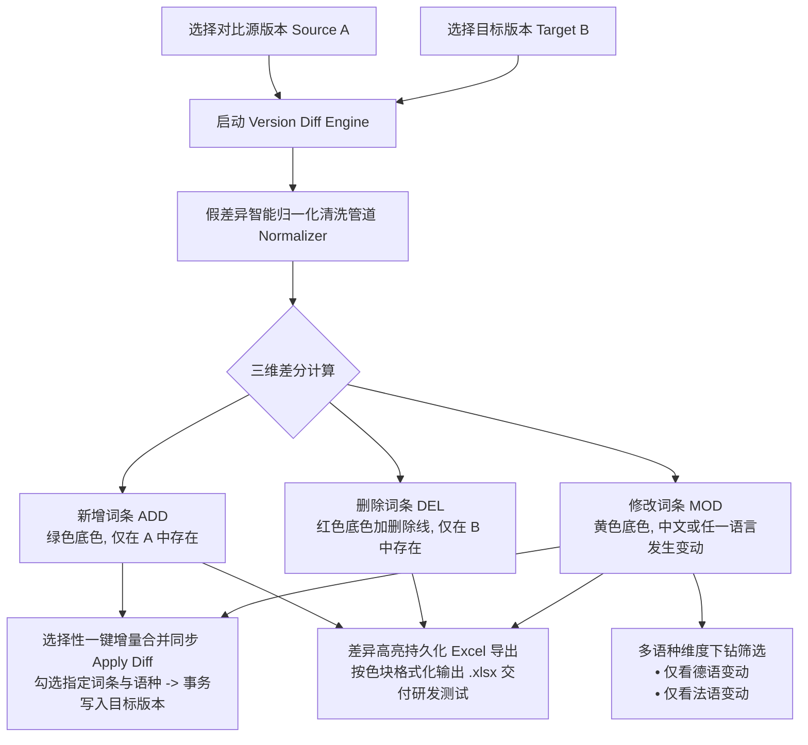
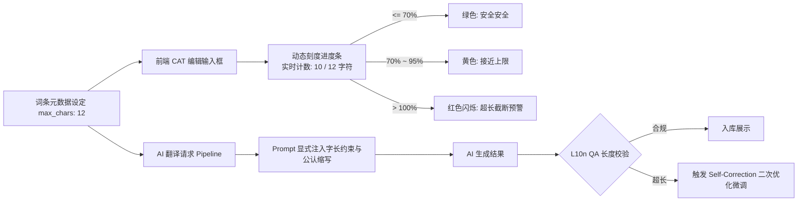
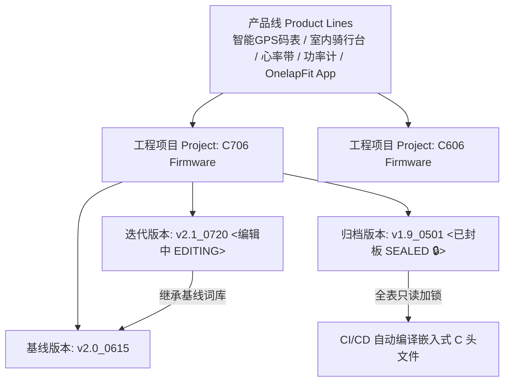
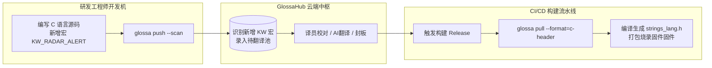
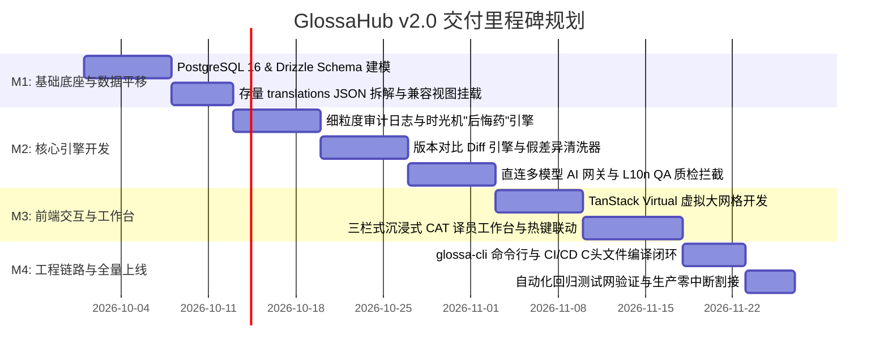

# GlossaHub 下一代多语言协同与固件词条平台 产品需求规格说明书 (PRD v2.0)

> **文档标识**：`GLOSSA-DESIGN-PRD-V2.0`  
> **文档版本**：v2.0 (Production Release)  
> **编写日期**：2026-09-28  
> **归档目录**：`design/PRODUCT_REQUIREMENTS_DOCUMENT.md`  
> **适用业务**：迈金科技（Magene）全线智能硬件（智能 GPS 码表 C706/C606、室内骑行台、心率带、功率计）及移动端（OnelapFit App）全球多语言资产协同  

---

## 1. 项目背景与战略愿景 (Executive Summary & Vision)

### 1.1 业务背景
迈金科技（Magene）作为全球领先的智能骑行与运动科技品牌，其硬件设备（智能码表、室内骑行台、心率监测设备、功率计）以及移动端应用（OnelapFit）畅销全球 50+ 个国家与地区，覆盖多达 16 种国际语言（中简、中繁、英、德、法、西、意、俄、日、韩、荷、波、芬、瑞典、葡、丹麦等）。

固件（Firmware）词条不同于普通 Web/App 翻译，具有以下极具挑战性的物理约束：
1. **嵌入式硬件屏幕物理空间受限**：码表屏幕分辨率与单行显示区域严格固定，字符超长必然导致固件显示截断、重叠甚至系统异常崩溃；
2. **格式与占位符极其脆弱**：单片机 C 语言渲染大量依赖 `%s`、`%d`、`%02d` 等格式化占位符，若翻译缺失或被大模型篡改，极易造成硬件死机（HardFault）；
3. **版本迭代高频且基线严格**：一个型号（如 C706）会经历几十次小版本迭代，跨版本升级时最关键的工作就是精确识别“这次改了哪句话”。

### 1.2 战略减负原则：摒弃伪需求，聚焦生命线
通过对历史 v1.0~v1.2 平台的深度复盘与一线研发/译员反馈，新平台确立了**“全面减负，增效破局”**的核心指导思想：

| 历史设计缺陷 (v1.x) | 实际业务现状 | v2.0 战略重构决策 |
| :--- | :--- | :--- |
| **繁重的多级审核流** (`DRAFT` $\rightarrow$ `PENDING` $\rightarrow$ `APPROVED` $\rightarrow$ `REJECTED`) | 硬件协同迭代极快，审核流在实际运行中从未真正生效，反而导致词条录入流程严重堵塞。 | **彻底取消审核工作流**。词条仅保留直观的“未翻译 / 已翻译”、“是否封板加锁”，大幅缩短交付链路。 |
| **层层设卡的 RBAC 五级权限体系** | 迈金研发、产品与翻译属于企业内部高互信团队，权限拦截阻碍协同，管理员需频繁处理越权申请。 | **取消 RBAC 权限体系**。统一采用“信任协作模式”（全员协作者），重点转向**全量细粒度变更追溯**。 |
| **模糊的操作记录** | 变更记录笼统（如仅记录“某人更新了词条”），无法知晓改了哪种语言，回退无安全感。 | **建立全维度细粒度变更记录与时光机**：精准记录到“单条单语言前后对比”，并提供带“后悔药”机制的一键回退。 |
| **粗糙的版本比对** | 缺乏跨版本深层次比对，被全半角标点、空格、引号等假差异严重干扰，研发排查极低效。 | **构建专业版本对比 Diff 引擎**：假差异清洗归一化，支持单语种下钻过滤，支持一键选择性合并与 Excel 差异导出。 |
| **Dify 翻译通道瓶颈** | 协议中转延迟高达 5~10 秒，高并发批量翻译频繁超时崩盘，私有化部署运维极其沉重。 | **完全脱离 Dify，自建多供应商直连网关**：直连 DeepSeek-V3、Claude 3.5 等顶尖模型，向量 TM 本地毫秒直通，三级加速。 |
| **大表打字卡顿** | 万级词条大表无虚拟化渲染，在输入框打字触发整表重渲染，掉帧严重。 | **引入 60FPS 虚拟化网格与沉浸式 CAT 工作台**：TanStack Virtual 视口复用，行级局部响应，配合真机截图热区映射。 |

---

## 2. 目标用户画像与核心用例 (User Personas & Use Cases)



### 2.1 固件研发工程师 (Firmware Engineer - 李工)
*   **痛点**：每次码表发版都要手动在前端导出 CSV，自己写 Python 脚本转成 C 语言数组，容易漏掉键名或产生乱码；新版本上线后不清楚产品修改了哪些词条。
*   **期望**：
    1. 提供 CLI 命令行工具（`glossa push`），自动扫描 C 源码中的 `KW_*` 宏并同步到云端；
    2. 发版时一键拉取并自动生成 `strings_lang.h` 和 `strings_lang.c` 嵌入式代码（`glossa pull`）；
    3. 清晰对比两个固件版本之间的词条增删改差异，一键同步。

### 2.2 本地化专员 / 翻译人员 (L10n Specialist / Translator - Sarah)
*   **痛点**：缺乏骑行码表实际操作上下文，不知道词条位于什么页面；大表打字卡顿；AI 翻译偶发丢掉 `%s` 占位符或翻译过长，在真机上爆框。
*   **期望**：
    1. 拥有专注高效的 CAT 译员工作台，能查看真机界面截图和高亮热区；
    2. 输入框实时显示物理字符上限进度条（如 `10/12`），超出立即黄色/红色警示；
    3. AI 翻译毫秒级响应，自动保证 `%s` 占位符不丢失，优先匹配已有词库（TM）。

### 2.3 硬件测试工程师 (QA Tester - 王工)
*   **痛点**：回归测试时不知道新固件相比上一版本改动了哪些文案，测试覆盖不全；发现翻译文案被改坏了，查不出是谁在何时改的，也无法快速恢复。
*   **期望**：
    1. 快速导出两个版本之间的 Diff 差异 Excel（新增绿底、修改黄底）；
    2. 针对任意词条，清晰查看完整的修改历史时间流（精确到是谁改的哪门语言）；
    3. 支持一键撤销回滚至任一历史版本，且具备“后悔药”二次恢复机制。

---

## 3. 核心功能规格说明 (Functional Requirements)

### 3.1 核心聚焦一：全维度细粒度变更记录与时光机 (Audit Trail & Snapshots)

系统坚决摒弃“只记录操作了某词条”的粗放记录，所有数据变动必须下沉至**“单字段、单语种级别”**，并提供全链路可逆的时光机机制。



#### 3.1.1 字段级变更捕获规范 (Fine-Grained Capture)
*   **格式要求**：`[CST 年-月-日 时:分:秒] 操作人: 姓名/工号`
    *   **词条元数据修改**：明确提示变更字段（如：修改了 `[KW_STOP_RIDE]` 的“中文基准文案”，从 `"结束"` 变更为 `"结束骑行"`）；
    *   **单语种翻译修改**：明确提示语种代码（如：修改了 `[KW_STOP_RIDE]` 的 `[德语(DE)]`，从 `"Anhalten"` 变更为 `"Fahrt beenden"`）；
    *   **批量翻译操作**：`通过 AI 批量翻译更新了 [KW_STOP_RIDE] 等 24 条词条的 [法语(FR)、西班牙语(ES)]`；
    *   **批量合并操作**：`从版本 [v2.0] 合并应用了 12 条词条变动至当前版本`。
*   **记录属性完整性**：
    *   `version_id`：所属固件版本；
    *   `term_id` / `kw`：词条 ID 与键名；
    *   `target_lang`：受影响语种代码（针对主表元数据可为空）；
    *   `action`：`CREATE` | `MODIFY` | `AI_TRANSLATE` | `ROLLBACK` | `DIFF_APPLY`；
    *   `old_value` / `new_value`：变动前后的明文内容；
    *   `operator`：操作人（姓名或系统标识）；
    *   `created_at`：统一东八区带时区时间戳。

#### 3.1.2 Git 风格双列红绿 Diff 对比
在操作审计大盘与词条详情历史抽屉中，提供直观的文本对比组件：
*   **左列（修改前 Old Value）**：红色浅底背景（`bg-rose-500/15`），红字高亮标记被删除或替换的字符；
*   **右列（修改后 New Value）**：绿色浅底背景（`bg-emerald-500/15`），绿字高亮标记新增的字符；
*   **字符级差异算法**：采用 Myers 差异算法在字符级别做精准高亮（非仅整行标记），对空格与标点变动提供明显的视觉符号提示；
*   **多维检索与过滤**：支持按“操作人”、“所属固件大表”、“具体 KW 键名”、“变动语种”、“时间范围”快速筛选。

#### 3.1.3 具备“后悔药”机制的一键时光机 (Time Machine Rollback)
1.  **快照生成触发时机**：词条的任意手工保存、AI 批量翻译、版本继承、版本间 Diff 合并等写操作，均在同一数据库事务中自动将词条及其全部多语种状态完整镜像写入 `term_snapshots`；
2.  **安全回退操作**：用户在历史时间轴中选择任一历史节点，点击【回退至此版本】；
3.  **核心安全保障（后悔药机制）**：
    *   系统在将历史数据覆盖写入当前主表之前，**强制将“当前的最新数据”自动备份生成一条 `reason='ROLLBACK_BACKUP'` 的崭新快照**；
    *   写入一条 `action='ROLLBACK'` 的审计记录；
    *   若用户事后发现回退错误，可立即在时光机中找到刚刚生成的备份快照，再次一键恢复。实现**双向绝对安全、永不丢失**。

---

### 3.2 核心聚焦二：专业固件版本对比 Diff 引擎 (Version Diff Engine)

针对骑行码表固件迭代的核心场景（如 `v2.0` 升级至 `v2.1`），本地化与研发团队必须掌握版本间的“绝对净变化”。



#### 3.2.1 假差异智能归一化清洗管道 (False Diff Normalizer)
对比引擎内置深度文本清洗管道，自动过滤排版噪音，杜绝“改了全角冒号”、“末尾多了个空格”导致整条词条被标记为修改：
1.  **空格与换行清洗**：
    *   自动修剪（Trim）字符串首尾所有可见与不可见空格；
    *   自动合并句中连续多空格为一个标准半角空格；
    *   统一将 Windows 换行（`\r\n`）与 Mac 旧换行（`\r`）归一化为 Linux 标准换行（`\n`）；
2.  **标点与引号等价映射**：
    *   中文弯双引号 `“` `”` 与英文直双引号 `"` 视为等价；
    *   中文弯单引号 `‘` `’` 与英文直单引号 `'` 视为等价；
    *   Unicode 省略号 `…` 与连续三点 `...` 视为等价；
    *   全角冒号 `：`、逗号 `，`、分号 `；` 与半角标点映射为同一比较基准；
3.  **不可见脏字符过滤**：
    *   自动过滤零宽空格（`\u200B`）、零宽无断行空格（`\uFEFF`）及不可见制表符。

#### 3.2.2 三维差分与多维度下钻 (3D Diff & Language Drilldown)
*   **新增 (ADD)**：在新版本 A 中存在、但在老版本 B 中不存在的全新词条（展示为绿色背景与 `ADD` 徽标）；
*   **删除 (DEL)**：在老版本 B 中存在、但在新版本 A 中已被移除的废弃词条（展示为淡红背景、中划线与 `DEL` 徽标）；
*   **修改 (MOD)**：
    *   **中文原文变动**：明确提示功能文案本身的调整；
    *   **特定语种变动**：词条其余 15 门语言均无变动，仅德语或法语发生调整；
    *   **语种级下钻筛选器**：支持在对比大盘顶部切换【变动语种过滤器】，例如点击“仅看德语变动”，系统秒级过滤出所有德语存在实质修改的词条集合，极大减轻海外译员校对负担。

#### 3.2.3 一键选择性增量合并同步 (Selective Apply Diff)
在版本比对界面，用户可任意多选词条（如“勾选 5 条新增词条与 3 条德语修改词条”），点击**【应用变更到目标版本】**：
*   **事务级原子写入**：系统在单个数据库事务中将选中的增量变更写入目标版本表；
*   **自动追溯记录**：自动生成操作类型为 `DIFF_APPLY` 的全量审计记录与不可变快照；
*   **无需重复搬运**：彻底告别“先导出 Excel，再人肉比对，再导入合并”的低效人肉流程。

#### 3.2.4 差异高亮持久化 Excel 导出
支持将比对大盘数据一键导出为原生 `.xlsx` 文档：
*   **表头元数据**：清晰标明比对的两个版本名称、对比发起人与导出时间戳；
*   **整行/单元格视觉格式化**：
    *   新增词条整行填充淡绿底色（`#E8F5E9`）；
    *   删除词条整行填充淡红底色并带删除线（`#FFEBEE`）；
    *   修改过的具体语言单元格单独填充淡黄底色（`#FFF9C4`）；
*   **开箱即用**：研发与硬件测试工程师无需任何第三方脚本即可直观排查改动。

---

### 3.3 核心聚焦三：硬件屏幕物理尺寸约束体系 (Hardware Physical Constraint Engine)

嵌入式骑行码表屏幕显示是硬件研发的核心敏感点。德语、法语等欧洲语言平均词长比中文高出 200%~300%，极易造成截断。



#### 3.3.1 物理约束元数据定义
*   `max_chars`：该词条允许的最大物理字符数（如主屏数据栏限制 12 字符，退出弹窗标题限制 20 字符）；
*   `owner_component`：词条所属的硬件屏幕组件（如 `TitleBar_18px`、`DataGrid_Large_32px`、`Toast_14px`）；
*   `context`：所在功能模块与页面路径（如 `骑行设置 -> 传感器配对 -> 雷达尾灯`）。

#### 3.3.2 交互层多级预警系统
在前端虚拟大网格及 CAT 译员工作台中：
*   **动态刻度条**：在输入框右下方实时渲染字数统计与微型刻度条：`10 / 12`；
*   **颜色分级反馈**：
    *   $\le 70\%$：绿色安全（`text-emerald-400`）；
    *   $70\% \sim 95\%$：黄色警告（`text-amber-400`）；
    *   $> 100\%$：红色告警（`text-rose-400 border-rose-500 animate-pulse`），并弹出提示：`⚠️ 已超出屏幕设计上限 2 字符，存在固件截断风险！`。

#### 3.3.3 AI 智能翻译约束注入与自动缩写
*   **Prompt 强制注入**：调用大模型时，若检测到 `max_chars`，强制将字长约束写入系统指令：
    > *"Target text MUST NOT exceed {max_chars} characters. If the natural translation is too long, use industry-standard cycling abbreviations (e.g., 'Heart Rate' -> 'HR', 'Calibration' -> 'Calibr.', 'Cadence' -> 'CAD')."*
*   **二次纠错闭环 (Self-Correction Loop)**：大模型返回译文后，若仍然超出 `max_chars`，网关自动在后台发起一次带惩罚项的微调重试，确保最终入库文本 100% 符合屏幕物理规范。

---

### 3.4 核心聚焦四：多供应商直连 AI 翻译与多模态 QA (Translation & QA Engine)

彻底终结 Dify 带来的协议延迟、超时崩溃与运维成本，建立自主可控的 **Multi-Provider AI Gateway**。

#### 3.4.1 多供应商模型矩阵分工

| 模型与通道 | 核心优势 | 业务分工 | 响应延迟 | 建议优先级 |
| :--- | :--- | :--- | :--- | :--- |
| **DeepSeek-V3 / R1 (直连)** | 极高性价比（仅 GPT-4o 的 1/30）；中文理解极深；国内直连网络稳、延迟极低。 | 绝大多数日常固件词条批量翻译、KW 宏键名自动推断。 | < 400ms | **⭐⭐⭐⭐⭐ 主通道 (Default)** |
| **Anthropic Claude 3.5 Sonnet** | 业界公认多语言翻译标杆；格式遵循极强；欧洲小语种（荷兰语、芬兰语等）语法无瑕疵。 | 复杂句式、长篇帮助说明文案、旗舰款码表封板最终审校。 | < 800ms | **⭐⭐⭐⭐ 高精度通道 (High Precision)** |
| **OpenAI GPT-4o-mini** | 响应极致，并发支持极高（>500 QPS）。 | 单词条实时输入打字联想、海量短语秒级补全。 | < 250ms | **⭐⭐⭐⭐ 备用通道 (Fallback)** |
| **本地私有 Qwen2.5-72B (Ollama)** | 完全运行在企业内网，无需公网，数据绝对保密；零 API 费用。 | 军工级保密硬件、断网开发与完全私有化环境。 | 取决于算力 | **⭐⭐⭐ 私有化通道 (On-Premise)** |

#### 3.4.2 极速三级加速流水线 (3-Tier Acceleration Pipeline)
为实现“从原先 10 秒等待降低至 300ms 极速响应”，构建三级加速推进引擎：
1.  **第一级：向量化 TM 记忆库本地毫秒直通 (Local TM Cache)**：
    *   利用 PostgreSQL 16 内置 `pgvector` 扩展，毫秒级比对历史数万条标准词库；
    *   **100% 精确匹配**：直接调取库内标准译文，响应延迟 **<20ms**，API 调用成本为 **0**，标记为 `source_type='tm'`；
2.  **第二级：微批聚合调度机制 (Micro-Batching Aggregation)**：
    *   严禁单条单请求发送！当用户在界面勾选 50 条词条批量翻译时，网关在 100ms 窗口期内自动聚合成单个 Batch 报文发送给模型；
    *   将 50 次外部 HTTP 往返骤降为 1 次，批量翻译整体耗时从 3 分钟缩短至 **4 秒以内**；
3.  **第三级：并发控制与动态熔断 (Concurrency & Circuit Breaker)**：
    *   内置滑动窗口并发工作池（基于 `p-limit`，默认并发度 8），充分跑满上游 API，坚决不触发 HTTP 429 速率限制；
    *   主通道 DeepSeek 若遇网络抖动超过 3 秒或抛出 5xx，熔断器在 **100ms 内自动平滑无缝降级**至 Claude 3.5 或 GPT-4o-mini，译员无感知。

#### 3.4.3 自动化 L10n QA 质检拦截网 (Automated QA Rules)
译文入库前，必须强制通过静态代码规则扫描，杜绝低级错误流入单片机：
*   **占位符绝对一致性**：自动提取原文与译文中的所有占位符（如 `%s`, `%d`, `%02d`, `%1$s`, `{0}`, `{name}`），数量与顺序必须完全一致，缺失或篡改直接硬性拦截；
*   **硬件屏幕字长上限**：超出 `max_chars` 抛出超长告警；
*   **配对符号检查**：英文双引号、中英文括号 `()` `（）`、中括号 `[]` 必须成对出现；
*   **空译文拦截**：杜绝 AI 返回空字符串或无意义的问答废话（如 "Here is the translation:"）。

---

### 3.5 核心聚焦五：前端设计系统与沉浸式 CAT 译员工作台 (UI/UX & CAT Studio)

遵照“设计水准要保持并升华”的原则，打造媲美 Linear / Figma 的专业高科技协作空间。

```
+----------------------------------------------------------------------------------------------------+
|  [ 🌐 GlossaHub CAT Studio ]   项目: C706 固件   版本: v2.1   目标语种: [ DE (德语) ▼ ]   [ 退出工作台 ]  |
+----------------------+-----------------------------------------------+-----------------------------+
|  【左栏: 词条导航】  |  【中栏: 核心翻译与真机上下文 (In-Context)】    |  【右栏: 智能决策与变更追溯】|
|                      |                                               |                             |
|  🔍 搜索 KW / 原文...  |  词条键名: KW_STOP_RIDE                       |  📚 专业术语库推荐 (Glossary)|
|  ------------------  |  所属页面: 骑行主界面 -> 退出确认弹窗          |  • "骑行" -> "Fahrt" (强制)  |
|  [全部(120)] [待办(14)]|  所属字号: 中号加粗 (16px)                    |  • "结束" -> "Beenden"      |
|                      |  -------------------------------------------  |  -------------------------  |
|  1. [已翻] KW_START  |  中文基准原文 (zh-CN):                         |  🧠 翻译记忆库匹配 (TM)      |
|  >2.[未翻] KW_STOP   |  结束骑行，是否保存记录？                     |  [100% 精确匹配]:           |
|  3. [锁定] KW_PAUSE  |                                               |  "Fahrt beenden und auf-    |
|  4. [已翻] KW_CALIB  |  -------------------------------------------  |  zeichnen?" (一键引用)      |
|  5. [未翻] KW_CADENCE|  目标德语译文输入 (DE):                        |  -------------------------  |
|                      |  +-----------------------------------------+  |  🤖 多模型智能建议 (AI)     |
|                      |  | Fahrt beenden, Aufzeichnung speichern?  |  |  • 候选 1 (DeepSeek): ...   |
|                      |  +-----------------------------------------+  |  • 候选 2 (Claude): ...     |
|                      |  物理字符限制: [ 37 / 40 字符 ] 🟩 安全       |  -------------------------  |
|                      |                                               |  🕒 最近变更追溯 (Audit)    |
|                      |  🖼️ 码表界面真机空间预览 (Visual Context):     |  • 李工 09-27 15:30 录入原词|
|                      |  +-----------------------------------------+  |  • AI 09-28 09:10 预翻译    |
|                      |  | [真机实拍/Figma 设计图]                  |  |  -------------------------  |
|                      |  |  +-----------------------------------+  |  |                             |
|                      |  |  | [ 高亮框选区: (X:120, Y:180)     |  |  |  [ 保存并进入下一条 (Ctrl+↵)]|
|                      |  |  |   "Fahrt beenden..."             |  |  |  [ 查看完整变更历史 (Alt+H) ]|
|                      |  |  +-----------------------------------+  |  |  [ 查看版本对比 Diff (Alt+D)]|
|                      |  +-----------------------------------------+  |                             |
+----------------------+-----------------------------------------------+-----------------------------+
```

#### 3.5.1 万级词条 60FPS 虚拟化网格 (TanStack Virtual)
*   **视口按需渲染**：通过 `@tanstack/react-virtual` 监听容器滚动，哪怕包含 10,000+ 条词条、横向 16 门语言，DOM 树上仅保留可视区域内的 25~30 行元素，滚动帧率稳定在 58~60 FPS；
*   **固定列粘性布局 (Sticky Columns)**：左侧前置固定锁定状态、KW 键名（JetBrains Mono 等宽字体）、中文基准文案（`zh_cn`），右侧平滑横向滚动，右侧阴影过渡提示更多语种；
*   **打字零卡顿 (Local Cell Isolation)**：输入框打字由单元格局部状态接管，1.5 秒防抖同步至全局 Zustand Store，彻底阻断其他 20+ 行的组件重渲染，实现极致跟手。

#### 3.5.2 沉浸式 CAT 译员工作台 (Translator Studio)
*   **三栏式科学布局**：
    *   **左栏**：词条状态列表（带“全部”、“未翻译待办”、“包含 QA 告警”标签切换快速过滤）；
    *   **中栏**：当前词条编辑核心区（基准原文、目标语译文输入、字符进度指示器）以及**真机屏幕截图与高亮热区联动区**；
    *   **右栏**：决策辅助（Glossary 强制术语词表、TM 100% 精准匹配项、AI 多模型候选建议、字段级最近变更记录）；
*   **极速快捷键体系**：
    *   `Ctrl + Enter`：保存当前翻译，自动触发 QA 扫描，自动跳转到下一条未完成词条；
    *   `Alt + 1` / `Alt + 2`：一键采纳右侧 TM 匹配项或 AI 候选译文；
    *   `Alt + H`：就地滑出该词条的完整历史时间轴与红绿 Diff 抽屉；
    *   `Alt + D`：快速查看该词条在基准版本中的差异变化。

#### 3.5.3 统一模态窗规范 GlossaModal v2
系统所有弹窗（时光机回退确认、版本比对配置、Excel 导出、真机截图上传）严格遵循 W3C WAI-ARIA 规范：
*   **焦点捕获陷阱 (Focus Trap)**：弹窗打开时焦点锁定在弹窗内，`Tab` 键循环不穿透；
*   **背景滚动锁定 (Body Scroll Lock)**：弹窗唤起时自动给页面注入防滚动锁定，避免滚轮穿透滚动大表格；
*   **长事务保护**：批量导入或 AI 批量翻译时，启用 `closeDisabled`，阻止 ESC 退出或点击遮罩导致的非预期中断。

---

### 3.6 核心聚焦六：多项目空间与固件版本生命周期 (Workspaces & Versions)



*   **物理级项目空间隔离**：按硬件产品线和具体硬件型号进行完全物理隔离，独立配置目标语种池（Target Languages）、专业术语库（Glossary）与记忆库（TM）；
*   **版本生命周期两阶段**：
    1.  `EDITING`（编辑中）：允许词条新增、修改、删除、AI 批量翻译与版本继承；
    2.  `SEALED`（已封板）：由负责人确认封板后，全表只读加锁不可变更，作为固定软件基线镜像，供 CI/CD 流水线拉取编译。

---

### 3.7 核心聚焦七：研发工程闭环与 `glossa-cli` 命令行工具链

将翻译平台能力向左延伸到研发 IDE 与 Git 代码仓库，向右延伸至嵌入式固件编译构建。



#### 3.7.1 核心命令集规范
1.  **宏定义自动提取并增量推送 (`glossa push`)**：
    *   命令：`glossa push --project=c706-firmware --version=v2.1 --scan-dir=./src/ui/ --pattern="KW_[A-Z0-9_]+"`
    *   行为：静态扫描 C 源码，提取新增的 `KW` 键名，自动与云端对比并增量追加，无需人工录入；
2.  **嵌入式 C 语言代码拉取并编译 (`glossa pull`)**：
    *   命令：`glossa pull --project=c706-firmware --version=v2.1 --format=c-header --output=./src/generated/`
    *   行为：拉取已翻译且封板的词条，自动编译生成嵌入式 C 语言头文件 `strings_lang.h` 与实现文件 `strings_lang.c`，直接参与单片机编译；
3.  **多端移动资产导出**：
    *   `--format=android-xml`：自动生成 Android `strings.xml`；
    *   `--format=ios-strings`：自动生成 iOS `Localizable.strings`。

---

## 4. 非功能性需求与工业级指标 (Non-Functional Requirements)

| 指标维度 | 历史基线 (v1.x) | 下一代目标 (v2.0) | 验证方案 |
| :--- | :--- | :--- | :--- |
| **核心 API 延迟 (P95)** | > 250ms | **< 50ms** (单条查询) / **< 120ms** (批量检索) | k6 高并发压测脚本监测 |
| **冷启动时间** | 2.5 秒 | **< 80ms** | 容器快速弹性伸缩基准测试 |
| **单条 AI 翻译耗时** | 6 ~ 10 秒 (Dify) | **< 400ms** (DeepSeek直连) / **< 20ms** (TM命中) | 真实公网 API 响应遥测 |
| **批量翻译吞吐 (50条)** | 频繁超时报 504 (需 3 分钟) | **< 4 秒** (微批聚合单次往返) | 批量翻译压力测试 |
| **前端大表滚动帧率** | 15 ~ 25 FPS (掉帧卡顿) | **58 ~ 60 FPS** (TanStack Virtual 虚拟滚动) | Chrome DevTools Performance 录制 |
| **打字输入延迟** | 120ms (整表重渲染) | **< 8ms** (本地原子状态隔离) | 键盘高频输入基准排查 |
| **系统可用性 (SLA)** | 99.0% | **99.9%** (多模型直连毫秒级熔断降级) | 生产监控告警与故障演练 |
| **向后兼容性** | 不兼容 | **100% 兼容** (通过 API 垫片兼容历史 75+ 项契约测试) | 自动化回归测试网全绿 |

---

## 5. 项目交付计划与里程碑 (Release Milestones)



*   **M1（底座与平移，12天）**：完成 PG16 容器化、细粒度数据表构建、旧数据无损迁移与兼容视图挂载；
*   **M2（核心双引擎与直连网关，21天）**：完成审计时光机、版本 Diff 引擎、多模型直连网关与自动化 QA 规则引擎；
*   **M3（前端设计与 CAT 工作台，15天）**：完成万级词条虚拟滚动大网格、深邃暗黑设计系统与沉浸式译员工作台；
*   **M4（CLI 工具与生产割接，9天）**：交付 `glossa-cli` 命令行工具，完成 75+ 项自动化测试验证与生产零停机平滑割接。
