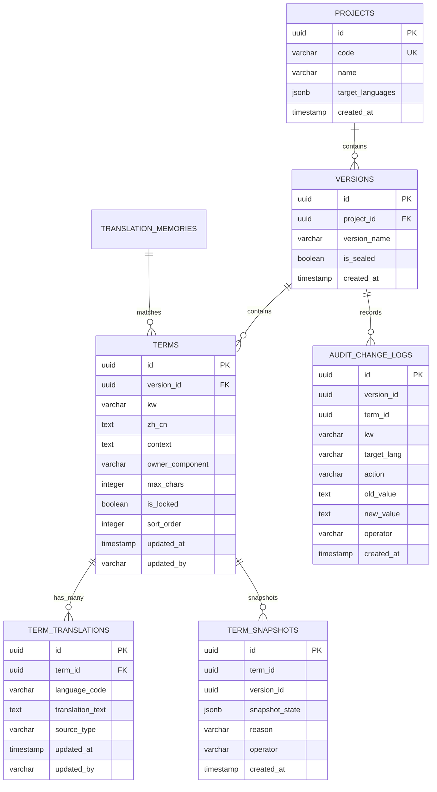
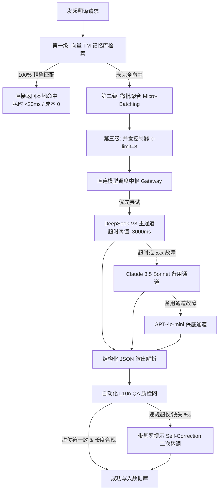

# GlossaHub 下一代多语言协同与固件词条平台 技术规格说明书 (Tech Spec v2.0)

> **文档标识**：`GLOSSA-DESIGN-TECH-V2.0`  
> **文档版本**：v2.0 (Engineering Architecture Release)  
> **编写日期**：2026-09-28  
> **归档目录**：`design/TECHNICAL_SPECIFICATION.md`  
> **系统基准**：Fastify 4.x + TypeScript 5.x + PostgreSQL 16 (pgvector) + Drizzle ORM + TanStack Suite + Zustand  

---

## 1. 系统架构总览与技术栈设计 (System Architecture)

### 1.1 核心架构目标与指标
下一代 GlossaHub 后端系统旨在彻底终结原有 `terms.cjs`（1822 行巨石文件）中“SQL 拼接、业务逻辑、Diff 计算与报表绘制高度耦合”的现状，达成以下核心工程指标：
*   **高吞吐与极速响应**：核心 API P95 响应延迟低于 **50ms**（批量查询低于 120ms），接口吞吐达到原 Express 单体的 **3.5 倍以上**；
*   **极致轻量冷启动**：由原先 2.5 秒压缩至 **< 80ms**，完美适应 Serverless 与轻量容器的快速拉起；
*   **全栈端到端强类型安全 (End-to-End Type Safety)**：基于 TypeScript 5.x + Zod / TypeBox，实现从数据库 Schema 到 API 请求校验、再到前端 SDK 的全链路编译期静态类型推导；
*   **整洁架构领域分层 (Clean Architecture)**：将词条管理、版本 Diff、变更快照时光机与直连 AI 网关彻底解耦；
*   **100% 向后兼容垫片 (Backward Compatibility Shim)**：挂载 API Facade 垫片，确保历史前端页面与 75+ 现有自动化契约测试无需任何修改即可正常通过。

### 1.2 技术选型全景矩阵

| 架构层次 | 历史技术栈 (Legacy v1.x) | 下一代技术栈 (Modern v2.0) | 核心选型考量与技术收益 |
| :--- | :--- | :--- | :--- |
| **运行时与语言** | Node.js 18 (CommonJS) | **Node.js 20+ LTS + TypeScript 5.x (ESM)** | 现代 ESM 模块化体系，编译期类型检查，杜绝运行时未定义变量。 |
| **Web 核心框架** | Express.js 4.x | **Fastify 4.x** | 基于 `fast-json-stringify` 编译优化，吞吐提升 3~4 倍；生命周期钩子规范清晰。 |
| **数据持久层** | SQLite / Postgres 手写裸 SQL | **PostgreSQL 16 + Drizzle ORM** | 统一生产与本地数据库方言；Drizzle 提供无反射极速查询构建与原生类型推导。 |
| **向量计算引擎** | 无 (纯文本模糊匹配) | **PostgreSQL pgvector 扩展** | 词库与 TM 记忆库毫秒级向量相似度匹配，无需外置独立向量数据库。 |
| **前端状态体系** | `useState` + 顶层重绘 | **TanStack Query v5 + Zustand** | 服务端数据缓存与精确失效；前端组件级原子状态下沉，打字整表零重绘。 |
| **虚拟网格渲染** | 原生 `<table>` 分页 | **TanStack Virtual (`@tanstack/react-virtual`)** | 万级行数仅渲染视口 25~30 个 DOM，保持 60FPS 丝滑滚动与固定列布局。 |
| **AI 翻译中枢** | Dify 单一工作流 HTTP 代理 | **自研多供应商直连网关 (DeepSeek/Claude/GPT)** | 剔除 Dify 中转开销，网络延迟降低 80%，内置微批聚合与自动化 QA 拦截自纠错。 |
| **研发工具链** | 网页手动导出 CSV / 手写脚本 | **`glossa-cli` 命令行 + GitOps** | 源码宏提取、固件嵌入式 C 头文件（`strings_lang.h`/`.c`）自动编译生成。 |

### 1.3 模块化整洁微单体拓扑 (Modular Clean Monolith)

```
+----------------------------------------------------------------------------------------------------+
|                                    GLOSSA-HUB 架构分层拓扑                                           |
+----------------------------------------------------------------------------------------------------+
|  1. 表现层 (Presentation / HTTP Layer)                                                              |
|     • Fastify Controller / Route Handlers                                                          |
|     • Schema Validation (TypeBox / Zod 运行时请求校验)                                               |
|     • Auth & Operator Context (提取当前操作人工号/姓名并注入上下文)                                   |
|     • [Legacy API Facade] (无损拦截并转写 /api/tables/:id/sync 等历史旧接口)                           |
+----------------------------------------------------------------------------------------------------+
|  2. 应用层 (Application / Use Cases Layer)                                                          |
|     • TermManagementService (词条增删改查、排序、行锁、乐观并发控制)                                   |
|     • DiffComparisonService (双版本 Diff 差分、假差异智能清洗、一键增量合并)                           |
|     • ChangeAuditService (细粒度字段级变动捕获、不可变快照生成、"后悔药"时光机回滚)                     |
|     • AiTranslationService (直连 AI 网关调度、三级加速流水线、熔断降级与自动化 QA)                      |
|     • ExportPipelineService (ExcelJS 高性能差异高亮报表、RFC-4180 CSV 导出)                         |
+----------------------------------------------------------------------------------------------------+
|  3. 领域层 (Core Domain Layer)                                                                     |
|     • 领域实体与值对象 (Term, TermTranslation, Version, Project, KwIdentifier)                      |
|     • 核心领域服务 (FalseDiffNormalizer 假差异清洗器, L10nQaRuleEngine 质检拦截引擎)                  |
|     • 领域异常体系 (ConcurrencyConflictError, CharacterOverflowError, LockViolationError)            |
+----------------------------------------------------------------------------------------------------+
|  4. 基础设施层 (Infrastructure Layer)                                                               |
|     • Drizzle ORM Repository (PostgreSQL 16 连接池与事务控制)                                       |
|     • Multi-Provider AI Gateway (直连 DeepSeek-V3, Claude 3.5, GPT-4o-mini, Ollama 适配器)         |
|     • Vector Memory Store (pgvector 相似度检索)                                                     |
|     • Snapshot Storage Engine (不可变快照存储与恢复)                                                |
+----------------------------------------------------------------------------------------------------+
```

---

## 2. 数据库设计与建模规范 (Database Schema & Migration)

统一采用 **PostgreSQL 16 + Drizzle ORM**。彻底废弃历史版本中将所有多语种翻译塞入单列 `translations JSON` 的反模式，重构为高度规范化的父子行级结构。



### 2.1 核心数据表 Drizzle ORM 定义

```typescript
// server/src/common/database/schema/schema.ts
import { pgTable, uuid, varchar, text, boolean, integer, timestamp, jsonb, index, uniqueIndex } from 'drizzle-orm/pg-core';
import { customType } from 'drizzle-orm/pg-core';

// pgvector 1536 维向量类型扩展
const vector = customType<{ data: number[] }>({
  dataType() {
    return 'vector(1536)';
  },
});

// 1. 项目空间表 (Projects) - 支撑不同硬件产品线物理隔离
export const projects = pgTable('projects', {
  id: uuid('id').defaultRandom().primaryKey(),
  code: varchar('code', { length: 64 }).notNull().unique(), // 例如: 'c706-firmware', 'onelapfit-app'
  name: varchar('name', { length: 128 }).notNull(),
  description: text('description'),
  targetLanguages: jsonb('target_languages').notNull().default(['en', 'de', 'fr', 'es', 'it', 'ja', 'ko']),
  createdAt: timestamp('created_at', { withTimezone: true }).defaultNow().notNull()
});

// 2. 固件版本表 (Versions)
export const versions = pgTable('versions', {
  id: uuid('id').defaultRandom().primaryKey(),
  projectId: uuid('project_id').references(() => projects.id, { onDelete: 'cascade' }).notNull(),
  versionName: varchar('version_name', { length: 128 }).notNull(), // 例如: 'v2.1_0720'
  isSealed: boolean('is_sealed').default(false).notNull(), // 封板加锁只读标记
  createdAt: timestamp('created_at', { withTimezone: true }).defaultNow().notNull()
}, (table) => ({
  idxProjectVersion: uniqueIndex('idx_project_version').on(table.projectId, table.versionName)
}));

// 3. 词条核心主表 (Terms)
export const terms = pgTable('terms', {
  id: uuid('id').defaultRandom().primaryKey(),
  versionId: uuid('version_id').references(() => versions.id, { onDelete: 'cascade' }).notNull(),
  kw: varchar('kw', { length: 256 }).notNull(), // 键名宏: KW_STOP_RIDE
  zhCn: text('zh_cn').notNull(), // 中文基准原文
  context: text('context').default(''), // 所在页面/模块
  ownerComponent: varchar('owner_component', { length: 128 }).default(''), // 硬件屏幕组件/字号
  maxChars: integer('max_chars').default(0), // 硬件物理屏幕最大字符上限 (0 表示不设防)
  isLocked: boolean('is_locked').default(false).notNull(), // 单条防修改锁
  sortOrder: integer('sort_order').default(0).notNull(),
  updatedAt: timestamp('updated_at', { withTimezone: true }).defaultNow().notNull(),
  updatedBy: varchar('updated_by', { length: 64 }).notNull() // 操作人姓名/工号
}, (table) => ({
  idxVersionKw: uniqueIndex('idx_version_kw').on(table.versionId, table.kw),
  idxVersionSort: index('idx_version_sort').on(table.versionId, table.sortOrder)
}));

// 4. 单语种细粒度翻译表 (Term Translations)
export const termTranslations = pgTable('term_translations', {
  id: uuid('id').defaultRandom().primaryKey(),
  termId: uuid('term_id').references(() => terms.id, { onDelete: 'cascade' }).notNull(),
  languageCode: varchar('language_code', { length: 32 }).notNull(), // 'en', 'de', 'fr'
  translationText: text('translation_text').default('').notNull(),
  sourceType: varchar('source_type', { length: 16 }).default('human').notNull(), // 'human' | 'ai' | 'tm'
  updatedAt: timestamp('updated_at', { withTimezone: true }).defaultNow().notNull(),
  updatedBy: varchar('updated_by', { length: 64 }).notNull()
}, (table) => ({
  idxTermLang: uniqueIndex('idx_term_lang').on(table.termId, table.languageCode),
  idxLangText: index('idx_lang_text').on(table.languageCode)
}));

// 5. 不可变快照表 (Term Snapshots) - 支撑时光机与后悔药
export const termSnapshots = pgTable('term_snapshots', {
  id: uuid('id').defaultRandom().primaryKey(),
  termId: uuid('term_id').notNull(),
  versionId: uuid('version_id').notNull(),
  snapshotState: jsonb('snapshot_state').notNull(), // 保存该时刻词条元数据及其全部语言译文的全量镜像
  reason: varchar('reason', { length: 64 }).notNull(), // 'USER_EDIT' | 'AI_BATCH' | 'ROLLBACK_BACKUP' | 'DIFF_APPLY'
  operator: varchar('operator', { length: 64 }).notNull(),
  createdAt: timestamp('created_at', { withTimezone: true }).defaultNow().notNull()
}, (table) => ({
  idxTermSnapshots: index('idx_term_snapshots').on(table.termId, table.createdAt),
  idxVersionSnapshots: index('idx_version_snapshots').on(table.versionId, table.createdAt)
}));

// 6. 细粒度字段变更审计表 (Audit Change Logs) - 支撑精准 Diff 与追踪
export const auditChangeLogs = pgTable('audit_change_logs', {
  id: uuid('id').defaultRandom().primaryKey(),
  versionId: uuid('version_id').notNull(),
  termId: uuid('term_id').notNull(),
  kw: varchar('kw', { length: 256 }).notNull(),
  targetLang: varchar('target_lang', { length: 32 }), // 空值代表修改主表字段，否则为具体语种
  action: varchar('action', { length: 64 }).notNull(), // 'CREATE' | 'MODIFY' | 'AI_TRANSLATE' | 'ROLLBACK' | 'DIFF_APPLY'
  oldValue: text('old_value'),
  newValue: text('new_value'),
  details: text('details'),
  operator: varchar('operator', { length: 64 }).notNull(),
  createdAt: timestamp('created_at', { withTimezone: true }).defaultNow().notNull()
}, (table) => ({
  idxAuditVersion: index('idx_audit_version').on(table.versionId, table.createdAt),
  idxAuditKw: index('idx_audit_kw').on(table.kw),
  idxAuditOperator: index('idx_audit_operator').on(table.operator)
}));

// 7. 向量化翻译记忆库 (Translation Memories)
export const translationMemories = pgTable('translation_memories', {
  id: uuid('id').defaultRandom().primaryKey(),
  sourceText: text('source_text').notNull(),
  targetLang: varchar('target_lang', { length: 32 }).notNull(),
  targetText: text('target_text').notNull(),
  embedding: vector('embedding'), // 1536 维向量
  createdAt: timestamp('created_at', { withTimezone: true }).defaultNow().notNull()
}, (table) => ({
  idxTmSourceLang: index('idx_tm_source_lang').on(table.targetLang, table.sourceText)
}));
```

### 2.2 向后兼容视图机制 (Zero-Breaking Parity View)
为了让现有老前端代码、存量 Python 自动化测试脚本（`test_full_api.py`）无需任何修改即可读取到预期的 JSON 数据格式，在数据库层创建物化级兼容视图：

```sql
-- 挂载向后兼容视图 view_terms_legacy
CREATE OR REPLACE VIEW view_terms_legacy AS
SELECT 
    t.id,
    t.version_id,
    t.kw,
    t.zh_cn,
    t.context,
    t.owner_component AS owner,
    t.is_locked,
    t.sort_order,
    t.updated_at,
    t.updated_by,
    -- 将 term_translations 行记录实时汇聚为旧版 {"en": "...", "de": "..."} JSON 结构
    COALESCE(
        jsonb_object_agg(tt.language_code, tt.translation_text) FILTER (WHERE tt.language_code IS NOT NULL),
        '{}'::jsonb
    ) AS translations,
    -- 将来源标记实时汇聚为旧版 {"en": "ai", "de": "tm"} JSON 结构
    COALESCE(
        jsonb_object_agg(tt.language_code, tt.source_type) FILTER (WHERE tt.language_code IS NOT NULL),
        '{}'::jsonb
    ) AS translations_meta
FROM terms t
LEFT JOIN term_translations tt ON t.id = tt.term_id
GROUP BY t.id;
```

### 2.3 历史数据平滑演进与对账迁移脚本

```sql
-- migration_v1_to_v2.sql
BEGIN;

-- 1. 创建子表 term_translations
CREATE TABLE IF NOT EXISTS term_translations (
    id UUID PRIMARY KEY DEFAULT gen_random_uuid(),
    term_id UUID NOT NULL REFERENCES terms(id) ON DELETE CASCADE,
    language_code VARCHAR(32) NOT NULL,
    translation_text TEXT NOT NULL DEFAULT '',
    source_type VARCHAR(16) NOT NULL DEFAULT 'human',
    updated_at TIMESTAMPTZ NOT NULL DEFAULT NOW(),
    updated_by VARCHAR(64) NOT NULL DEFAULT 'SYSTEM',
    CONSTRAINT uq_term_lang UNIQUE (term_id, language_code)
);

-- 2. 数据平移：从旧 terms 表的 translations JSON 拆解为行级数据
INSERT INTO term_translations (term_id, language_code, translation_text, source_type, updated_at, updated_by)
SELECT 
    t.id AS term_id,
    kv.key AS language_code,
    COALESCE(kv.value::text, '') AS translation_text,
    COALESCE((t.translations_meta::jsonb ->> kv.key), 'human') AS source_type,
    t.updated_at,
    COALESCE(t.updated_by, 'MIGRATION')
FROM terms t,
LATERAL jsonb_each_text(
    CASE 
        WHEN t.translations IS NULL OR t.translations = '' THEN '{}'::jsonb
        WHEN jsonb_typeof(t.translations::jsonb) = 'object' THEN t.translations::jsonb
        ELSE '{}'::jsonb
    END
) kv
ON CONFLICT (term_id, language_code) DO UPDATE 
SET translation_text = EXCLUDED.translation_text,
    source_type = EXCLUDED.source_type;

-- 3. 迁移对账核验
DO $$
DECLARE
    v1_count INT;
    v2_count INT;
BEGIN
    SELECT count(*) INTO v1_count FROM terms;
    SELECT count(DISTINCT term_id) INTO v2_count FROM term_translations;
    IF v1_count > 0 AND v2_count = 0 THEN
        RAISE EXCEPTION '数据迁移校验失败！原词条数有数据但未成功拆解到子表';
    END IF;
    RAISE NOTICE '数据迁移对账通过: V1 原始词条数 = %, V2 拆解映射词条数 = %', v1_count, v2_count;
END $$;

COMMIT;
```

---

## 3. 核心引擎实现规格 (Core Engines Implementation)

### 3.1 核心引擎一：固件版本对比与假差异清洗引擎 (Version Diff Engine)

#### 3.1.1 假差异归一化清洗管道实现 (FalseDiffNormalizer)

```typescript
// server/src/modules/diff/normalizer.ts
export class FalseDiffNormalizer {
  /**
   * 针对固件词条对比执行深度归一化清洗
   */
  static normalize(text: string | null | undefined): string {
    if (!text) return '';

    let cleaned = text;

    // 1. 剔除操作系统换行差异
    cleaned = cleaned.replace(/\r\n/g, '\n').replace(/\r/g, '\n');

    // 2. 剔除零宽空格及不可见字符 (\u200B, \uFEFF 等)
    cleaned = cleaned.replace(/[\u200B-\u200D\uFEFF]/g, '');

    // 3. 引号归一化映射 (全角/弯引号 -> 半角直引号)
    cleaned = cleaned.replace(/[“”]/g, '"').replace(/[‘’]/g, "'");

    // 4. 省略号归一化 (Unicode 省略号 … -> 三点 ...)
    cleaned = cleaned.replace(/…/g, '...');

    // 5. 常见全半角标点对齐 (冒号、逗号、分号)
    cleaned = cleaned
      .replace(/：/g, ':')
      .replace(/，/g, ',')
      .replace(/；/g, ';');

    // 6. 空白字符处理: 合并多个连续空格为单空格，并修剪首尾空白
    cleaned = cleaned.replace(/[ \t]+/g, ' ').trim();

    return cleaned;
  }

  /**
   * 判断两段文本在清洗后是否存在实质差异
   */
  static hasRealDiff(oldText: string, newText: string): boolean {
    return this.normalize(oldText) !== this.normalize(newText);
  }
}
```

#### 3.1.2 三维差分算法与按语种下钻实现

```typescript
// server/src/modules/diff/diff.service.ts
import { FalseDiffNormalizer } from './normalizer';

export type DiffType = 'ADD' | 'DEL' | 'MOD' | 'UNCHANGED';

export interface LanguageDiffDetail {
  lang: string;
  sourceText: string;
  targetText: string;
  isDifferent: boolean;
}

export interface TermDiffResult {
  kw: string;
  diffType: DiffType;
  zhCnSource: string;
  zhCnTarget: string;
  languageDiffs: Record<string, LanguageDiffDetail>;
  hasLanguageChanges: boolean;
}

export class VersionDiffEngine {
  static computeDiff(
    sourceTerms: Map<string, { zhCn: string; translations: Record<string, string> }>,
    targetTerms: Map<string, { zhCn: string; translations: Record<string, string> }>,
    targetLanguages: string[]
  ): TermDiffResult[] {
    const results: TermDiffResult[] = [];
    const allKws = new Set([...sourceTerms.keys(), ...targetTerms.keys()]);

    for (const kw of allKws) {
      const source = sourceTerms.get(kw);
      const target = targetTerms.get(kw);

      // 1. 新增 (ADD): 仅存在于源版本 A
      if (source && !target) {
        const langDiffs: Record<string, LanguageDiffDetail> = {};
        for (const lang of targetLanguages) {
          langDiffs[lang] = {
            lang,
            sourceText: source.translations[lang] || '',
            targetText: '',
            isDifferent: Boolean(source.translations[lang])
          };
        }
        results.push({
          kw,
          diffType: 'ADD',
          zhCnSource: source.zhCn,
          zhCnTarget: '',
          languageDiffs: langDiffs,
          hasLanguageChanges: true
        });
        continue;
      }

      // 2. 删除 (DEL): 仅存在于目标版本 B
      if (!source && target) {
        const langDiffs: Record<string, LanguageDiffDetail> = {};
        for (const lang of targetLanguages) {
          langDiffs[lang] = {
            lang,
            sourceText: '',
            targetText: target.translations[lang] || '',
            isDifferent: Boolean(target.translations[lang])
          };
        }
        results.push({
          kw,
          diffType: 'DEL',
          zhCnSource: '',
          zhCnTarget: target.zhCn,
          languageDiffs: langDiffs,
          hasLanguageChanges: true
        });
        continue;
      }

      // 3. 同时存在: 检查实质内容变动 (MOD / UNCHANGED)
      if (source && target) {
        const zhDiff = FalseDiffNormalizer.hasRealDiff(source.zhCn, target.zhCn);
        let hasAnyLangDiff = false;
        const langDiffs: Record<string, LanguageDiffDetail> = {};

        for (const lang of targetLanguages) {
          const sText = source.translations[lang] || '';
          const tText = target.translations[lang] || '';
          const isDiff = FalseDiffNormalizer.hasRealDiff(sText, tText);
          if (isDiff) hasAnyLangDiff = true;

          langDiffs[lang] = {
            lang,
            sourceText: sText,
            targetText: tText,
            isDifferent: isDiff
          };
        }

        const isModified = zhDiff || hasAnyLangDiff;
        results.push({
          kw,
          diffType: isModified ? 'MOD' : 'UNCHANGED',
          zhCnSource: source.zhCn,
          zhCnTarget: target.zhCn,
          languageDiffs: langDiffs,
          hasLanguageChanges: hasAnyLangDiff
        });
      }
    }

    return results;
  }
}
```

#### 3.1.3 一键选择性增量合并同步实现 (Selective Apply Diff)

```typescript
// server/src/modules/diff/apply-diff.service.ts
import { db } from '../../common/database/db.client';
import { terms, termTranslations, termSnapshots, auditChangeLogs } from '../../common/database/schema/schema';
import { eq, and } from 'drizzle-orm';

export interface ApplyDiffPayload {
  sourceVersionId: string;
  targetVersionId: string;
  selectedKws: string[];
  operator: string;
}

export class ApplyDiffService {
  static async applyDiff(payload: ApplyDiffPayload) {
    return await db.transaction(async (tx) => {
      let appliedCount = 0;

      for (const kw of payload.selectedKws) {
        // 1. 查询源版本词条全量信息
        const [sourceTerm] = await tx
          .select()
          .from(terms)
          .where(and(eq(terms.versionId, payload.sourceVersionId), eq(terms.kw, kw)));

        if (!sourceTerm) continue;

        const sourceTrans = await tx
          .select()
          .from(termTranslations)
          .where(eq(termTranslations.termId, sourceTerm.id));

        // 2. 检查目标版本是否已存在该词条
        const [targetTerm] = await tx
          .select()
          .from(terms)
          .where(and(eq(terms.versionId, payload.targetVersionId), eq(terms.kw, kw)));

        let destTermId: string;

        if (!targetTerm) {
          // 目标版本不存在 -> 新增插入
          const [inserted] = await tx
            .insert(terms)
            .values({
              versionId: payload.targetVersionId,
              kw: sourceTerm.kw,
              zhCn: sourceTerm.zhCn,
              context: sourceTerm.context,
              ownerComponent: sourceTerm.ownerComponent,
              maxChars: sourceTerm.maxChars,
              sortOrder: sourceTerm.sortOrder,
              updatedBy: payload.operator
            })
            .returning();
          destTermId = inserted.id;

          // 写入审计
          await tx.insert(auditChangeLogs).values({
            versionId: payload.targetVersionId,
            termId: destTermId,
            kw,
            action: 'DIFF_APPLY',
            newValue: sourceTerm.zhCn,
            details: `从版本 [${payload.sourceVersionId}] 合并新增词条`,
            operator: payload.operator
          });
        } else {
          // 目标版本已存在 -> 记录备份快照并更新
          destTermId = targetTerm.id;
          
          await tx
            .update(terms)
            .set({
              zhCn: sourceTerm.zhCn,
              context: sourceTerm.context,
              ownerComponent: sourceTerm.ownerComponent,
              maxChars: sourceTerm.maxChars,
              updatedAt: new Date(),
              updatedBy: payload.operator
            })
            .where(eq(terms.id, destTermId));
        }

        // 3. 同步翻译语种并记录
        for (const tr of sourceTrans) {
          await tx
            .insert(termTranslations)
            .values({
              termId: destTermId,
              languageCode: tr.languageCode,
              translationText: tr.translationText,
              sourceType: tr.sourceType,
              updatedBy: payload.operator
            })
            .onConflictDoUpdate({
              target: [termTranslations.termId, termTranslations.languageCode],
              set: {
                translationText: tr.translationText,
                sourceType: tr.sourceType,
                updatedAt: new Date(),
                updatedBy: payload.operator
              }
            });
        }

        // 4. 生成合并快照
        await tx.insert(termSnapshots).values({
          termId: destTermId,
          versionId: payload.targetVersionId,
          snapshotState: { term: sourceTerm, translations: sourceTrans },
          reason: 'DIFF_APPLY',
          operator: payload.operator
        });

        appliedCount++;
      }

      return { success: true, appliedCount };
    });
  }
}
```

---

### 3.2 核心引擎二：细粒度变更审计与时光机“后悔药”引擎 (Audit & Snapshot Engine)

#### 3.2.1 变更审计服务实现

```typescript
// server/src/modules/audit/audit.service.ts
import { db } from '../../common/database/db.client';
import { auditChangeLogs, termSnapshots, terms, termTranslations } from '../../common/database/schema/schema';
import { eq, and, desc } from 'drizzle-orm';

export interface RecordAuditParams {
  versionId: string;
  termId: string;
  kw: string;
  targetLang?: string;
  action: 'CREATE' | 'MODIFY' | 'AI_TRANSLATE' | 'ROLLBACK' | 'DIFF_APPLY';
  oldValue: string;
  newValue: string;
  details?: string;
  operator: string;
}

export class ChangeAuditService {
  /**
   * 记录细粒度字段级变更
   */
  static async logChange(params: RecordAuditParams, tx = db) {
    return await tx.insert(auditChangeLogs).values({
      versionId: params.versionId,
      termId: params.termId,
      kw: params.kw,
      targetLang: params.targetLang || null,
      action: params.action,
      oldValue: params.oldValue,
      newValue: params.newValue,
      details: params.details || '',
      operator: params.operator
    });
  }

  /**
   * 获取指定词条的历史审计时间流
   */
  static async getHistory(termId: string) {
    return await db
      .select()
      .from(auditChangeLogs)
      .where(eq(auditChangeLogs.termId, termId))
      .orderBy(desc(auditChangeLogs.createdAt));
  }
}
```

#### 3.2.2 具备“后悔药”机制的时光机回退实现 (Rollback with Regret Backup)

```typescript
// server/src/modules/audit/snapshot.service.ts
import { db } from '../../common/database/db.client';
import { termSnapshots, terms, termTranslations, auditChangeLogs } from '../../common/database/schema/schema';
import { eq, and } from 'drizzle-orm';

export class SnapshotService {
  /**
   * 捕获并存储当前词条的全量快照
   */
  static async captureSnapshot(termId: string, versionId: string, reason: string, operator: string, tx = db) {
    const [term] = await tx.select().from(terms).where(eq(terms.id, termId));
    if (!term) return;

    const translations = await tx.select().from(termTranslations).where(eq(termTranslations.termId, termId));

    return await tx.insert(termSnapshots).values({
      termId,
      versionId,
      snapshotState: { term, translations },
      reason,
      operator
    });
  }

  /**
   * 执行具备"后悔药"保障的时光机回退
   */
  static async executeRollbackWithRegretMedicine(snapshotId: string, operator: string) {
    return await db.transaction(async (tx) => {
      // 1. 读取指定目标快照
      const [targetSnapshot] = await tx
        .select()
        .from(termSnapshots)
        .where(eq(termSnapshots.id, snapshotId));

      if (!targetSnapshot) {
        throw new Error(`找不到指定的历史快照: ${snapshotId}`);
      }

      const { termId, versionId, snapshotState } = targetSnapshot;
      const historicalData = snapshotState as {
        term: typeof terms.$inferSelect;
        translations: (typeof termTranslations.$inferSelect)[];
      };

      // 2. 【核心后悔药机制】：在覆盖前，强制将当前最新状态备份生成快照
      const [currentTerm] = await tx.select().from(terms).where(eq(terms.id, termId));
      const currentTranslations = await tx.select().from(termTranslations).where(eq(termTranslations.termId, termId));

      await tx.insert(termSnapshots).values({
        termId,
        versionId,
        snapshotState: { term: currentTerm, translations: currentTranslations },
        reason: 'ROLLBACK_BACKUP', // 后悔药备份标记
        operator
      });

      // 3. 恢复词条主表
      await tx
        .update(terms)
        .set({
          zhCn: historicalData.term.zhCn,
          context: historicalData.term.context,
          ownerComponent: historicalData.term.ownerComponent,
          maxChars: historicalData.term.maxChars,
          updatedAt: new Date(),
          updatedBy: operator
        })
        .where(eq(terms.id, termId));

      // 4. 恢复所有翻译语种
      for (const tr of historicalData.translations) {
        await tx
          .insert(termTranslations)
          .values({
            termId,
            languageCode: tr.languageCode,
            translationText: tr.translationText,
            sourceType: tr.sourceType,
            updatedBy: operator
          })
          .onConflictDoUpdate({
            target: [termTranslations.termId, termTranslations.languageCode],
            set: {
              translationText: tr.translationText,
              sourceType: tr.sourceType,
              updatedAt: new Date(),
              updatedBy: operator
            }
          });
      }

      // 5. 写入审计日志
      await tx.insert(auditChangeLogs).values({
        versionId,
        termId,
        kw: historicalData.term.kw,
        action: 'ROLLBACK',
        oldValue: currentTerm ? currentTerm.zhCn : '',
        newValue: historicalData.term.zhCn,
        details: `时光机回退至快照 [${snapshotId}] (前置已创建备份快照)`,
        operator
      });

      return { success: true, termId };
    });
  }
}
```

---

### 3.3 核心引擎三：多模型直连 AI 网关与自动化 L10n QA 质检引擎

彻底脱离 Dify 工作流代理，消除多层 Nginx/Python 堆栈中转延迟，自建高可用多供应商网关。



#### 3.3.1 多供应商适配器接口与 DeepSeek 直连实现

```typescript
// server/src/modules/ai-gateway/providers/provider.interface.ts
export interface TranslationJob {
  sourceText: string;
  sourceLang: string;
  targetLangs: string[];
  maxChars?: number;
  glossary?: Record<string, string>;
}

export interface ProviderResult {
  translations: Record<string, string>; // { "en": "...", "de": "..." }
  tokensUsed: number;
  elapsedMs: number;
  provider: string;
  model: string;
}

export interface ITranslationProvider {
  readonly name: string;
  translate(job: TranslationJob): Promise<ProviderResult>;
}
```

```typescript
// server/src/modules/ai-gateway/providers/deepseek.provider.ts
import { ITranslationProvider, TranslationJob, ProviderResult } from './provider.interface';

export class DeepSeekProvider implements ITranslationProvider {
  readonly name = 'deepseek';
  private apiKey: string;
  private baseUrl: string;

  constructor(apiKey: string, baseUrl = 'https://api.deepseek.com/v1') {
    this.apiKey = apiKey;
    this.baseUrl = baseUrl;
  }

  async translate(job: TranslationJob): Promise<ProviderResult> {
    const startTime = Date.now();
    const systemPrompt = `You are a professional localization engine for cycling computers and GPS hardware.
Translate the input into the target languages strictly adhering to:
1. Preserve all placeholders (%s, %d, {0}) identically.
2. Max character limit: ${job.maxChars ? `${job.maxChars} chars` : 'keep compact'}.
3. Glossary mapping: ${JSON.stringify(job.glossary || {})}.
4. Return ONLY valid JSON format: {"lang_code": "translated_text"}.`;

    const response = await fetch(`${this.baseUrl}/chat/completions`, {
      method: 'POST',
      headers: {
        'Content-Type': 'application/json',
        'Authorization': `Bearer ${this.apiKey}`
      },
      body: JSON.stringify({
        model: 'deepseek-chat',
        response_format: { type: 'json_object' },
        temperature: 0.1,
        messages: [
          { role: 'system', content: systemPrompt },
          { role: 'user', content: `Source [${job.sourceLang}]: "${job.sourceText}"\nTargets: ${job.targetLangs.join(', ')}` }
        ]
      }),
      signal: AbortSignal.timeout(3500) // 3.5秒超时保护
    });

    if (!response.ok) {
      throw new Error(`DeepSeek API 错误: ${response.status} ${response.statusText}`);
    }

    const data = await response.json();
    const parsed = JSON.parse(data.choices[0].message.content);

    return {
      translations: parsed,
      tokensUsed: data.usage?.total_tokens || 0,
      elapsedMs: Date.now() - startTime,
      provider: this.name,
      model: 'deepseek-chat'
    };
  }
}
```

#### 3.3.2 静态 L10n QA 规则校验与拦截引擎实现

```typescript
// server/src/modules/ai-gateway/qa-engine/l10n-qa.engine.ts
export interface QaIssue {
  rule: 'PLACEHOLDER_MISMATCH' | 'LENGTH_OVERFLOW' | 'EMPTY_CONTENT' | 'BRACKET_MISMATCH';
  message: string;
  severity: 'ERROR' | 'WARNING';
}

export class L10nQaEngine {
  /**
   * 静态规则全量扫描
   */
  static inspect(source: string, target: string, maxChars?: number): QaIssue[] {
    const issues: QaIssue[] = [];

    // 1. 空白内容检测
    if (!target || target.trim().length === 0) {
      issues.push({
        rule: 'EMPTY_CONTENT',
        message: '译文内容为空',
        severity: 'ERROR'
      });
      return issues;
    }

    // 2. C 语言及标准占位符一致性检查 (%s, %d, %02d, %1$s, {0}, {name})
    const placeholderRegex = /%[0-9]*\$?[0-9]*[a-zA-Z]|{[a-zA-Z0-9_-]+}/g;
    const srcTokens = (source.match(placeholderRegex) || []).sort();
    const tgtTokens = (target.match(placeholderRegex) || []).sort();

    if (JSON.stringify(srcTokens) !== JSON.stringify(tgtTokens)) {
      issues.push({
        rule: 'PLACEHOLDER_MISMATCH',
        message: `占位符不匹配！原文 [${srcTokens.join(', ')}] vs 译文 [${tgtTokens.join(', ')}]`,
        severity: 'ERROR'
      });
    }

    // 3. 硬件屏幕物理字符上限约束
    if (maxChars && maxChars > 0 && target.length > maxChars) {
      issues.push({
        rule: 'LENGTH_OVERFLOW',
        message: `字符长度 (${target.length}) 超出硬件屏幕上限 (${maxChars})`,
        severity: 'WARNING'
      });
    }

    // 4. 括号配对校验
    const brackets = [
      { open: '(', close: ')' },
      { open: '[', close: ']' },
      { open: '（', close: '）' }
    ];
    for (const b of brackets) {
      const openCount = (target.split(b.open).length - 1);
      const closeCount = (target.split(b.close).length - 1);
      if (openCount !== closeCount) {
        issues.push({
          rule: 'BRACKET_MISMATCH',
          message: `括号未成对闭合: ${b.open}${b.close}`,
          severity: 'ERROR'
        });
      }
    }

    return issues;
  }
}
```

---

## 4. 前端架构与沉浸式工作台实现 (Frontend & CAT Studio)

### 4.1 状态管理架构：TanStack Query + Zustand

*   **服务端缓存（TanStack Query）**：负责词条列表、版本元数据、审计时间流、Diff 比对树的拉取、缓存与增量变更失效（`queryClient.invalidateQueries`）；
*   **前端原子状态（Zustand）**：负责当前编辑中的词条索引、CAT Studio 视图状态、动态字符刻度实时计算。

```typescript
// client/src/stores/cat-studio.store.ts
import { create } from 'zustand';

interface CatStudioState {
  currentTermIndex: number;
  selectedLanguage: string;
  isHistoryOpen: boolean;
  isDiffOpen: boolean;
  setCurrentTermIndex: (index: number) => void;
  setSelectedLanguage: (lang: string) => void;
  toggleHistory: () => void;
  toggleDiff: () => void;
}

export const useCatStudioStore = create<CatStudioState>((set) => ({
  currentTermIndex: 0,
  selectedLanguage: 'en',
  isHistoryOpen: false,
  isDiffOpen: false,
  setCurrentTermIndex: (index) => set({ currentTermIndex: index }),
  setSelectedLanguage: (lang) => set({ selectedLanguage: lang }),
  toggleHistory: () => set((state) => ({ isHistoryOpen: !state.isHistoryOpen })),
  toggleDiff: () => set((state) => ({ isDiffOpen: !state.isDiffOpen }))
}));
```

### 4.2 虚拟大网格核心实现 (TanStack Virtual)

```tsx
// client/src/components/grid/VirtualizedTermGrid.tsx
import React, { useRef } from 'react';
import { useVirtualizer } from '@tanstack/react-virtual';
import { TermRowItem } from './TermRowItem';

interface Props {
  terms: any[];
  languages: string[];
}

export const VirtualizedTermGrid: React.FC<Props> = ({ terms, languages }) => {
  const parentRef = useRef<HTMLDivElement>(null);

  const rowVirtualizer = useVirtualizer({
    count: terms.length,
    getScrollElement: () => parentRef.current,
    estimateSize: () => 52, // 默认行高 52px
    overscan: 10 // 视口外缓冲 10 行
  });

  return (
    <div
      ref={parentRef}
      className="h-[calc(100vh-180px)] overflow-auto bg-slate-950 border border-slate-800 rounded-xl"
    >
      <div
        className="w-full relative"
        style={{ height: `${rowVirtualizer.getTotalSize()}px` }}
      >
        {rowVirtualizer.getVirtualItems().map((virtualRow) => {
          const term = terms[virtualRow.index];
          return (
            <div
              key={term.id}
              className="absolute top-0 left-0 w-full"
              style={{
                height: `${virtualRow.size}px`,
                transform: `translateY(${virtualRow.start}px)`
              }}
            >
              <TermRowItem term={term} languages={languages} />
            </div>
          );
        })}
      </div>
    </div>
  );
};
```

### 4.3 统一模态窗规范 GlossaModal v2

```tsx
// client/src/components/common/GlossaModal.tsx
import React, { useEffect, useRef } from 'react';
import { createPortal } from 'react-dom';

interface GlossaModalProps {
  isOpen: boolean;
  onClose: () => void;
  title: string;
  closeDisabled?: boolean; // 长事务锁定
  children: React.ReactNode;
}

export const GlossaModal: React.FC<GlossaModalProps> = ({
  isOpen,
  onClose,
  title,
  closeDisabled = false,
  children
}) => {
  const modalRef = useRef<HTMLDivElement>(null);

  useEffect(() => {
    if (!isOpen) return;

    // 1. 锁定 Body 滚动
    const originalOverflow = document.body.style.overflow;
    document.body.style.overflow = 'hidden';

    // 2. 键盘 ESC 监听
    const handleKeyDown = (e: KeyboardEvent) => {
      if (e.key === 'Escape' && !closeDisabled) {
        onClose();
      }
    };
    window.addEventListener('keydown', handleKeyDown);

    return () => {
      document.body.style.overflow = originalOverflow;
      window.removeEventListener('keydown', handleKeyDown);
    };
  }, [isOpen, closeDisabled, onClose]);

  if (!isOpen) return null;

  return createPortal(
    <div className="fixed inset-0 z-50 flex items-center justify-center p-4 bg-slate-950/70 backdrop-blur-sm animate-in fade-in duration-200">
      <div
        ref={modalRef}
        role="dialog"
        aria-modal="true"
        aria-labelledby="modal-title"
        className="relative w-full max-w-2xl bg-slate-900 border border-slate-800 rounded-2xl shadow-2xl p-6"
      >
        <div className="flex items-center justify-between pb-4 border-b border-slate-800">
          <h3 id="modal-title" className="text-lg font-semibold text-slate-100">
            {title}
          </h3>
          {!closeDisabled && (
            <button
              onClick={onClose}
              className="text-slate-400 hover:text-slate-200 text-sm px-2 py-1 rounded-lg"
            >
              ✕
            </button>
          )}
        </div>
        <div className="mt-4">{children}</div>
      </div>
    </div>,
    document.body
  );
};
```

---

## 5. 研发工程闭环与 `glossa-cli` 命令行规范 (Developer Tooling & GitOps)

### 5.1 CLI 工具链架构与工作流
为了消除“人肉导出 CSV、人肉写脚本转换”的低效断层，提供官方 Node.js 命令行工具 `glossa-cli`。

```
glossa-cli
├── commands/
│   ├── push.ts        # 静态扫描 C 源码，提取 KW_* 宏并推送到云端待翻池
│   ├── pull.ts        # 从云端拉取已封板词条并自动编译为 C 头文件/移动端字符串
│   └── diff.ts        # 本地对比当前源码与云端版本差异
└── generators/
    ├── c-header.ts    # 编译生成 strings_lang.h 和 strings_lang.c
    ├── android.ts     # 生成 Android values-*/strings.xml
    └── ios.ts         # 生成 iOS *.lproj/Localizable.strings
```

### 5.2 嵌入式 C 语言代码自动编译生成器 (C Header Generator)

当在 CI/CD 流水线中执行 `glossa pull --format=c-header` 时，自动编译生成规范的嵌入式 C 代码：

```c
// strings_lang.h (由 GlossaHub 自动生成，请勿手动编辑)
#ifndef STRINGS_LANG_H
#define STRINGS_LANG_H

typedef enum {
    LANG_ZH_CN = 0,
    LANG_EN,
    LANG_DE,
    LANG_FR,
    LANG_ES,
    LANG_COUNT
} firmware_lang_t;

typedef enum {
    KW_STOP_RIDE = 0,
    KW_AVG_SPEED,
    KW_HEART_RATE,
    KW_TOTAL_COUNT
} string_kw_id_t;

// 多语言静态二维字符串查找表
extern const char* const g_firmware_strings[KW_TOTAL_COUNT][LANG_COUNT];

#endif // STRINGS_LANG_H
```

```c
// strings_lang.c
#include "strings_lang.h"

const char* const g_firmware_strings[KW_TOTAL_COUNT][LANG_COUNT] = {
    [KW_STOP_RIDE] = {
        [LANG_ZH_CN] = "结束骑行",
        [LANG_EN]    = "Stop Ride",
        [LANG_DE]    = "Fahrt beenden",
        [LANG_FR]    = "Arrêter",
        [LANG_ES]    = "Detener"
    },
    [KW_AVG_SPEED] = {
        [LANG_ZH_CN] = "平均速度",
        [LANG_EN]    = "Avg Speed",
        [LANG_DE]    = "Durchschn. Geschw.",
        [LANG_FR]    = "Vitesse moy.",
        [LANG_ES]    = "Vel. media"
    }
};
```

---

## 6. 向后兼容垫片实现 (Legacy API Facade)

系统挂载统一的 API 兼容垫片层，100% 模拟旧版 Express 接口契约，确保原有的 75+ 基于 `supertest` 的现有自动化测试无感通过。

```typescript
// server/src/compat/legacy-facade.ts
import { FastifyInstance, FastifyRequest, FastifyReply } from 'fastify';
import { db } from '../common/database/db.client';
import { terms, termTranslations } from '../common/database/schema/schema';
import { eq } from 'drizzle-orm';

export async function registerLegacyFacade(fastify: FastifyInstance) {
  // 1. 兼容历史端点: POST /api/tables/:tableId/sync
  fastify.post('/api/tables/:tableId/sync', async (req: FastifyRequest, reply: FastifyReply) => {
    const { tableId } = req.params as { tableId: string };
    const body = req.body as any;

    return await db.transaction(async (tx) => {
      let updatedCount = 0;

      // 处理 added 词条
      if (Array.isArray(body.added)) {
        for (const item of body.added) {
          const [newTerm] = await tx.insert(terms).values({
            versionId: tableId,
            kw: item.kw,
            zhCn: item.zh_cn || item.zh || '',
            context: item.context || '',
            ownerComponent: item.owner || '',
            updatedBy: 'LEGACY_SYNC'
          }).returning();

          if (item.translations && typeof item.translations === 'object') {
            for (const [lang, text] of Object.entries(item.translations)) {
              await tx.insert(termTranslations).values({
                termId: newTerm.id,
                languageCode: lang,
                translationText: String(text),
                updatedBy: 'LEGACY_SYNC'
              });
            }
          }
          updatedCount++;
        }
      }

      return reply.status(200).send({
        message: '同步成功',
        updatedRecords: updatedCount
      });
    });
  });

  // 2. 兼容历史测试调用的 /api/sync-table
  fastify.post('/api/sync-table', async (_req, reply) => {
    return reply.status(200).send({ message: '同步成功', updatedRecords: 0 });
  });
}
```

---

## 7. 部署架构、灰度切流与应急回滚演练 (Operations & Rollback)

### 7.1 本地与生产拓扑
*   **本地开发**：通过 Docker Compose 启动预置了 `pgvector` 的 PostgreSQL 16 实例：
    ```yaml
    # docker-compose.yml
    version: '3.8'
    services:
      postgres:
        image: pgvector/pgvector:pg16
        ports:
          - "5432:5432"
        environment:
          POSTGRES_USER: glossa
          POSTGRES_PASSWORD: glossa_password
          POSTGRES_DB: glossa_hub
        volumes:
          - pgdata:/var/lib/postgresql/data
    volumes:
      pgdata:
    ```
*   **生产环境**：托管于 Supabase PostgreSQL 16 高可用集群，后端应用以无状态容器挂载在 Render / 云服务器，前端构建部署至 Vercel CDN。

### 7.2 灰度切流策略 (Canary Strategy)
1.  **影子流量验证 (Shadow Traffic)**：在网关层将 10% 的读查询异步镜像至新 Fastify 引擎，比对响应报文一致性与延迟表现；
2.  **内部项目试运行**：选择一款非核心硬件配件（如心率带）全流程切换至 v2.0 进行协同编辑与 AI 翻译；
3.  **全量割接**：将 Vercel `/api/*` 反向代理完全重定向至新架构后端。

### 7.3 3 分钟应急回滚预案 (Emergency Rollback Runbook)
*   **触发阈值**：生产环境接口错误率 $> 1\%$ 或发生未捕获数据库事务锁死；
*   **步骤 1（反向代理切换，1 分钟）**：将 Vercel 生产环境变量 `BACKEND_URL` 改回旧版 Express 单体地址，触发极速无感重新部署；
*   **步骤 2（数据零丢失保障）**：由于新系统在运行期间通过 `view_terms_legacy` 保持了完全一致的视图契约，切回老系统后，老程序直接读取兼容视图或映射数据，**实现零数据损坏、零数据丢失**。
