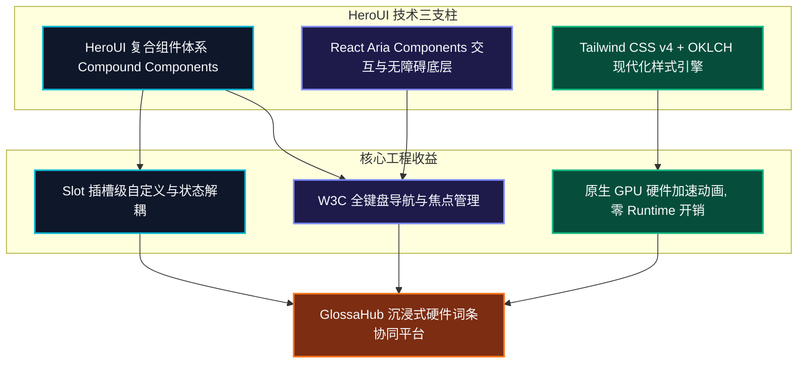
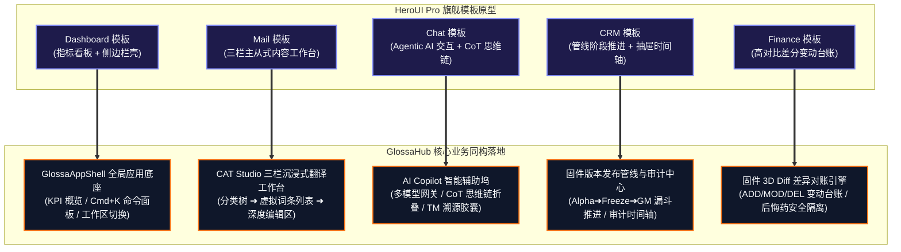

# GlossaHub 前端设计规范与 HeroUI 组件架构标准 (design.md)

> **文档标识**：`GLOSSA-DESIGN-SYSTEM-HEROUI-V2.0`  
> **设计系统基准**：[HeroUI (v3.x / React)](https://heroui.com/en/docs/react/components) + Tailwind CSS v4 + React Aria Components  
> **适用终端**：GlossaHub 企业级国际化多语言与智能硬件固件词条协同平台  
> **文档位置**：`design/design.md`  
> **编写日期**：2026-09-28  

---

## 1. HeroUI 设计系统核心哲学与技术基准

HeroUI（前身为 NextUI）是业界公认兼具极致视觉美感（Modern Aesthetics）与工业级无障碍体验（W3C Accessible）的现代化 React 组件库。在 GlossaHub v2.0 的前端重构中，我们全面引入 HeroUI 的设计系统与技术基准，彻底终结传统后台“简陋、卡顿、交互生硬”的粗糙现状。



### 1.1 技术支柱与架构演进
1. **React Aria 底层支撑（Zero-Effort Accessibility）**：
   HeroUI 内部完全构建在 Adobe 的 `react-aria-components` 之上，开箱自带完整的键盘焦点捕获（Focus Trap）、屏幕阅读器无障碍无损支持（ARIA Live Regions / Roles）、按键循环导航与移动端触控优化。
2. **Tailwind CSS v4 原生驱动（CSS-First Theming）**：
   全面摒弃繁重的运行时 JS 动画库（如 Framer Motion），拥抱 Tailwind CSS v4 的原生 CSS Transitions 与 Keyframes 动画，实现 GPU 硬件级加速，运行时性能提升 300%。
3. **复合组件模式（Compound Component Pattern）**：
   组件采用结构拆解模式（例如 `<Card><Card.Header /><Card.Body /></Card>`），将视觉样式与行为彻底解耦，开发者可灵活重排内部 Slot 而绝不破坏交互状态。
4. **多插槽样式覆盖体系（Slots-Based Styling）**：
   每个复合组件暴露细粒度的 `classNames` 插槽（如 `base`, `trigger`, `content`, `label`, `input`, `clearButton`），支持在任意层级精准注入 Tailwind 实用类，避免使用全局 `!important` 样式覆写。

---

### 1.2 HeroUI Pro 旗舰模板架构范式与平台同构 (HeroUI Pro Architectural Paradigms)

官方 [HeroUI Pro 模板矩阵 (Templates)](https://heroui.pro/docs/react/templates) 凝聚了现代 Web 应用在不同业务形态下的最佳交互与布局模式。经过深度剖析，GlossaHub 将 5 大官方模板的设计精髓与固件本地化协同场景进行了 1:1 的**架构级同构**：



1. **Dashboard 模板 ➔ 全局应用底座 (`GlossaAppShell`)**：
   *   **吸收范式**：紧凑响应式侧边栏（折叠 64px / 展开 260px）、工作区切换器、顶栏全局搜索与快捷键 `Cmd+K`、KPI 指标卡片（含环比百分比微标与 Sparkline 趋势线）。
   *   **业务映射**：用于硬件产品线导航、固件基线版本库概览，直观呈现全平台词条总量、翻译完成率、未解决 QA 拦截数与 TM 向量库命中率。
2. **Mail 模板 ➔ CAT Studio 专业三栏工作台 (`CatStudioThreePane`)**：
   *   **吸收范式**：经典的三栏（3-Pane）主从联动布局。左栏分类与过滤标签、中栏高密度虚拟滚动列表、右栏沉浸式主体内容与操作区。
   *   **业务映射**：左栏为语种与词条分组；中栏为万级词条高速列表（带高光光标与快速筛选）；右栏为核心编辑区，集成中文基准原文、目标语言输入框与真机物理屏幕模拟器。
3. **Chat 模板 ➔ CAT AI Copilot 智能辅助坞 (`AICopilotDock`)**：
   *   **吸收范式**：Agentic AI 交互模式、**CoT（Chain-of-Thought）思维链折叠展示组件（`Thought for X seconds`）**、工具调用徽章（Tool Call Cards）、模型切换胶囊与知识溯源引用芯片（Citations）。
   *   **业务映射**：右侧辅助坞实时渲染 Multi-LLM（DeepSeek / Claude / GPT / Qwen）的翻译推理过程与屏幕字长自适应决策；展示 L10n QA 校验工具链执行状态；高亮 TM 向量数据库匹配证据（相似度百分比）。
4. **CRM 模板 ➔ 固件版本发布管线与审计中心 (`VersionPipelineDrawer`)**：
   *   **吸收范式**：阶段漏斗推进（Pipeline Funnel）、健康度评分环（Health Gauges）、右侧滑出式全景抽屉（Slide-out Detail Drawer）与活动时间轴（Activity Timeline）。
   *   **业务映射**：追踪固件版本生命周期状态（`Draft` ➔ `Alpha Freeze` ➔ `L10n QA Validated` ➔ `Golden Master Sealed`），滑出式抽屉展示词条粒度的历史变更快照与时光机回退操作记录。
5. **Finance 模板 ➔ 固件 3D Diff 差异对账引擎 (`DiffLedgerViewer`)**：
   *   **吸收范式**：高对比变动台账网格、红绿差分指标卡（变动总计 / 新增 / 修改 / 删除）、批量选择性生效勾选框、高危动作二次确认安全屏障。
   *   **业务映射**：固件版本比对（Diff Engine）的视觉呈现，清晰标识字符级变动，提供假差异过滤开关与“后悔药自动备份”安全告知。


---

## 2. 完备设计令牌体系 (Comprehensive Design Token Specification)

为了全面支撑 **Web 端 UI 设计（Figma 变量 / Tokens Studio）** 与 **现代前端工程开发（Tailwind CSS v4 + HeroUI React + TypeScript）**，GlossaHub 制定了工业级、全色阶、全语义的完备设计令牌体系（Design Tokens）。

系统统一采用 **OKLCH 色彩空间**（结合 sRGB Hex Fallback）。OKLCH 在感知均匀度（Perceptual Uniformity）和色域宽广度上远超传统 HSL/RGB，可确保高饱和度品牌色（如迈金橙、极光青）在深浅两种模式下保持一致的亮度层次，严格满足 WCAG AAA 对比度无障碍标准。

---

### 2.1 颜色系统全色阶与语义体系 (Color Scales & Semantics)

#### 2.1.1 品牌核心色阶：迈金活力橙 (Primary: Magene Orange)
*   **品牌定位**：代表骑行运动活力、硬件高动能与科技仪器感。
*   **用途**：全局主行动按钮（Primary Button）、激活光标（Active Cursor）、表格焦点框、选中高亮外环与核心 Tab 指示条。

| 色阶 Token | OKLCH 数值定义 | Hex 等价基准 | 对比度场景 (Dark) | 对比度场景 (Light) | 典型应用与组件映射 |
| :--- | :--- | :--- | :--- | :--- | :--- |
| **`primary-50`** | `oklch(0.975 0.025 45)` | `#fff7ed` | 极高亮对比文本 | 超浅微悬浮底色 | 按钮微悬浮背景、极浅 Chip 浅底 |
| **`primary-100`** | `oklch(0.935 0.055 45)` | `#ffedd5` | 浅色高光字 | 浅色选中底色 | 大网格选中行浅底、高亮气泡浅色底 |
| **`primary-200`** | `oklch(0.875 0.095 44)` | `#fed7aa` | 辅助高亮边框 | 边框强调色 | 交互边框次高亮、输入框弱描边 |
| **`primary-300`** | `oklch(0.805 0.145 43)` | `#fdba74` | 暗黑强调高亮字 | 悬停高光边框 | 暗黑模式下的文字高亮、活动图标 |
| **`primary-400`** | `oklch(0.740 0.185 42)` | `#fb923c` | 暗色模式次主色 | 强调图标 | 按钮 Hover 渐变过渡色、进度条中段 |
| **`primary-500` (Base)**| `oklch(0.680 0.220 42)` | **`#f97316`** | **主行动点核心** | **主行动点核心** | **Primary 按钮底色、核心 Tab 指示条、活动焦点圈** |
| **`primary-600`** | `oklch(0.600 0.210 40)` | `#ea580c` | 点击按下深色态 | 高对比文字色 | 按钮按下 (Active) 态、明亮模式下的强调文本 |
| **`primary-700`** | `oklch(0.520 0.190 38)` | `#c2410c` | 渐变暗部 | 深色高对比文案 | 符合 WCAG AAA 的浅色模式强调文本 |
| **`primary-800`** | `oklch(0.440 0.160 36)` | `#9a3412` | 极深色调 | 深色边框描边 | 特殊强调背景、深橙色大标题 |
| **`primary-900`** | `oklch(0.360 0.130 34)` | `#7c2d12` | 暗部描边 | 极深底色 | 极低明度暗调面板 |
| **`primary-950`** | `oklch(0.240 0.090 32)` | `#431407` | 容器微透背景 | 几乎不可见 | `primary/15` 暗黑模式磨砂容器底色 |

---

#### 2.1.2 辅助高光色阶：极光青 (Accent: Aurora Cyan)
*   **品牌定位**：代表数字化、自动化算法智慧、真机上下文热区指引。
*   **用途**：AI 翻译标记、TM 向量相似度高分徽章、自动化质检标签、智能建议卡片高光。

| 色阶 Token | OKLCH 数值定义 | Hex 等价基准 | 对比度场景 (Dark) | 对比度场景 (Light) | 典型应用与组件映射 |
| :--- | :--- | :--- | :--- | :--- | :--- |
| **`accent-50`** | `oklch(0.975 0.028 205)` | `#ecfeff` | 浅色反光字 | 极浅青底 | AI 建议卡片极浅背景 |
| **`accent-100`** | `oklch(0.935 0.060 205)` | `#cffafe` | 浅色青字 | 浅色选中态 | AI 标签浅色背景、TM 浅色微徽标 |
| **`accent-200`** | `oklch(0.880 0.095 205)` | `#a5f3fc` | 辅助青边框 | 边框强调色 | 交互边框青色高亮 |
| **`accent-300`** | `oklch(0.820 0.130 205)` | `#67e8f9` | 暗黑高亮青字 | 鲜明边框 | 暗黑模式下 AI 辅助文字、发光边缘 |
| **`accent-400`** | `oklch(0.770 0.150 205)` | `#22d3ee` | 暗色高光指示 | 青色图标 | 极光青图标、进度条指示 |
| **`accent-500` (Base)**| `oklch(0.720 0.160 205)` | **`#06b6d4`** | **AI 核心高光** | **高光指示** | **AI 生成标记徽标、TM 向量相似度高分徽章** |
| **`accent-600`** | `oklch(0.630 0.150 205)` | `#0891b2` | 点击按下态 | 高对比青色文本 | 浅色模式下的 AI 辅助核心按钮 |
| **`accent-700`** | `oklch(0.550 0.140 205)` | `#0e7490` | 深调背景 | 高对比青字 | 浅色模式下的 AI 说明文案 (WCAG AAA) |
| **`accent-800`** | `oklch(0.460 0.115 205)` | `#155e75` | 极深青色调 | 极深青文字 | 特殊青色面板标题 |
| **`accent-900`** | `oklch(0.380 0.090 205)` | `#164e63` | 暗部描边 | 极深青底色 | 暗调青色容器 |
| **`accent-950`** | `oklch(0.250 0.070 205)` | `#083344` | 暗调微透背景 | — | `accent/15` 紫青色微调背景 |

---

#### 2.1.3 中性灰阶：冷调石板灰 (Neutral Slate Scale - 支撑双主题)
*   **设计基调**：采用偏冷的 Slate 蓝灰调（色相 250~260），赋予固件工作台专业、沉稳的工业仪器感，彻底规避偏暖灰色的浑浊廉价感。

| 色阶 Token | OKLCH 数值定义 | Hex 基准 | 暗黑模式 (Dark Mode) 职责 | 明亮模式 (Light Mode) 职责 |
| :--- | :--- | :--- | :--- | :--- |
| **`slate-50`** | `oklch(0.985 0.008 250)` | `#f8fafc` | 默认纯高亮主文本 (`fg-default`) | 全局主画布背景 (`canvas-bg`) |
| **`slate-100`** | `oklch(0.960 0.012 250)` | `#f1f5f9` | 一级高对比文本 | 一级浅色卡片底色 (`surface-1`)、大网格斑马纹 |
| **`slate-200`** | `oklch(0.920 0.018 250)` | `#e2e8f0` | 次级反色文字 | 二级面板背景 (`surface-2`)、默认分割线与描边 |
| **`slate-300`** | `oklch(0.860 0.022 250)` | `#cbd5e1` | 悬停文字色、高对比边框 | 边框强调色、禁用文字背景 |
| **`slate-400`** | `oklch(0.700 0.030 250)` | `#94a3b8` | 次级描述文字 (`fg-muted`)、未翻译状态 | 次级描述文字 (`fg-muted`)、占位符 |
| **`slate-500`** | `oklch(0.550 0.035 250)` | `#64748b` | 占位符 (`placeholder`)、加锁图标 | 占位符、次要图标、弱化标签 |
| **`slate-600`** | `oklch(0.440 0.035 250)` | `#475569` | 弱化分割线、不可交互边框 | 强对比深色次级文本 |
| **`slate-700`** | `oklch(0.360 0.032 250)` | `#334155` | 交互卡片悬停边框 (`border-hover`) | 标题文字色、主文本 |
| **`slate-800`** | `oklch(0.270 0.030 255)` | `#1e293b` | 默认组件边框 (`border-default`)、输入框底色 | 一级深黑文本 (`fg-default`) |
| **`slate-900`** | `oklch(0.180 0.030 260)` | `#0f172a` | 一级面板底色 (`surface-1`)、弹窗与抽屉背景 | 极黑文字强调 |
| **`slate-950`** | `oklch(0.120 0.020 260)` | `#020617` | 全局主画布背景 (`canvas-bg`) | 极黑阴影遮罩 |

---

#### 2.1.4 状态语义全色阶 (Semantic Status Scales: Success, Warning, Danger, Info, AI)

全状态五色阶覆盖固件研发关键生命周期（字长防截断、版本差分、L10n QA 校验）：

| 语义通道 | 基础色阶 (500) | 浅底色阶 (50/100) | 文字高亮 (400/700) | 深色底色 (900/950) | 固件本地化映射业务场景 |
| :--- | :--- | :--- | :--- | :--- | :--- |
| **`success`**<br/>(翡翠绿 / 145) | `oklch(0.650 0.200 145)`<br/>`#10b981` | `oklch(0.975 0.028 145)`<br/>`#ecfdf5` | `text-success-400` (`#34d399`)<br/>`text-success-700` (`#047857`) | `oklch(0.200 0.070 145)`<br/>`#022c22` | • 词条翻译：已翻译 (Translated)<br/>• TM 命中：100% 精确匹配徽章<br/>• Diff 对比：新增词条 (ADD)<br/>• 硬件约束：字长 $<70\%$ 安全区间 |
| **`warning`**<br/>(琥珀黄 / 85) | `oklch(0.750 0.180 85)`<br/>`#f59e0b` | `oklch(0.980 0.030 85)`<br/>`#fffbeb` | `text-warning-400` (`#fbbf24`)<br/>`text-warning-700` (`#b45309`) | `oklch(0.220 0.070 85)`<br/>`#451a03` | • 词条状态：待审校 / 待复核<br/>• Diff 对比：修改词条 (MOD)<br/>• 硬件约束：字长 $70\% \sim 95\%$ 预警<br/>• QA 质检：非致命格式或标点警告 |
| **`danger`**<br/>(玫瑰红 / 25) | `oklch(0.600 0.240 25)`<br/>`#f43f5e` | `oklch(0.975 0.030 25)`<br/>`#fff1f2` | `text-danger-400` (`#fb7185`)<br/>`text-danger-700` (`#be123c`) | `oklch(0.180 0.080 25)`<br/>`#4c0519` | • 词条状态：QA 严重拦截报错<br/>• Diff 对比：删除词条 (DEL)<br/>• 硬件约束：字长 $>100\%$ 物理爆框截断<br/>• 占位符：缺失 `%s` 或 `%d` 硬性拦截 |
| **`info`**<br/>(天青蓝 / 245) | `oklch(0.620 0.180 245)`<br/>`#3b82f6` | `oklch(0.975 0.025 245)`<br/>`#eff6ff` | `text-info-400` (`#60a5fa`)<br/>`text-info-700` (`#1d4ed8`) | `oklch(0.180 0.065 245)`<br/>`#172554` | • 真机上下文：物理屏幕坐标框选高亮<br/>• 审计日志：版本继承、时光机操作事件<br/>• 系统通知：固件新版本封板发布提示 |
| **`ai`**<br/>(智能紫 / 295) | `oklch(0.620 0.220 295)`<br/>`#a855f7` | `oklch(0.975 0.025 295)`<br/>`#faf5ff` | `text-ai-400` (`#c084fc`)<br/>`text-ai-700` (`#7e22ce`) | `oklch(0.180 0.080 295)`<br/>`#3b0764` | • 多模型网关：DeepSeek / Claude / GPT / Qwen<br/>• 批量翻译：AI 自动流水线推理中指示<br/>• 术语提取：AI 自动发现潜在专有名词 |

---

#### 2.1.5 固件 3D Diff 专属语义差分令牌 (Firmware Diff Semantic Tokens)

专为高精度固件版本对比引擎设计，支持明暗双模式与行内微粒度对比：

```css
/* 固件 3D Diff 差分令牌规范 */
:root {
  /* 新增词条 (ADD) */
  --diff-add-bg: oklch(0.650 0.200 145 / 0.10);
  --diff-add-border: oklch(0.650 0.200 145 / 0.30);
  --diff-add-fg: oklch(0.480 0.165 145);
  --diff-add-inline: oklch(0.650 0.200 145 / 0.22);

  /* 修改词条 (MOD) */
  --diff-mod-bg: oklch(0.750 0.180 85 / 0.12);
  --diff-mod-border: oklch(0.750 0.180 85 / 0.35);
  --diff-mod-fg: oklch(0.540 0.155 85);
  --diff-mod-inline: oklch(0.750 0.180 85 / 0.25);

  /* 删除词条 (DEL) */
  --diff-del-bg: oklch(0.600 0.240 25 / 0.10);
  --diff-del-border: oklch(0.600 0.240 25 / 0.30);
  --diff-del-fg: oklch(0.440 0.195 25);
  --diff-del-inline: oklch(0.600 0.240 25 / 0.20);

  /* 假差异已过滤 (FALSE_DIFF - 引号/标点/空格规范化过滤) */
  --diff-false-bg: oklch(0.920 0.018 250 / 0.50);
  --diff-false-border: oklch(0.700 0.030 250 / 0.40);
  --diff-false-fg: oklch(0.550 0.035 250);

  /* 版本冲突 (CONFLICT) */
  --diff-conflict-bg: oklch(0.600 0.240 25 / 0.18);
  --diff-conflict-border: oklch(0.600 0.240 25 / 0.60);
  --diff-conflict-fg: oklch(0.440 0.195 25);
}

.dark {
  --diff-add-bg: oklch(0.650 0.200 145 / 0.16);
  --diff-add-border: oklch(0.650 0.200 145 / 0.35);
  --diff-add-fg: oklch(0.805 0.140 145);
  --diff-add-inline: oklch(0.650 0.200 145 / 0.28);

  --diff-mod-bg: oklch(0.750 0.180 85 / 0.16);
  --diff-mod-border: oklch(0.750 0.180 85 / 0.40);
  --diff-mod-fg: oklch(0.835 0.140 85);
  --diff-mod-inline: oklch(0.750 0.180 85 / 0.30);

  --diff-del-bg: oklch(0.600 0.240 25 / 0.18);
  --diff-del-border: oklch(0.600 0.240 25 / 0.40);
  --diff-del-fg: oklch(0.790 0.165 25);
  --diff-del-inline: oklch(0.600 0.240 25 / 0.32);

  --diff-false-bg: oklch(0.240 0.030 260 / 0.60);
  --diff-false-border: oklch(0.360 0.035 250 / 0.60);
  --diff-false-fg: oklch(0.700 0.030 250);

  --diff-conflict-bg: oklch(0.600 0.240 25 / 0.25);
  --diff-conflict-border: oklch(0.600 0.240 25 / 0.70);
  --diff-conflict-fg: oklch(0.870 0.110 25);
}
```

---

#### 2.1.6 硬件物理屏幕字长约束指示器与屏幕点阵仿真令牌 (Hardware Screen Tokens)

针对码表、心率带、功率计等嵌入式屏幕特殊定制：

*   **字长仪表盘刻度分级 (Gauge Scales)**：
    *   `gauge-safe-bg`: `oklch(0.650 0.200 145)`（$<70\%$ 绿色安全指示）
    *   `gauge-warn-bg`: `oklch(0.750 0.180 85)`（$70\% \sim 95\%$ 预警琥珀指示）
    *   `gauge-danger-bg`: `oklch(0.600 0.240 25)`（$>100\%$ 爆框危险红闪烁）
*   **物理屏幕拟真底色 (Physical Screen Emulation)**：
    *   `screen-lcd-bg`: `#c5d1c2` (经典段码/点阵 LCD 拟真背景) / `#1c261e` (夜视模式)
    *   `screen-lcd-fg`: `#1d2b1f` (点阵像素深灰) / `#6ee7b7` (荧光翠绿发光点)
    *   `screen-oled-bg`: `#000000` (OLED 物理级纯黑省电背景)
    *   `screen-oled-fg`: `#ffffff` (OLED 高锐度纯白文本)
    *   `screen-bezel`: `#2b303c` (骑行硬件外壳磨砂边框)

---

#### 2.1.7 空间表面、图层层级与背景表面令牌 (Surface & Layer Hierarchy)

```
+----------------------------------------------------------------------------------------------------+
|                                    GLOSSA-HUB 空间表面层级体系                                       |
+----------------------------------------------------------------------------------------------------+
|  [ Level 0: Canvas (全局底层画布) ]                                                                |
|  • Dark:  bg-slate-950 (#020617)  |  Light: bg-slate-50 (#f8fafc)                                  |
|  ------------------------------------------------------------------------------------------------- |
|  [ Level 1: Surface-1 (一级基础卡片与大网格面板) ]                                                  |
|  • Dark:  bg-slate-900/90 (#0f172a) + backdrop-blur-md + border-slate-800                          |
|  • Light: bg-white (#ffffff) + border-slate-200 + shadow-sm                                        |
|  ------------------------------------------------------------------------------------------------- |
|  [ Level 2: Surface-2 (二级嵌套面板、输入框底色、左侧导航抽屉) ]                                     |
|  • Dark:  bg-slate-950/60 (#020617) + border-slate-700/80                                          |
|  • Light: bg-slate-100/80 (#f1f5f9) + border-slate-300                                             |
|  ------------------------------------------------------------------------------------------------- |
|  [ Level 3: Surface-3 (三级浮动层: Dropdown 菜单、Tooltip 气泡、Popover) ]                           |
|  • Dark:  bg-slate-800/95 (#1e293b) + border-slate-700 + shadow-xl                                 |
|  • Light: bg-white (#ffffff) + border-slate-200 + shadow-lg                                        |
|  ------------------------------------------------------------------------------------------------- |
|  [ Level 4: Overlay & Modal (全屏遮罩与模态弹窗) ]                                                  |
|  • Dark:  bg-slate-950/78 + backdrop-blur-md (遮罩) / bg-slate-900 (模态窗实体)                     |
|  • Light: bg-slate-900/45 + backdrop-blur-sm (遮罩) / bg-white (模态窗实体)                         |
+----------------------------------------------------------------------------------------------------+
```

---

### 2.2 排版与文字梯度系统 (Typography & Modular Scale)

基于 **Major Third (1.25)** 模块化比例构建文字梯度，针对固件多语言混合排版（包含中文汉字、等宽宏键名、德法长复合词与日韩字符）做特别渲染优化。

#### 2.2.1 字体家族标准 (Font Families)
*   **`font-sans` (界面通用文字)**：  
    `Inter, -apple-system, BlinkMacSystemFont, "Segoe UI", Roboto, "PingFang SC", "Hiragino Sans GB", "Microsoft YaHei", sans-serif`  
    *特征*：几何低对比度无衬线，x-height 较高，在 11px~14px 微型字号下具备极高辨识度。
*   **`font-mono` (固件键名宏与占位符代码)**：  
    `"JetBrains Mono", "SF Mono", "Fira Code", Menlo, Monaco, Consolas, monospace`  
    *特征*：带连字特性、清晰区分 `0` 与 `O`、`1` 与 `l`，专为 `KW_*` 宏键名、`%s`、`%d` 占位符定制。

#### 2.2.2 字号、行高与字间距标尺表

| 梯度 Token | 字号 (px / rem) | 行高 (Leading) | 字间距 (Tracking) | 推荐字重 (Weight) | 典型业务场景 |
| :--- | :--- | :--- | :--- | :--- | :--- |
| **`text-2xs`** | `10px` / `0.625rem` | `14px` (`leading-tight`) | `+0.05em` (`tracking-wider`) | `600` (Semibold) | 胶囊来源微标 (`AI`/`TM`)、真机坐标标记、小时间戳 |
| **`text-xs`** | `12px` / `0.75rem` | `16px` (`leading-normal`)| `0` (`tracking-normal`) | `500` (Medium) | 字符统计 (`10/12字`)、二级元数据、快捷键 Kbd 徽章 |
| **`text-sm`** | `14px` / `0.875rem` | `20px` (`leading-normal`)| `-0.01em` | `400` (Reg) / `500` (Med) | **大网格单元格文案、表单输入框、按钮文字、正文默认** |
| **`text-base`** | `16px` / `1.000rem` | `24px` (`leading-relaxed`)| `-0.015em` | `500` (Med) / `600` (Semi) | CAT 工作台中栏核心译文输入、词条基准原文正文 |
| **`text-lg`** | `18px` / `1.125rem` | `28px` (`leading-snug`) | `-0.02em` | `600` (Semibold) | 卡片标题、模态窗标题、导航栏关键分组名 |
| **`text-xl`** | `20px` / `1.250rem` | `28px` (`leading-snug`) | `-0.025em` (`tracking-tight`) | `600` (Semibold) | 抽屉大标题、版本对比概览总数 |
| **`text-2xl`** | `24px` / `1.500rem` | `32px` (`leading-tight`) | `-0.03em` (`tracking-tight`) | `700` (Bold) | 项目工作区大标题、KPI 核心指标数字 |
| **`text-3xl`** | `30px` / `1.875rem` | `36px` (`leading-tight`) | `-0.035em` (`tracking-tighter`) | `700` (Bold) | 登录欢迎页大标语、导出报告封面标题 |

---

### 2.3 间距、网格与容器尺寸体系 (Spacing, Sizing & Grid)

系统严格基于 **4px 基础网格标尺（4px Base Grid Unit）**。任何 padding、margin、gap、width、height 必须为 4 的整数倍（特殊微调除外）。

#### 2.3.1 核心间距标尺表 (Spacing Scale)

| 间距 Token | 像素值 (px) | rem 当量 | 典型在 HeroUI 中的应用场景 |
| :--- | :--- | :--- | :--- |
| **`space-0.5`** | `2px` | `0.125rem` | 边框微调、图标与文字的极窄间距 |
| **`space-1`** | `4px` | `0.250rem` | 紧凑徽标 padding、输入框内部图标偏移 |
| **`space-1.5`** | `6px` | `0.375rem` | 按钮内容与图标 gap、微型 Chip 内边距 |
| **`space-2`** | `8px` | `0.500rem` | 紧凑表单元素行距、下拉菜单项 padding |
| **`space-2.5`** | `10px` | `0.625rem` | 紧凑卡片内边距、Tab 标签横向间距 |
| **`space-3`** | `12px` | `0.750rem` | 默认按钮横向 padding、表头单元格横向边距 |
| **`space-4`** | `16px` | `1.000rem` | **标准卡片内边距 (`p-4`)、大网格单元格默认高度间距** |
| **`space-5`** | `20px` | `1.250rem` | CAT 工作台中栏核心面板内边距 |
| **`space-6`** | `24px` | `1.500rem` | 弹窗内容与外框 padding、顶栏固定高度边距 |
| **`space-8`** | `32px` | `2.000rem` | 页面主区域间隙 (Page Section Gap) |
| **`space-12`** | `48px` | `3.000rem` | 左右大分栏抽屉边距 |
| **`space-16`** | `64px` | `4.000rem` | 页面顶部留白 |

#### 2.3.2 界面控件高度与尺寸规范 (Component Dimension Tokens)

*   **表格行高 (Table Row Heights)**：
    *   `row-compact`: `40px` (高密度大表浏览模式)
    *   `row-default`: `52px` (标准虚拟滚动网格，含多行文字与操作按钮)
    *   `row-relaxed`: `68px` (宽松模式，附带真机屏幕缩略图预览)
*   **输入框高度 (Input Heights)**：
    *   `input-sm`: `32px` (表格行内即时编辑单行框)
    *   `input-md`: `40px` (标准表单通用输入框)
    *   `input-lg`: `48px` (CAT 工作台重点搜索框)
*   **按钮高度 (Button Heights)**：
    *   `btn-xs`: `24px` (小操作点、历史回退微型按钮)
    *   `btn-sm`: `32px` (次要操作、辅助工具条按钮)
    *   `btn-md`: `40px` (标准主要操作按钮)
    *   `btn-lg`: `48px` (页面主保存按钮、大模态窗确认按钮)
*   **分栏宽度 (Layout Column Widths)**：
    *   `sidebar-collapsed`: `64px` (极窄模式，仅显示图标)
    *   `sidebar-standard`: `260px` (标准全局左侧导航栏)
    *   `cat-nav-left`: `320px` (CAT 工作台左栏词条导航树)
    *   `cat-main-center`: `minmax(480px, 1fr)` (CAT 中栏翻译核心区)
    *   `cat-dock-right`: `360px` (CAT 右栏术语/TM/AI决策辅助坞)
    *   `audit-drawer`: `440px` (右侧滑出式审计 Diff 抽屉)
*   **模态窗最大宽度 (Modal Max-Widths)**：
    *   `modal-sm`: `400px` (单项确认、删除/回退二次确认)
    *   `modal-md`: `560px` (新建版本、版本继承配置)
    *   `modal-lg`: `760px` (真机截图上传与热区标定)
    *   `modal-xl`: `960px` (固件版本对比 Diff 独立大窗)
    *   `modal-full`: `calc(100vw - 48px)` (全屏专业校对视窗)

---

### 2.4 圆角与边框系统 (Border Radius & Stroke Tokens)

统一的圆角系统能消除视觉生硬感，强化现代软硬件一体的高科技亲和力。

| 圆角 Token | 像素值 (px) | 适用 HeroUI 控件与业务场景 |
| :--- | :--- | :--- |
| **`radius-none`** | `0px` | 严格贴边的表格内边缘、全宽分割线 |
| **`radius-xs`** | `4px` | 极小微章、Kbd 键盘按键修饰框、行内代码块背景 |
| **`radius-sm`** | `6px` | 小型 Chip 标签（`ADD`/`DEL` 状态）、微型下拉菜单项 |
| **`radius-md`** | `8px` | **通用按钮（Button）、标准输入框（Input）、下拉选单面板** |
| **`radius-lg`** | `12px` | **内容卡片（Card）、表格外框容器、通知气泡（Toast）** |
| **`radius-xl`** | `16px` | **模态窗口（Modal）、侧滑抽屉（Drawer）、浮动动作条** |
| **`radius-2xl`** | `24px` | 营销展示大卡片、CAT 工作台三栏主面板外廓 |
| **`radius-full`** | `9999px` | 药丸型进度条（Meter Track）、头像（Avatar）、状态圆点 |

*   **边框描边粗细 (Stroke Widths)**：
    *   `border-1`: `1px` (默认控件描边，如卡片、输入框、普通分割线)
    *   `border-1.5`: `1.5px` (输入框聚焦态描边)
    *   `border-2`: `2px` (活动 Tab 底部划线、真机热区矩形框)
    *   `ring-focus`: `2px` (全键盘导航焦点环，带 `2px` 外偏移)

---

### 2.5 空间层级、阴影与毛玻璃质感 (Elevation, Shadows & Glassmorphism)

#### 2.5.1 Z-Index 层级堆叠标尺
杜绝前端样式中随意的 `z-index: 9999`，建立严密递增的层级标尺：

| Z-Index Token | 标称数值 | 承载业务元素 |
| :--- | :--- | :--- |
| **`z-base`** | `0` | 常规大网格单元格、卡片内容 |
| **`z-sticky-col`** | `10` | 虚拟表格前置固定列（锁定状态、KW 宏、中文原文） |
| **`z-sticky-header`**| `20` | 虚拟表格置顶表头、固定工具栏 |
| **`z-dropdown`** | `100` | 下拉菜单、自动补全候选浮层、日期选择面板 |
| **`z-popover`** | `200` | 鼠标悬浮气泡、操作人快照详情卡片 |
| **`z-drawer`** | `300` | 变更审计历史侧滑抽屉、真机实拍全景预览坞 |
| **`z-modal-backdrop`**| `400`| 模态窗全屏高斯模糊遮罩层 |
| **`z-modal`** | `500` | 时光机回退弹窗、Diff 差异导出弹窗、报错强告警 |
| **`z-toast`** | `600` | 全局轻量通知提示 (Toast Notifications) |
| **`z-tooltip`** | `700` | 顶层防遮挡工具提示（悬浮展示快捷键、完整错误堆栈） |

#### 2.5.2 阴影与发光效果 (Box Shadows & Glows)
*   **常规漫反射阴影**：
    *   `shadow-xs`: `0 1px 2px 0 rgb(0 0 0 / 0.05)`
    *   `shadow-sm`: `0 1px 3px 0 rgb(0 0 0 / 0.1), 0 1px 2px -1px rgb(0 0 0 / 0.1)` (按钮基础微投影)
    *   `shadow-md`: `0 4px 6px -1px rgb(0 0 0 / 0.15), 0 2px 4px -2px rgb(0 0 0 / 0.1)` (悬浮卡片)
    *   `shadow-lg`: `0 10px 15px -3px rgb(0 0 0 / 0.25), 0 4px 6px -4px rgb(0 0 0 / 0.2)` (下拉菜单、小弹窗)
    *   `shadow-xl`: `0 20px 25px -5px rgb(0 0 0 / 0.35), 0 8px 10px -6px rgb(0 0 0 / 0.3)` (抽屉与标准模态窗)
    *   `shadow-2xl`: `0 25px 50px -12px rgb(0 0 0 / 0.5)` (核心高优模态窗、全屏大图)
*   **硬件高科技发光氛围 (Glow Ambient Shadows)**：
    *   `shadow-glow-primary`: `0 0 24px -2px oklch(0.680 0.220 42 / 0.45)` (迈金橙按钮悬停高光)
    *   `shadow-glow-accent`: `0 0 24px -2px oklch(0.720 0.160 205 / 0.45)` (极光青 AI 状态高光)
    *   `shadow-glow-danger`: `0 0 28px -2px oklch(0.600 0.240 25 / 0.55)` (字符爆框截断警示呼吸光晕)
    *   `shadow-glow-success`: `0 0 22px -2px oklch(0.650 0.200 145 / 0.40)` (100% 匹配与保存成功光晕)
    *   `shadow-glow-ai`: `0 0 26px -2px oklch(0.620 0.220 295 / 0.45)` (AI 推理呼吸高光)

#### 2.5.3 毛玻璃模糊标尺 (Backdrop Blur Tokens)
*   `backdrop-blur-none`: `blur(0px)`
*   `backdrop-blur-sm`: `blur(4px)` (表头粘性滚动微模糊)
*   `backdrop-blur-md`: `blur(8px)` (标准组件磨砂玻璃，用于卡片与输入框)
*   `backdrop-blur-lg`: `blur(12px)` (抽屉面板、悬浮顶栏)
*   `backdrop-blur-xl`: `blur(20px)` (全屏模态窗遮罩层)

---

### 2.6 微动效、转场与贝塞尔过渡曲线 (Motion & Transition Curves)

HeroUI 与 Tailwind CSS v4 强调**原生 CSS GPU 加速**，杜绝 JS 逐帧计算引起的丢帧卡顿。

#### 2.6.1 动画时长标尺 (Duration Tokens)
*   **`duration-instant`** (`50ms` / `0.05s`)：高频打字时单元格边框激活、按键瞬时按压；
*   **`duration-fast`** (`150ms` / `0.15s`)：按钮 Hover 色彩渐变、Tooltip 淡入淡出、Checkbox 勾选动画；
*   **`duration-normal`** (`250ms` / `0.25s`)：下拉菜单展开折叠、Tab 底部滑动条位置平移、输入框高度伸缩；
*   **`duration-slow`** (`350ms` / `0.35s`)：右侧抽屉滑入滑出、模态弹窗缩放展示（Scale In）、折叠面板展开；
*   **`duration-gentle`** (`500ms` / `0.5s`)：暗黑/明亮主题全屏无缝平滑色彩淡出过渡、警告呼吸光晕。

#### 2.6.2 贝塞尔缓动曲线 (Easing Curves)
*   **标准自然过渡 (`ease-standard`)**：  
    `cubic-bezier(0.2, 0.0, 0.0, 1.0)` —— 模拟物理惯性，常用于通用元素悬停与状态变换。
*   **疾速减速退出 (`ease-out-expo`)**：  
    `cubic-bezier(0.16, 1.0, 0.3, 1.0)` —— 迅速入场，在接近终点时柔和减速，用于模态窗与抽屉入场。
*   **轻快弹簧微动 (`ease-spring`)**：  
    `cubic-bezier(0.34, 1.56, 0.64, 1.0)` —— 带有微小的过冲回弹，用于 Tab 滑块与完成对勾动画。

---

### 2.7 响应式断点与自适应布局规则 (Breakpoints & Layout Behavior)

针对不同工种（固件工程师双屏显示器、译员笔记本、测试平板）制定自适应断点：

| 断点 Token | 最小宽度 (Min-Width) | 针对设备场景 | GlossaHub 核心布局响应策略 |
| :--- | :--- | :--- | :--- |
| **`xs`** | `360px` | 移动端预览 | 隐藏大网格，单列卡片式简单只读查看 |
| **`sm`** | `640px` | 小屏幕平板竖屏 | 隐藏辅助侧边栏，保留单列表格，操作转入抽屉 |
| **`md`** | `768px` | 平板横屏 / 窄屏 | 左侧导航栏折叠为 64px 极窄图标栏，工作台双栏显示 |
| **`lg`** | `1024px` | 标配轻薄笔记本 (13寸) | 大网格完整展示；CAT 工作台右栏折叠为抽屉触发模式 |
| **`xl`** | `1280px` | 标配办公屏 (1080P) | **CAT 工作台完整呈现三栏并排，大网格显示全部 16+ 语言滚动** |
| **`2xl`** | `1536px` | 2K 专业设计与开发屏 | CAT 工作台中栏自动展开真机大图高清预览画布 |
| **`3xl`** | `1920px` | 4K / 超宽带鱼屏 (Ultra-Wide)| 支持版本 Diff 左右完整双大表平铺同步滚动对照 |

---

### 2.8 完整可执行 CSS 代码与 Tailwind v4 集成

生产代码已完整编译就绪，保存在 [`client/src/styles/design-tokens.css`](file:///Users/jacko/Projects/magene-glossary/client/src/styles/design-tokens.css)。前端工程师在应用入口引入后，即可在 JSX 中获得完整的 Tailwind CSS v4 `@theme` 自动补全与原生原子类支持：

```css
/* client/src/styles/design-tokens.css */
@import "./design-tokens.css";

/* 支持直接在 JSX 中使用：
   - 品牌与高光类：bg-primary-500, text-accent-500, border-primary-200
   - 表面与前景色：bg-surface-1, bg-canvas-bg, text-fg-default, text-fg-muted
   - 固件 3D Diff 语义类：bg-diff-add-bg, border-diff-mod-border, text-diff-del-fg
   - 硬件高科技氛围发光：shadow-glow-primary, shadow-glow-accent, shadow-glow-danger
   - 字体与动效：font-mono, font-sans, animate-diff-flash, animate-danger-heartbeat
*/
```

---

### 2.9 前端 TypeScript 令牌库与开发辅助函数 (TypeScript Definitions & Helpers)

为了让前端工程师在编写 React / HeroUI 组件、TanStack 虚拟大网格以及 CAT 工作台时享有**强类型提示、零魔法字符串、自动计算硬件约束与 Diff 样式**，我们在 [`client/src/styles/tokens.ts`](file:///Users/jacko/Projects/magene-glossary/client/src/styles/tokens.ts) 中提供了类型定义与高频领域辅助计算函数：

```typescript
// client/src/styles/tokens.ts 使用示例
import { 
  getDiffBadgeConfig, 
  evaluateHardwareGauge, 
  getSourceBadgeConfig,
  COLOR_SCALES,
  SPACING_TOKENS,
  RADIUS_TOKENS 
} from '@/styles/tokens';

// 1. 固件 3D Diff 标签样式自动装配
const diffInfo = getDiffBadgeConfig('MOD'); 
// => { label: '修改 MOD', color: 'warning', bgClass: 'bg-amber-500/10...', textClass: '...' }

// 2. 硬件字长动态仪表盘与截断风险判定
const gauge = evaluateHardwareGauge(currentText.length, maxChars);
// => { state: 'danger', color: 'danger', percentage: 115, isOverflow: true, delta: 3 }

// 3. 来源徽章自动装配
const badge = getSourceBadgeConfig('tm');
// => { label: 'TM 100%', color: 'success', icon: 'shield-check' }
```

---

### 2.10 UI 设计师 Figma Tokens / DTCG 导入标准 (Design Tokens JSON Spec)

为了支撑 UI 设计师在 Figma 中进行无缝设计与变量同步，项目在根目录下提供了标准的 W3C Design Tokens Community Group (DTCG) 格式文件 [`design/tokens.json`](file:///Users/jacko/Projects/magene-glossary/design/tokens.json)。

*   **Figma 导入方案**：
    1. 在 Figma 中安装 **Tokens Studio for Figma (Tokens Studio)** 插件；
    2. 打开插件，选择 **Tools & Integrations -> Load from File / URL**；
    3. 选择 [`design/tokens.json`](file:///Users/jacko/Projects/magene-glossary/design/tokens.json) 载入；
    4. 点击 **Sync to Figma Variables**，系统将自动在 Figma 本地变量库生成 Primary, Accent, Slate, Semantic, Spacing, Radius 与 Elevation 完整变量合集！


---

---

## 3. HeroUI & HeroUI Pro 核心组件与业务映射矩阵

为了在 GlossaHub 中复现 HeroUI Pro 旗舰级的用户体验，我们系统化整合了 HeroUI v3 基础组件与 HeroUI Pro 模板模式，形成针对迈金智能硬件固件词条平台的**全景映射矩阵**：

### 3.1 HeroUI 核心组件插槽与规范

| HeroUI 核心组件 | GlossaHub 映射业务场景 | 定制插槽 (Slots) 与核心属性 | 交互体验规范 |
| :--- | :--- | :--- | :--- |
| **`Table` / `Virtualizer`** | **万级词条大网格 (Manager Grid)** | `base`, `table`, `thead`, `tr`, `th`, `td` | 固定前置列（锁定状态、KW宏、中文原文），支持横向多语言平滑滑动，配合 `ScrollShadow` 展示阴影渐变。 |
| **`Card`** | **CAT 译员工作台面板 / Diff 对比卡片** | `base`, `header`, `body`, `footer` | `backdrop-blur-md bg-surface/80 border border-divider` 高斯模糊磨砂质感；支持微悬浮（`hover:scale-[1.01]`）。 |
| **`Modal` / `Drawer`** | **时光机回退确认 / 变更审计历史抽屉** | `backdrop`, `base`, `header`, `body`, `footer` | 严格遵守 `GlossaModal v2` 规范：焦点捕获陷阱（Focus Trap）、页面防滚、长事务锁定（`isDismissable={false}`）。 |
| **`Input` / `TextArea`** | **词条翻译编辑输入框** | `label`, `inputWrapper`, `input`, `description` | 单元格打字局部原子隔离，右下方动态挂载 `Meter` 字符指示器；支持 `variant="bordered"` 与 `color="primary"`。 |
| **`Meter` / `Progress`** | **硬件物理屏幕 `max_chars` 刻度条** | `base`, `track`, `indicator`, `label`, `value` | 三色动态阈值：$<70\%$ 绿色安全，`70%~95%` 黄色警告，$>100\%$ 红色爆框警示并触发抖动动画。 |
| **`Accordion`** | **AI 推理思维链 (CoT) 折叠面板** | `base`, `item`, `trigger`, `content` | 仿照 HeroUI Pro Chat 模板中的 `Thought for X seconds` 折叠器，默认收起，点击展示术语决策与字长剪裁逻辑。 |
| **`Autocomplete` / `Kbd`**| **全局命令面板 (`Cmd+K`) / 快速跳转** | `base`, `selectorButton`, `listbox`, `popover` | 支持多条件快速跳转至指定词条宏名、固件版本或切换硬件产品线。 |
| **`Chip`** | **词条翻译来源与 Diff 状态标记** | `base`, `content`, `avatar`, `closeButton` | 绿色盾牌（`TM 100%`）、紫色机器（`AI 翻译`）、红绿黄 Diff 标签（`ADD` / `DEL` / `MOD`）。 |
| **`Tabs`** | **工作台语种切换 / 过滤模式切换** | `tabList`, `tab`, `tabContent`, `cursor` | 丝滑弹簧光标滑块（Spring Motion Indicator），无缝切换“全部词条 / 待办词条 / 异常拦截词条”。 |
| **`Tooltip` / `Popover`** | **真机上下文悬浮 / 操作审计快照摘要** | `base`, `content` | 毫秒级防抖延迟浮现，展示翻译生成模型、耗时、字数统计与操作人头像。 |
| **`Dropdown` / `Select`** | **多语种下钻过滤 / 模型通道切换** | `trigger`, `menu`, `item`, `section` | 极速键盘导航（上下箭头快速选取，回车生效，ESC 关闭）。 |
| **`Alert` / `AlertDialog`** | **QA 质检拦截提示 / 后悔药回滚警示** | `base`, `title`, `description`, `icon` | 区分 `warning`（字符超长）与 `danger`（缺少 `%s` 占位符）；提供“后悔药自动备份”安全告知。 |
| **`Skeleton`** | **高频切换时骨架屏平滑加载** | `base`, `content` | 数据拉取时呈现高斯渐变呼吸动画，杜绝界面突兀白屏。 |

---

### 3.2 HeroUI Pro 官方五大旗舰模板业务同构表

| HeroUI Pro 模板 | 官方交互亮点 | GlossaHub 核心业务对齐与落地组件 | 核心赋能场景 |
| :--- | :--- | :--- | :--- |
| **`Dashboard`** | 紧凑响应式侧边栏、`Cmd+K` 全局搜索、KPI 环比卡片 | [`GlossaAppShell`](#45-全局应用骨架与快捷指令面板-glossaappshell) | 硬件产品线（C606 / C406 等）全局统领与多维进度大屏。 |
| **`Mail`** | 三栏主从联动（Folders ➔ List ➔ Detail View） | [`CatStudioThreePane`](#42-cat-studio-沉浸式三栏工作台-catstudiothreepane) | 专业 CAT 译员三栏一体化沉浸式翻译工作台。 |
| **`Chat`** | 思维链折叠 (`Thought for 4s`)、Tool Call 卡片、引用源 | [`AICopilotDock`](#43-cat-ai-智能推理与知识溯源坞-aicopilotdock) | Multi-LLM 决策辅助坞、L10n QA 自动化检测与 TM 向量证据。 |
| **`CRM`** | 漏斗阶段推进、健康度仪表环、侧滑审计抽屉 | [`VersionPipelineDrawer`](#44-固件-3d-diff-差异对账台账-diffledgerviewer) | 固件版本生命周期状态机与词条时光机审计抽屉。 |
| **`Finance`** | 高对比交易台账、红绿变动差分卡片、高危操作防护 | [`DiffLedgerViewer`](#44-固件-3d-diff-差异对账台账-diffledgerviewer) | 固件 3D Diff 差异对账中心、选择性合并与后悔药自动备份。 |

---

## 4. 关键界面组件实现设计蓝图 (HeroUI Pro Recipes)

### 4.1 硬件物理屏幕字长约束指示器 (`HardwareConstraintMeter`)

利用 HeroUI 的 `Meter` 组件结合 Tailwind CSS v4 动态计算刻度，作为骑行码表防截断的核心防御 UI：

```tsx
// client/src/components/ui/HardwareConstraintMeter.tsx
import React from 'react';
import { Meter } from '@heroui/react';

interface Props {
  currentLength: number;
  maxChars: number;
}

export const HardwareConstraintMeter: React.FC<Props> = ({ currentLength, maxChars }) => {
  if (!maxChars || maxChars <= 0) return null;

  const percentage = Math.min(Math.round((currentLength / maxChars) * 100), 150);
  const isOverflow = currentLength > maxChars;
  const isWarning = percentage >= 70 && !isOverflow;

  // 动态计算语义色
  const color = isOverflow ? 'danger' : isWarning ? 'warning' : 'success';

  return (
    <div className="flex items-center gap-2 mt-1.5">
      <Meter
        aria-label="硬件字符上限"
        value={percentage}
        color={color}
        size="sm"
        classNames={{
          base: 'max-w-[140px]',
          track: 'bg-slate-200 dark:bg-slate-800 h-1.5 rounded-full',
          indicator: isOverflow ? 'animate-pulse' : '',
        }}
      />
      <span
        className={`text-xs font-mono font-medium ${
          isOverflow
            ? 'text-rose-500 font-bold'
            : isWarning
            ? 'text-amber-500'
            : 'text-slate-400'
        }`}
      >
        {currentLength} / {maxChars} 字符
        {isOverflow && (
          <span className="ml-1 text-[11px] text-rose-500 font-sans">
            (⚠️ 溢出 {currentLength - maxChars})
          </span>
        )}
      </span>
    </div>
  );
};
```

---

### 4.2 CAT Studio 沉浸式三栏工作台 (`CatStudioThreePane`)

> **设计基准**：深度解构 HeroUI Pro **`Mail Template`** 的 3-Pane 主从联动交互结构，将分类目录（Folders）、高密度词条列表（List）与沉浸式翻译编辑器（Detail）完美融为一体：

```tsx
// client/src/components/cat/CatStudioThreePane.tsx
import React, { useState } from 'react';
import { Card, Input, Button, Chip, ScrollShadow, Tabs, Tab } from '@heroui/react';
import { HardwareConstraintMeter } from '../ui/HardwareConstraintMeter';
import { AICopilotDock } from './AICopilotDock';

export const CatStudioThreePane: React.FC = () => {
  const [selectedKw, setSelectedKw] = useState('KW_POWER_ZONE_ALERT');
  const [activeFilter, setActiveFilter] = useState('all');

  return (
    <div className="flex h-[calc(100vh-60px)] w-full overflow-hidden bg-canvas-bg text-fg-default">
      {/* ===================================================================
          Pane 1 (左栏: 300px): 分类与筛选漏斗 (借鉴 Mail 模板 Folders)
          =================================================================== */}
      <aside className="w-[300px] shrink-0 border-r border-border-default bg-surface-1 flex flex-col p-4 gap-4">
        <div className="flex items-center justify-between">
          <span className="text-sm font-semibold tracking-tight">词条分组与筛选</span>
          <Chip size="sm" variant="flat" color="primary">C606 v2.1</Chip>
        </div>

        <Tabs 
          selectedKey={activeFilter} 
          onSelectionChange={(k) => setActiveFilter(k as string)}
          variant="underlined"
          classNames={{ tabList: 'gap-4 border-b border-border-subtle w-full' }}
        >
          <Tab key="all" title="全部 (1240)" />
          <Tab key="untranslated" title="待办 (45)" />
          <Tab key="qa_risk" title="QA告警 (3)" />
        </Tabs>

        <ScrollShadow className="flex-1 space-y-1 pr-1">
          {['骑行主屏', '功率计设置', '导航播报', '传感器配对', '系统设置'].map((group, i) => (
            <button
              key={group}
              className={`w-full flex items-center justify-between px-3 py-2 rounded-lg text-xs font-medium transition-colors ${
                i === 0 ? 'bg-primary-500/10 text-primary-600 font-semibold' : 'text-fg-muted hover:bg-surface-hover'
              }`}
            >
              <span>{group}</span>
              <span className="text-[11px] text-fg-subtle">24</span>
            </button>
          ))}
        </ScrollShadow>
      </aside>

      {/* ===================================================================
          Pane 2 (中栏: 380px): 高密度词条导航列表 (借鉴 Mail 模板 Thread List)
          =================================================================== */}
      <section className="w-[380px] shrink-0 border-r border-border-default bg-surface-1/60 flex flex-col">
        <div className="p-3 border-b border-border-default">
          <Input 
            size="sm" 
            placeholder="搜索 KW 宏、中文或译文... (J/K 切换)" 
            variant="bordered"
            isClearable
          />
        </div>
        
        <ScrollShadow className="flex-1 divide-y divide-border-subtle">
          {[
            { kw: 'KW_POWER_ZONE_ALERT', zh: '功率目标区间超限报警', status: 'qa_risk', max: 18 },
            { kw: 'KW_STOP_RIDE_CONFIRM', zh: '结束骑行，是否保存记录？', status: 'translated', max: 24 },
            { kw: 'KW_SENSOR_CONNECTED', zh: '心率带已连接', status: 'untranslated', max: 12 },
          ].map((item) => (
            <div
              key={item.kw}
              onClick={() => setSelectedKw(item.kw)}
              className={`p-3 cursor-pointer transition-colors ${
                selectedKw === item.kw 
                  ? 'bg-primary-500/10 border-l-4 border-primary-500' 
                  : 'hover:bg-surface-hover'
              }`}
            >
              <div className="flex items-center justify-between mb-1">
                <span className="font-mono text-xs font-semibold text-primary truncate max-w-[220px]">
                  {item.kw}
                </span>
                <Chip size="sm" variant="dot" color={item.status === 'translated' ? 'success' : item.status === 'qa_risk' ? 'danger' : 'warning'}>
                  {item.status.toUpperCase()}
                </Chip>
              </div>
              <p className="text-xs text-fg-default font-medium truncate">{item.zh}</p>
              <div className="flex items-center justify-between mt-1 text-[11px] text-fg-subtle">
                <span>上限: {item.max} 字</span>
                <span className="font-mono">zh-CN ➔ en-US</span>
              </div>
            </div>
          ))}
        </ScrollShadow>
      </section>

      {/* ===================================================================
          Pane 3 (右栏: 1fr): 沉浸式翻译核心区 + AI Copilot 辅助坞 (Mail + Chat 混合)
          =================================================================== */}
      <main className="flex-1 flex overflow-hidden">
        {/* 中间编辑工作区 */}
        <div className="flex-1 flex flex-col p-6 overflow-y-auto gap-5">
          {/* 顶栏操作 */}
          <div className="flex items-center justify-between pb-3 border-b border-border-default">
            <div>
              <h2 className="text-base font-mono font-bold text-primary">{selectedKw}</h2>
              <span className="text-xs text-fg-muted">硬件物理屏幕最大可用字符: 18</span>
            </div>
            <div className="flex items-center gap-2">
              <Button size="sm" variant="light">变更历史 (Alt+H)</Button>
              <Button size="sm" color="primary">保存并跳转下一条 (Ctrl+Enter)</Button>
            </div>
          </div>

          {/* 中文基准原文卡片 */}
          <Card className="bg-surface-2 border border-border-default p-4 rounded-xl shadow-xs">
            <span className="text-[11px] uppercase tracking-wider text-fg-muted font-semibold block mb-1">
              中文基准原文 (zh-CN)
            </span>
            <p className="text-sm font-medium leading-relaxed">功率目标区间超限报警</p>
          </Card>

          {/* 目标语言编辑卡片 */}
          <Card className="bg-surface-1 border border-border-default p-4 rounded-xl shadow-sm space-y-3">
            <span className="text-[11px] uppercase tracking-wider text-fg-muted font-semibold block">
              目标语言译文 (en-US)
            </span>
            <textarea
              rows={3}
              defaultValue="Power Zone Alert"
              className="w-full bg-surface-2 border border-border-default rounded-lg p-3 text-sm font-sans focus:outline-none focus:border-primary"
            />
            <HardwareConstraintMeter currentLength={16} maxChars={18} />
          </Card>

          {/* 真机 LCD / OLED 物理屏幕拟真预览视窗 */}
          <div className="bg-[#1c261e] border-4 border-[#2b303c] rounded-xl p-4 shadow-inner flex flex-col items-center justify-center min-h-[140px]">
            <span className="text-[10px] font-mono text-emerald-500/70 mb-2">● 码表真机点阵拟真 (2.4" 240x320)</span>
            <div className="text-emerald-400 font-mono text-base tracking-wider font-bold">
              Power Zone Alert
            </div>
          </div>
        </div>

        {/* 右侧挂载 AI Copilot 决策坞 (借鉴 Chat 模板) */}
        <AICopilotDock />
      </main>
    </div>
  );
};
```

---

### 4.3 CAT AI 智能推理与知识溯源坞 (`AICopilotDock`)

> **设计基准**：深度解构 HeroUI Pro **`Chat Template`**，将 **CoT 思维链折叠（`Thought for X seconds`）**、多模型通道切换、静态 L10n QA 校验工具卡片以及 TM 向量匹配证据完美聚合于工作台右侧坞中：

```tsx
// client/src/components/cat/AICopilotDock.tsx
import React, { useState } from 'react';
import { Card, Accordion, AccordionItem, Button, Chip, Select, SelectItem, Kbd } from '@heroui/react';

export const AICopilotDock: React.FC = () => {
  const [model, setModel] = useState('deepseek-v3');

  return (
    <aside className="w-[360px] shrink-0 border-l border-border-default bg-surface-1/95 flex flex-col p-4 gap-4 overflow-y-auto">
      {/* 顶栏模型通道切换器 */}
      <div className="flex items-center justify-between pb-3 border-b border-border-default">
        <span className="text-xs font-semibold uppercase tracking-wider text-fg-muted">
          AI & 记忆库辅助坞
        </span>
        <Chip size="sm" variant="flat" color="secondary">Multi-LLM</Chip>
      </div>

      <Select
        size="sm"
        label="推理引擎通道"
        selectedKeys={[model]}
        onSelectionChange={(keys) => setModel(Array.from(keys)[0] as string)}
      >
        <SelectItem key="deepseek-v3">DeepSeek-V3 (推荐: 极高性价比)</SelectItem>
        <SelectItem key="claude-3-5">Claude 3.5 Sonnet (高精度)</SelectItem>
        <SelectItem key="gpt-4o-mini">GPT-4o-mini (极速响应)</SelectItem>
        <SelectItem key="qwen-2-5">Qwen 2.5 14B (本地私有化部署)</SelectItem>
      </Select>

      {/* TM 翻译记忆库推荐 (一键采纳快捷键 Alt+1) */}
      <Card className="bg-emerald-500/10 border border-emerald-500/20 p-3 rounded-xl shadow-xs">
        <div className="flex items-center justify-between mb-1">
          <span className="text-xs font-bold text-emerald-400">TM 100% 精确匹配</span>
          <Kbd keys={['alt']}>1</Kbd>
        </div>
        <p className="text-xs text-emerald-300 font-mono mb-2">Power Zone Warning</p>
        <div className="flex items-center justify-between text-[11px] text-emerald-400/80">
          <span>来源: C606 v1.2.0 (固件已发布)</span>
          <Button size="xs" color="success" variant="flat">采纳</Button>
        </div>
      </Card>

      {/* AI Agentic 推理候选与思维链展示 (借鉴 HeroUI Pro Chat Template) */}
      <Card className="bg-purple-500/10 border border-purple-500/20 p-3 rounded-xl shadow-xs space-y-2">
        <div className="flex items-center justify-between">
          <div className="flex items-center gap-1.5">
            <span className="text-xs font-bold text-purple-400">AI 推荐候选</span>
            <Chip size="xs" variant="flat" color="secondary">DeepSeek-V3</Chip>
          </div>
          <Kbd keys={['alt']}>2</Kbd>
        </div>

        <p className="text-xs text-purple-200 font-mono font-medium">Power Zone Alert</p>

        {/* 核心亮点: Chain-of-Thought (CoT) 思维链折叠器 */}
        <Accordion variant="light" className="p-0">
          <AccordionItem
            key="cot"
            aria-label="查看 AI 决策思维链"
            title={<span className="text-[11px] text-purple-400 font-medium">💡 思考用时 1.8 秒 (展开分析)</span>}
            classNames={{ content: 'text-[11px] text-fg-muted space-y-1' }}
          >
            <p>1. 识别上下文：自行车码表“功率区间警报”仪表盘报警。</p>
            <p>2. 硬件约束比对：当前屏幕上限为 18 字符，"Power Target Zone Alert" 达 22 字符，存在物理溢出截断风险。</p>
            <p>3. 智能压缩：精简为 "Power Zone Alert" (16字符)，既准确表达业务语义，又绝对安全留在 18 字符警戒线内。</p>
          </AccordionItem>
        </Accordion>

        {/* L10n QA 校验工具卡片 */}
        <div className="pt-2 border-t border-purple-500/20 text-[11px] space-y-1 text-fg-subtle">
          <div className="flex items-center gap-1 text-emerald-400">
            <span>✔</span>
            <span>已通过占位符一致性校验 (无缺失)</span>
          </div>
          <div className="flex items-center gap-1 text-emerald-400">
            <span>✔</span>
            <span>已通过固件保留字防冲突核验</span>
          </div>
        </div>

        <Button size="sm" color="secondary" className="w-full mt-2 font-medium">
          一键替换译文 (Alt+2)
        </Button>
      </Card>
    </aside>
  );
};
```

---

### 4.4 固件 3D Diff 差异对账台账 (`DiffLedgerViewer`)

> **设计基准**：深度解构 HeroUI Pro **`Finance Template`** 与 **`CRM Pipeline`**，针对固件版本比对引擎（Diff Engine）打造变动汇总 KPI 卡片与高精度行内差分网格：

```tsx
// client/src/components/diff/DiffLedgerViewer.tsx
import React, { useState } from 'react';
import { Card, Chip, Button, Switch, Checkbox, Tabs, Tab } from '@heroui/react';

export const DiffLedgerViewer: React.FC = () => {
  const [filterFalseDiff, setFilterFalseDiff] = useState(true);

  return (
    <div className="p-6 bg-canvas-bg text-fg-default space-y-6">
      {/* 顶栏对比基线与 KPI 汇总卡 (借鉴 Finance Template) */}
      <div className="grid grid-cols-5 gap-4">
        <Card className="p-4 bg-surface-1 border border-border-default rounded-xl shadow-xs">
          <span className="text-xs text-fg-muted">总词条变动行</span>
          <span className="text-2xl font-bold font-mono mt-1">63</span>
          <span className="text-[11px] text-fg-subtle mt-0.5">基线: v1.9.0 ➔ 目标: v2.0.0</span>
        </Card>
        <Card className="p-4 bg-emerald-500/10 border border-emerald-500/20 rounded-xl shadow-xs">
          <span className="text-xs text-emerald-400 font-semibold">新增 (ADD)</span>
          <span className="text-2xl font-bold font-mono text-emerald-300 mt-1">+42</span>
          <span className="text-[11px] text-emerald-400/80 mt-0.5">新增硬件传感器特性</span>
        </Card>
        <Card className="p-4 bg-amber-500/10 border border-amber-500/20 rounded-xl shadow-xs">
          <span className="text-xs text-amber-400 font-semibold">修改 (MOD)</span>
          <span className="text-2xl font-bold font-mono text-amber-300 mt-1">~18</span>
          <span className="text-[11px] text-amber-400/80 mt-0.5">术语统一与长词缩写</span>
        </Card>
        <Card className="p-4 bg-rose-500/10 border border-rose-500/20 rounded-xl shadow-xs">
          <span className="text-xs text-rose-400 font-semibold">删除 (DEL)</span>
          <span className="text-2xl font-bold font-mono text-rose-300 mt-1">-3</span>
          <span className="text-[11px] text-rose-400/80 mt-0.5">弃用过时调试指令</span>
        </Card>
        <Card className="p-4 bg-surface-2 border border-border-default rounded-xl shadow-xs">
          <span className="text-xs text-fg-muted">假差异已自动降噪</span>
          <span className="text-2xl font-bold font-mono text-primary mt-1">15</span>
          <span className="text-[11px] text-fg-subtle mt-0.5">引号/标点/空格自动过滤</span>
        </Card>
      </div>

      {/* 过滤控制栏 */}
      <div className="flex items-center justify-between pb-3 border-b border-border-default">
        <Tabs variant="underlined">
          <Tab key="all" title="全部语言 (16)" />
          <Tab key="en" title="英语 (en-US)" />
          <Tab key="de" title="德语 (de-DE: 风险最高)" />
          <Tab key="ja" title="日语 (ja-JP)" />
        </Tabs>

        <div className="flex items-center gap-4">
          <Switch 
            size="sm" 
            isSelected={filterFalseDiff} 
            onValueChange={setFilterFalseDiff}
          >
            <span className="text-xs font-medium">隐藏假差异 (引号/标点符号降噪)</span>
          </Switch>
          <Button size="sm" color="primary">选择性应用选中的变更 (Selective Apply)</Button>
        </div>
      </div>

      {/* Git 风格行级差异台账明细 */}
      <Card className="bg-surface-1 border border-border-default rounded-xl divide-y divide-border-subtle overflow-hidden">
        {[
          {
            type: 'MOD',
            kw: 'KW_HR_SENSOR_LOST',
            oldVal: 'Heart rate monitor disconnected from bike computer',
            newVal: 'Heart rate sensor lost',
            reason: '优化小屏截断问题，精简文案',
          },
          {
            type: 'ADD',
            kw: 'KW_RADAR_THREAT_FAST',
            oldVal: '',
            newVal: 'High speed approaching vehicle',
            reason: '新增尾灯雷达疾速接近告警',
          }
        ].map((item) => (
          <div key={item.kw} className="p-4 flex items-start gap-4 hover:bg-surface-hover transition-colors">
            <Checkbox defaultSelected className="mt-1" />
            <Chip size="sm" variant="flat" color={item.type === 'ADD' ? 'success' : 'warning'}>
              {item.type}
            </Chip>
            <div className="flex-1 space-y-1">
              <div className="flex items-center gap-2">
                <span className="font-mono text-xs font-bold text-primary">{item.kw}</span>
                <span className="text-[11px] text-fg-subtle">({item.reason})</span>
              </div>
              <div className="grid grid-cols-2 gap-4 text-xs font-mono pt-1">
                <div className="p-2 rounded bg-rose-500/10 border border-rose-500/20 text-rose-300">
                  {item.oldVal ? <span className="line-through">{item.oldVal}</span> : <span className="text-fg-subtle italic">（无）</span>}
                </div>
                <div className="p-2 rounded bg-emerald-500/10 border border-emerald-500/20 text-emerald-300">
                  {item.newVal}
                </div>
              </div>
            </div>
          </div>
        ))}
      </Card>
    </div>
  );
};
```

---

### 4.5 全局应用骨架与快捷指令面板 (`GlossaAppShell`)

> **设计基准**：深度解构 HeroUI Pro **`Dashboard Template`**，为企业级平台构建极致丝滑的侧边栏、工作区切换与 `Cmd+K` 全局动作面板：

```tsx
// client/src/components/layout/GlossaAppShell.tsx
import React, { useState } from 'react';
import { Button, Chip, Kbd, Tooltip } from '@heroui/react';

export const GlossaAppShell: React.FC<{ children: React.ReactNode }> = ({ children }) => {
  const [collapsed, setCollapsed] = useState(false);

  return (
    <div className="min-h-screen flex bg-canvas-bg text-fg-default font-sans">
      {/* 侧边栏 (折叠 64px / 展开 260px) */}
      <aside className={`transition-all duration-300 border-r border-border-default bg-surface-1 flex flex-col justify-between ${
        collapsed ? 'w-[64px]' : 'w-[260px]'
      }`}>
        <div>
          {/* Logo 品牌与工作区切换 */}
          <div className="h-[60px] flex items-center justify-between px-4 border-b border-border-default">
            {!collapsed && (
              <div className="flex items-center gap-2">
                <div className="size-7 rounded-lg bg-primary flex items-center justify-center text-white font-bold text-sm">
                  M
                </div>
                <span className="font-bold text-sm tracking-tight">GlossaHub <span className="text-primary text-xs font-normal">v2.0</span></span>
              </div>
            )}
            <Button size="xs" variant="light" isIconOnly onPress={() => setCollapsed(!collapsed)}>
              {collapsed ? '➔' : '◀'}
            </Button>
          </div>

          {/* 导航菜单项 */}
          <nav className="p-2 space-y-1">
            {[
              { label: '固件大网格', icon: '▦', active: true },
              { label: 'CAT 翻译工作台', icon: '✎', active: false, badge: '45' },
              { label: '3D Diff 差异对账', icon: '◫', active: false, badge: 'MOD' },
              { label: '时光机与版本封板', icon: '⏱', active: false },
              { label: 'TM 记忆库管理', icon: '🧠', active: false },
            ].map((item) => (
              <button
                key={item.label}
                className={`w-full flex items-center gap-3 px-3 py-2.5 rounded-xl text-xs font-medium transition-all ${
                  item.active 
                    ? 'bg-primary text-white shadow-md shadow-primary/25' 
                    : 'text-fg-muted hover:bg-surface-hover hover:text-fg-default'
                }`}
              >
                <span className="text-base">{item.icon}</span>
                {!collapsed && (
                  <div className="flex-1 flex items-center justify-between">
                    <span>{item.label}</span>
                    {item.badge && (
                      <Chip size="xs" variant="flat" color={item.active ? 'default' : 'primary'}>
                        {item.badge}
                      </Chip>
                    )}
                  </div>
                )}
              </button>
            ))}
          </nav>
        </div>

        {/* 底部用户与设置 */}
        <div className="p-3 border-t border-border-default flex items-center justify-between">
          {!collapsed && (
            <div className="flex items-center gap-2">
              <div className="size-8 rounded-full bg-slate-700 flex items-center justify-center text-xs font-bold text-white">
                F
              </div>
              <div className="text-left text-xs">
                <span className="font-semibold block truncate">Firmware Lead</span>
                <span className="text-fg-subtle text-[10px]">Magene Tech</span>
              </div>
            </div>
          )}
        </div>
      </aside>

      {/* 主工作视窗 */}
      <div className="flex-1 flex flex-col min-w-0">
        {/* 全局顶栏 */}
        <header className="h-[60px] border-b border-border-default bg-surface-1/80 backdrop-blur-md px-6 flex items-center justify-between sticky top-0 z-20">
          <div className="flex items-center gap-3">
            <span className="text-xs text-fg-muted">当前硬件项目：</span>
            <Chip size="sm" variant="bordered" color="primary">迈金 C606 智能 GPS 码表</Chip>
          </div>

          {/* 全局 Cmd+K 搜索按钮 */}
          <Button
            size="sm"
            variant="flat"
            className="w-[280px] justify-between text-xs text-fg-muted bg-surface-2 border border-border-default"
            endContent={<Kbd keys={['command']}>K</Kbd>}
          >
            全局搜索词条、宏名、版本...
          </Button>
        </header>

        {/* 动态内容页面 */}
        <main className="flex-1 overflow-auto">
          {children}
        </main>
      </div>
    </div>
  );
};
```

---

### 4.6 具备后悔药告知的统一模态窗 (`GlossaModalV2`)

基于 HeroUI 的 `Modal` 复合组件进行硬化封装，满足 W3C WAI-ARIA 规范与后悔药（自动快照备份）双向安全保障机制：

```tsx
// client/src/components/common/GlossaModalV2.tsx
import React from 'react';
import { Modal, Button, Alert } from '@heroui/react';

interface Props {
  isOpen: boolean;
  onClose: () => void;
  title: string;
  children: React.ReactNode;
  onConfirm?: () => void;
  confirmText?: string;
  confirmColor?: 'primary' | 'danger' | 'warning' | 'success';
  isRegretProtected?: boolean; // 是否启用后悔药自动快照保护
  isPending?: boolean; // 异步执行状态锁定
}

export const GlossaModalV2: React.FC<Props> = ({
  isOpen,
  onClose,
  title,
  children,
  onConfirm,
  confirmText = '确认',
  confirmColor = 'primary',
  isRegretProtected = false,
  isPending = false,
}) => {
  return (
    <Modal
      isOpen={isOpen}
      onOpenChange={(open) => !open && !isPending && onClose()}
      isDismissable={!isPending}
      backdrop="blur"
      classNames={{
        base: 'bg-slate-900 border border-slate-800 text-slate-100 rounded-2xl shadow-2xl',
        header: 'border-b border-slate-800 pb-3 font-semibold text-lg',
        footer: 'border-t border-slate-800 pt-3 flex justify-end gap-2',
      }}
    >
      <Modal.Content>
        <Modal.Header>{title}</Modal.Header>
        <Modal.Body className="py-4">
          {children}
          {isRegretProtected && (
            <Alert
              color="success"
              variant="flat"
              title="双向后悔药保障机制已激活"
              description="系统将在执行覆盖前，自动备份一份当前最新数据的独立快照。若误操作，可随时在时光机中一键恢复。"
              className="mt-3 text-xs"
            />
          )}
        </Modal.Body>
        <Modal.Footer>
          <Button
            variant="light"
            onPress={onClose}
            isDisabled={isPending}
            className="text-slate-400"
          >
            取消
          </Button>
          {onConfirm && (
            <Button
              color={confirmColor}
              onPress={onConfirm}
              isLoading={isPending}
              className="font-medium shadow-md"
            >
              {confirmText}
            </Button>
          )}
        </Modal.Footer>
      </Modal.Content>
    </Modal>
  );
};
```

---

## 5. 无障碍交互标准与键盘流规范 (Accessibility & Shortcuts)

系统全面遵循 W3C WAI-ARIA 2.1 标准，保证专业本地化译员与固件工程师可以**脱离鼠标、纯键盘高效完成全流程作业**：

### 5.1 全局快捷键映射表

| 组合键 | 作用范围 | 交互动作 | 视觉反馈 |
| :--- | :--- | :--- | :--- |
| **`Cmd + K` / `Ctrl + K`** | 全局全局视窗 | 呼出全局指令与词条快速检索中心（Command Palette）。 | 屏幕正中沉浸式弹出高斯模糊搜索浮层。 |
| **`J` / `K`** | CAT 词条列表 | 快速上下步进选定词条（无需使用鼠标）。 | 中栏光标行高亮上下移动，右栏内容秒级响应切换。 |
| **`Ctrl + Enter`** | CAT 译员输入框 | 保存当前翻译，自动触发 L10n QA 校验，并自动聚焦跳转至下一条待翻译词条。 | 当前词条绿色闪烁一次，列表高亮光标下移。 |
| **`Alt + 1`** | CAT 工作台右栏 | 采纳右侧 TM（翻译记忆库）推荐的第一条译文直接填入输入框。 | 输入框背景微闪青色光晕。 |
| **`Alt + 2`** | CAT 工作台右栏 | 采纳右侧 AI 多模型建议的第一条候选直接填入输入框。 | 输入框背景微闪紫色光晕。 |
| **`Alt + H`** | 全局词条行 / CAT | 滑出该词条的**全量变更审计时间轴与 Git 风格红绿 Diff 抽屉**。 | 屏幕右侧滑出磨砂毛玻璃抽屉。 |
| **`Alt + D`** | 全局词条行 / CAT | 展开版本比对视图，查看该词条在基准固件版本中的变动详情。 | 弹出版本差分浮层。 |
| **`Escape`** | 模态窗 / 抽屉 | 关闭当前弹窗或抽屉（长事务执行中自动锁定禁止退出）。 | 平滑淡出退出。 |
| **`Tab` / `Shift+Tab`**| 模态窗内部 | 焦点在弹窗交互元素间循环，绝对禁止穿透至背景大网格。 | 明显的主色聚焦外轮廓（`ring-2 ring-primary`）。 |


---

## 6. 统一工程实施规范 (Engineering Implementation Guidelines)

1. **统一引入官方包**：
   项目统一通过 `@heroui/react` 引入组件，严格避免复制粘贴式散装维护：
   ```bash
   npm i @heroui/react
   ```
2. **样式解耦与 Slot 优先**：
   禁止手写深层嵌套 CSS 选择器覆写组件样式；所有自定义必须通过 HeroUI 组件暴露的 `classNames={{ base: "...", input: "..." }}` 注入 Tailwind 实用类。
3. **消除冗余动画开销**：
   组件内部全面启用原生 CSS 变换，在万级词条大网格（TanStack Virtual）中禁止挂载高频动画监听，保证 60FPS 极速跟手体验。
