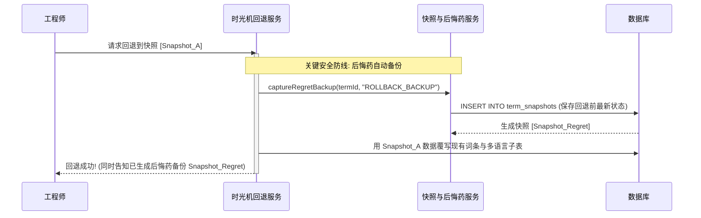

# 【TASK-302】不可变快照生成与“后悔药”自动备份机制

*   **工单编号**：`TASK-302`
*   **所属 Epic**：`Epic 3: 全维度细粒度变更审计与时光机`
*   **冲刺归属**：`Sprint 2 (Milestone 2)`
*   **优先级**：`P0 (Blocker)`
*   **估算工时**：`2d (16h)`
*   **责任角色**：后端高级工程师
*   **当前状态**：`[READY]`
*   **前置依赖**：[`TASK-301`](./TASK-301.md)

---

## 1. 业务价值与用户故事 (User Story)
> **作为** 操作词条批量翻译、版本合并或时光机回退的工程师，  
> **我需要** 平台在执行任何大范围覆盖或回滚前，自动为受影响数据拍摄一份只读不可变的完整全量镜像快照（带有 `ROLLBACK_BACKUP` 标记），  
> **以便于** 彻底解除对“无审批流自由协作会误删误改”的恐惧，即使有人手滑执行了错误的回退或批量覆写，也拥有 100% 可逆的“后悔药”能够随时一键二次还原。

---

## 2. 涉及代码文件清单 (Target Files)
*   `server/src/modules/audit/snapshot.service.ts` (不可变快照生成、只读控制与后悔药触发器)
*   `server/src/modules/audit/snapshot.controller.ts` (快照列表与明细查询)
*   `server/test/modules/audit/snapshot.service.test.ts` (快照不可变性与后悔药测试)

---

## 3. 技术契约与详细设计 (Technical Specification)

### 3.1 快照数据结构设计
```typescript
// server/src/modules/audit/snapshot.service.ts
export interface TermSnapshotPayload {
  termId: string;
  versionId: string;
  kw: string;
  zhCn: string;
  maxChars?: number;
  isLocked: boolean;
  translations: Record<string, {
    text: string;
    sourceType: string;
    updatedAt: string;
  }>;
}

export interface CreateSnapshotParams {
  termId: string;
  versionId: string;
  operatorId: string;
  operatorName: string;
  reason: 'MANUAL_EDIT' | 'BATCH_TRANSLATE' | 'DIFF_APPLY' | 'ROLLBACK_BACKUP';
}
```

### 3.2 后悔药双向保护触发链


---

## 4. 验收条件清单 (Acceptance Criteria Checklist)
- [ ] 无论单条编辑还是批量操作，变更落库前自动捕获词条当前最新全量快照；
- [ ] 后悔药机制：执行回退前，系统强校验并自动生成一条 `reason='ROLLBACK_BACKUP'` 快照；
- [ ] 快照不可变性：数据库层面禁止任何对 `term_snapshots` 表的 `UPDATE` 或 `DELETE` 语句；
- [ ] 快照查询：通过 `GET /api/v2/audit/terms/:termId/snapshots` 可按时间倒序拉取该词条的完整历史时光机版本列表。

---

## 5. 验证命令 (Verification Command)
```bash
npm run test:snapshot-service
# 或运行独立测试
npx tsx server/test/modules/audit/snapshot.service.test.ts
```

---

## 6. 完成定义 (Definition of Done)
1. 单元测试完整覆盖自动快照与后悔药生成逻辑；
2. 尝试执行 SQL `UPDATE term_snapshots` 必然失败（触发器或权限拦截）。
