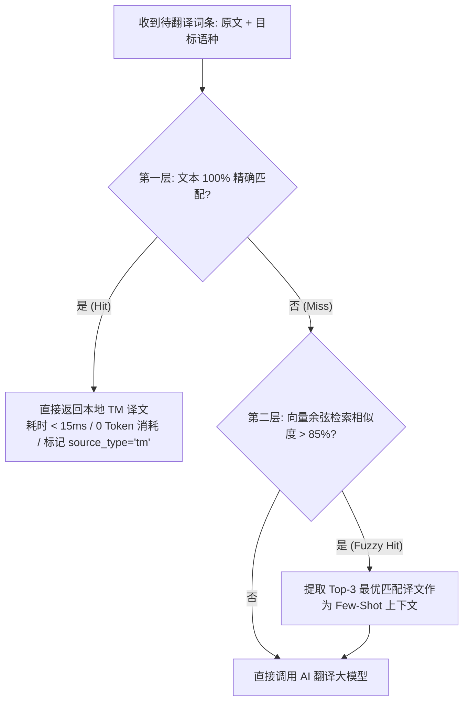

# 【TASK-502】向量化 TM 翻译记忆库本地毫秒直通检索

*   **工单编号**：`TASK-502`
*   **所属 Epic**：`Epic 5: 直连多供应商 AI 网关与 QA 质检`
*   **冲刺归属**：`Sprint 3 (Milestone 3)`
*   **优先级**：`P1 (High)`
*   **估算工时**：`3d (24h)`
*   **责任角色**：后端 / 算法工程师
*   **当前状态**：`[BACKLOG]`
*   **前置依赖**：[`TASK-102`](./TASK-102.md)

---

## 1. 业务价值与用户故事 (User Story)
> **作为** 平台系统与企业成本控制中心，  
> **我需要** 在调用昂贵的大模型翻译前，优先在本地基于 `pgvector` 的 `translation_memories` 库中进行精确与模糊相似度检索，  
> **以便于** 对 100% 精确匹配的历史审校词条在 20ms 内直接秒级返回（API 消耗为 0，标记 `source_type='tm'`），对相似度 $>85\%$ 的词条自动提取作为 Few-Shot 样本注入大模型，显著提高翻译一致性并节约 70%+ 的 API Token 费用。

---

## 2. 涉及代码文件清单 (Target Files)
*   `server/src/modules/ai-gateway/tm/tm-vector.service.ts` (基于 pgvector 的余弦相似度检索与精确缓存)
*   `server/src/modules/ai-gateway/tm/embedding.service.ts` (文本向量化轻量服务)
*   `server/test/modules/ai-gateway/tm-vector.service.test.ts` (TM 检索与命中率单元测试)

---

## 3. 技术契约与详细设计 (Technical Specification)

### 3.1 检索双层漏斗


### 3.2 SQL 查询模板
```sql
-- 余弦距离检索最近邻 (HNSW / IVFFlat 索引加速)
SELECT source_text, target_text, 1 - (embedding <=> :queryVector) AS similarity
FROM translation_memories
WHERE target_lang = :targetLang
ORDER BY embedding <=> :queryVector ASC
LIMIT 3;
```

---

## 4. 验收条件清单 (Acceptance Criteria Checklist)
- [ ] 针对已存在于 TM 记忆库中的词条，调用检索接口耗时 $\le 15\text{ms}$，100% 返回精确匹配结果；
- [ ] 精确命中时，翻译来源自动标记为 `tm`，不发起任何外网大模型 HTTP 请求；
- [ ] 语义相似匹配（如 `"心率计已断开"` vs `"心率带断开"`），正确检出且相似度高于预期阈值；
- [ ] 固件版本封板时，提供自动同步词库至 TM 记忆库的管道命令。

---

## 5. 验证命令 (Verification Command)
```bash
npm run test:tm-vector
# 或运行独立测试
npx tsx server/test/modules/ai-gateway/tm-vector.service.test.ts
```

---

## 6. 完成定义 (Definition of Done)
1. 单元测试覆盖精确匹配、模糊命中与空库冷启动场景；
2. 向量距离计算耗时在 P99 下 $\le 30\text{ms}$。
