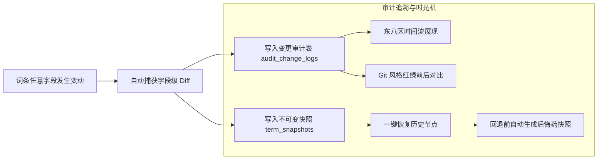

# GlossaHub 下一代企业级翻译与多语言协同平台 产品需求规格说明书 (PRD v2.0 精炼聚焦版)

> **文档标识**：`GLOSSA-HANDOFF-01-PRD`  
> **归档路径**：`/Users/jacko/Projects/glossa-hub/handoff/01_PRODUCT_REQUIREMENTS_SPEC.md`  
> **版本**：v2.0 (Engineering Architecture Release - Focused Edition)  
> **编写日期**：2026-09-28  
> **战略调整原则**：**取消未曾启用的审核工作流与层层设卡的 RBAC 权限，全力强化两大核心价值：“全维度细粒度变更记录”与“高精准固件版本对比 Diff 引擎”。**  

---

## 1. 业务战略减负与核心聚焦

### 1.1 减负原则
*   **取消未使用的审核功能**：
    原先设计的多级审核状态（`DRAFT` / `PENDING_REVIEW` / `APPROVED` / `REJECTED`）、驳回原因与批量审批弹窗在实际骑行码表固件迭代中从未发挥实质效用，反而导致词条录入流程繁琐。新版本**彻底取消审核流**，词条回归纯粹本质：“未翻译 / 已翻译”、“是否加锁封板”。
*   **取消复杂的 RBAC 权限体系**：
    迈金内部团队属于高信任协同，繁重的五级权限与多重拦截阻碍了协同效率。新版本取消 RBAC，登录用户即可参与协作，重点转为**“透明详尽的审计追溯”**——谁在什么时间修改了什么，全部清晰记录在案。

### 1.2 核心聚焦：固件研发的两大真正生命线
1.  **明确不可篡改的变更记录（Audit Trail）**：任何字段、任何语种的修改均有据可查，支持 Git 风格的红绿双列 Diff，并支持带“后悔药”机制的一键时光机撤销回滚。
2.  **高精度智能版本对比引擎（Version Diff Engine）**：快速对比两个固件版本间的新增、删除与修改，智能清洗标点空格等假差异，支持单语种过滤比对与一键增量合并同步。

---

## 2. 核心聚焦一：全维度细粒度变更记录与时光机 (Audit Trail & Snapshots)



### 2.1 字段级变更精准捕获
系统坚决告别笼统的“更新了某词条”记录，必须下沉到**“字段与单门语言级”**：
*   **格式规范**：`[CST 2026-09-28 15:30:12] 操作人: 张三`
    *   **词条主属性修改**：`修改了 [KW_STOP_RIDE] 的中文基准文案：从 "结束" 变更为 "结束骑行"`；
    *   **单门语言翻译修改**：`修改了 [KW_STOP_RIDE] 的 [德语(DE)] 译文：从 "Anhalten" 变更为 "Fahrt beenden"`；
    *   **批量翻译操作**：`通过 AI 批量翻译更新了 [KW_STOP_RIDE] 等 24 条词条的 [法语(FR)、西班牙语(ES)]`。

### 2.2 Git 风格双列红绿 Diff 对比
在操作审计日志与词条历史弹窗中，提供直观的对比视窗：
*   **左列（修改前 Old Value）**：红色底色高亮标记被删除或替换的原字符；
*   **右列（修改后 New Value）**：绿色底色高亮标记新增的字符；
*   支持按“操作人”、“所属版本大表”、“具体 KW”、“变动语言”进行多维度快速检索过滤。

### 2.3 具备“后悔药”机制的一键时光机回退
1.  每个词条的任意保存、批量翻译、版本继承操作都会在同一数据库事务中自动生成不可变的 `term_snapshots` 全量快照；
2.  当用户误操作或发现翻译不符合预期时，在历史列表中挑选任一历史快照，点击**【回退至此版本】**；
3.  **核心安全保障（后悔药机制）**：系统在执行回退前，**自动把“回退前的当前最新数据”备份生成一份崭新的快照**。这意味着回退动作本身也是一次可追溯、可二次撤销的安全行为，彻底消除数据损坏恐慌。

---

## 3. 核心聚焦二：专业固件版本对比 Diff 引擎 (Version Diff Engine)

固件按型号与批次迭代（如从 `v2.0` 升级到 `v2.1`），研发与本地化团队最关心的就是“这次更新改了哪几句话”。

```mermaid
graph TD
    A[选择对比源版本 A] & B[选择基准版本 B] --> C[启动 Version Diff Engine]
    C --> D[假差异智能归一化清洗管道]
    D --> E{三维差分计算}
    
    E --> F[新增词条 ADD<br/>绿色高亮, 仅在 A 存在]
    E --> G[删除词条 DEL<br/>红色删除线, 仅在 B 存在]
    E --> H[修改词条 MOD<br/>黄色高亮, 翻译存在变动]
    
    H --> I[多语种维度下钻筛选: 仅看德语变动 / 仅看英语变动]
    F & H --> J[选择性一键增量合并同步到目标表 (Apply Diff)]
```

### 3.1 假差异智能归一化清洗 (False Diff Normalization)
对比引擎内置深度文本清洗管道，过滤无意义的排版干扰，确保只展示实质内容变更：
*   **空格清洗**：自动剔除字符串首尾空格、合并句中连续多空格；
*   **标点与引号映射**：
    *   中文弯引号 `“` `”` 与英文直引号 `"` 视为等价；
    *   Unicode 省略号 `…` 与三点 `...` 视为等价；
    *   全角冒号 `：`、逗号 `，`、分号 `；` 与半角标点映射对齐；
*   **不可见字符剔除**：自动过滤零宽空格（`\u200B`）及操作系统换行差异（`\r\n` vs `\n`）。

### 3.2 三维差分与语言级多维度下钻
1.  **新增 (ADD)**：在新固件版本 A 中新增的按键或功能文案（例如新增了雷达尾灯配对功能，绿色显式）；
2.  **删除 (DEL)**：在老固件 B 中存在但在 A 中已精简下线的冗余词条（红色删除线）；
3.  **修改 (MOD)**：
    *   **中文原文变动**：明确提示产品功能文案发生演化；
    *   **特定语种润色**：支持在对比大盘顶部切换**【语种过滤器】**，一键下钻“仅看德语发生变动的词条”或“仅看法语发生变动的词条”。

### 3.3 一键选择性增量合并同步 (Selective Apply Diff)
在版本比对界面，用户可以按需勾选“5 条新增词条与 3 条德语修改”，点击**【应用变更到目标版本】**：
*   系统在单次事务中安全写入目标固件表；
*   自动记录“版本间合并同步”的详细审计日志与快照；
*   无需导出再手工导入，极大缩短版本迁移周期。

### 3.4 差异高亮持久化 Excel 导出
支持将比对结果一键导出为原生 `.xlsx` 文档：
*   表头包含固件版本元数据与比对时间戳；
*   新增词条整行标绿、修改过的单元格标黄；
*   研发工程师拿到 Excel 可直观排查改动，无需借助第三方 Diff 工具。

---

## 4. 硬件屏幕物理尺寸约束体系 (Hardware Constraint Engine)

针对嵌入式屏幕文字溢出的核心痛点，建立“硬件物理尺寸防御体系”：
*   **元数据定义**：
    *   `max_chars`：允许的最大字符数（针对字符数统计，如单行上限 12 字符）；
*   **实时交互预警**：
    *   输入框右下角展示计数进度条：`10 / 12 字符`；
    *   达到 90% 显示黄色预警；超出限制（如 `14 / 12`）边框变红并提示：`⚠️ 已超出屏幕设计上限 2 字符，存在固件截断风险`；
*   **AI 翻译强制约束注入**：
    *   触发 AI 翻译时，系统将 `max_chars` 显式写入 Prompt 约束：“目标语言译文绝对不得超过 12 个字符，若超限请使用合规的公认缩写”。

---

## 5. 产品线与真多项目空间管理 (Workspaces & Projects)

*   **多层级层级树**：`产品线（Product Line）` $\rightarrow$ `设备工程项目（Project）` $\rightarrow$ `固件基线版本（Version）`。
*   **空间独立隔离**：
    *   按硬件产品形态（C706 码表、C606 码表、心率带、功率计、OnelapFit App）提供物理级项目空间；
    *   每个项目独立维护支持的目标语种池、专业词库（Glossary）与记忆库（TM）。
*   **固件生命周期状态**：
    *   `EDITING`（编辑中）：支持词条增删改、AI 批量翻译与版本继承；
    *   `SEALED`（已封板发布）：全表只读加锁，生成只读发布镜像供 CI/CD 自动编译生成 C 头文件。
