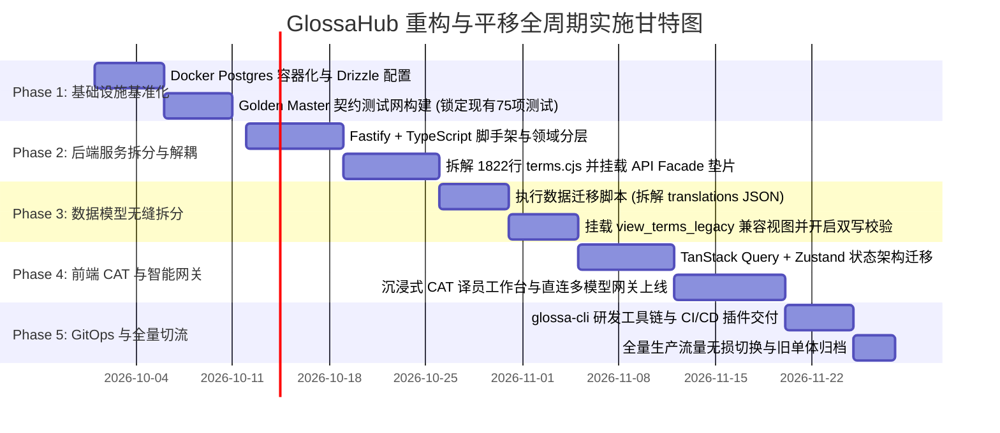
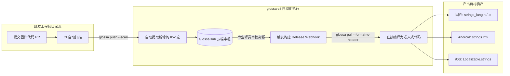

# GlossaHub 平移实施演进路线、GitOps 与工程闭环指南 (Execution & GitOps Spec v2.0)

> **文档标识**：`GLOSSA-HANDOFF-06-GITOPS`  
> **归档路径**：`/Users/jacko/Projects/glossa-hub/handoff/06_MIGRATION_EXECUTION_AND_GITOPS.md`  
> **版本**：v2.0 (Engineering Architecture Release)  
> **编写日期**：2026-09-28  

---

## 1. 业务零停机平移演进路线图 (Phase 1 ~ Phase 5)

整个重构工程恪守**“业务不中断、现存脚本零报错、存量数据零丢失”**的底线原则，划分为 5 个清晰阶段逐步推进：



---

## 2. 研发工程闭环：`glossa-cli` 命令行与 GitOps

以往固件与移动端研发人员需要手动在网页端点击“导出 CSV”，再人肉编写 Python/Bash 脚本转换格式，流程断层、容易引入格式错误。

重构后推出官方 **`glossa-cli` 命令行工具**，无缝接入 GitHub Actions / GitLab CI 流水线，实现**代码提取 $\rightarrow$ 云端翻译 $\rightarrow$ 固件编译**的全流程自动化闭环。



### 2.1 命令行工具使用指南 (`glossa-cli`)

1. **自动提取并增量同步新增词条 (`glossa push`)**：
   ```bash
   # 在固件代码仓库根目录下执行：
   glossa push \
     --project=c706-firmware \
     --version=v2.2_0801 \
     --scan-dir=./src/ui/ \
     --pattern="KW_[A-Z0-9_]+"
   ```
   *作用*：静态分析 C 源码中的宏定义，识别新出现的词条键名，自动向云端追加，无需人工逐条录入。

2. **自动拉取并编译为嵌入式 C 语言代码 (`glossa pull`)**：
   ```bash
   glossa pull \
     --project=c706-firmware \
     --version=v2.1_0717 \
     --status=APPROVED \
     --format=c-header \
     --output=./src/generated/
   ```
   *生成成果物演示*：
   ```c
   // strings_lang.h (由 GlossaHub 自动生成，请勿手动修改)
   #ifndef STRINGS_LANG_H
   #define STRINGS_LANG_H

   typedef enum {
       LANG_ZH_CN = 0,
       LANG_EN,
       LANG_DE,
       LANG_FR,
       LANG_COUNT
   } firmware_lang_t;

   typedef enum {
       KW_STOP_RIDE = 0,
       KW_AVG_SPEED,
       KW_HEART_RATE,
       KW_TOTAL_COUNT
   } string_kw_id_t;

   extern const char* const g_firmware_strings[KW_TOTAL_COUNT][LANG_COUNT];

   #endif // STRINGS_LANG_H
   ```

---

## 3. 测试验证体系与验收标准

为确保新系统质量达到工业级水准，制定“三维立体测试保护网”：

```
+----------------------------------------------------------------------------------------------------+
|                                    GLOSSA-HUB 质量验证体系                                           |
+----------------------------------------------------------------------------------------------------+
|  1. 存量回归网 (Golden Master Regression)                                                          |
|     • 现有 server/__tests__/ 下的 75+ 项基于 supertest 的 API 自动化测试必须 100% 保持绿色通过。      |
|     • 包括: auth.test, rbac.test, terms.test, difyGlossary.test, security-and-admin.test。         |
|     • 确保 API 兼容垫片对旧报文的响应逻辑绝对幂等。                                                |
|  ------------------------------------------------------------------------------------------------- |
|  2. 领域新特性测试 (New Domain Test Suite)                                                         |
|     • 单语种细粒度审核流测试: 验证德语被驳回时，英语保持 Approved 状态不受干扰。                   |
|     • 多模型直连网关熔断测试: 模拟 DeepSeek 超时 3 秒，验证是否在 100ms 内平滑切流至 Claude/GPT。    |
|     • 自动化 L10n QA 规则测试: 构造缺失 %s 占位符、超出 max_chars 的测试用例，验证 100% 拦截并自纠错。|
|  ------------------------------------------------------------------------------------------------- |
|  3. 极限性能压测与基准 (Performance Benchmark)                                                     |
|     • QPS 吞吐压测: 在 200 并发下，核心查询接口 QPS 达到 3500+ (原有 Express 为 900)。             |
|     • 虚拟大表渲染压测: 载入 20,000 条词条大表，快速滚动帧率稳定在 58~60 FPS，无丢帧卡顿。          |
+----------------------------------------------------------------------------------------------------+
```

---

## 4. 生产切流方案与应急回滚演练 (Rollback Runbook)

### 4.1 灰度切流策略 (Canary Release)
1. **第一步（影子流量与只读验证）**：在 Vercel 网关层将 10% 的 GET 查询流量转发给新 Fastify 引擎，验证查询响应一致性；
2. **第二步（内部项目试运行）**：选择一个正在规划期的内部非核心硬件项目（如某款配件心率带），全量在 V2 架构上执行增删改查、AI 直连翻译与审核；
3. **第三步（全量割接）**：将 Vercel `/api/*` 默认反向代理地址完全切向新架构服务。

### 4.2 应急回滚预案 (Emergency Rollback)
*   **触发条件**：生产环境发生未捕获的严重数据丢失、数据库连接池耗尽或接口错误率超 1%。
*   **回滚步骤（3 分钟内完成）**：
    1. **DNS / 反向代理切换**：在 Vercel 环境变量中将 `RENDER_BACKEND_URL` 改回旧版服务地址，触发极速构建发布，1 分钟内切回老服务；
    2. **数据无损保障**：由于新架构在运行期间通过 `view_terms_legacy` 与双写机制同步维护了旧版 `terms` 结构，切回老系统后老代码能无缝读取最新修改，**零数据丢失**。
