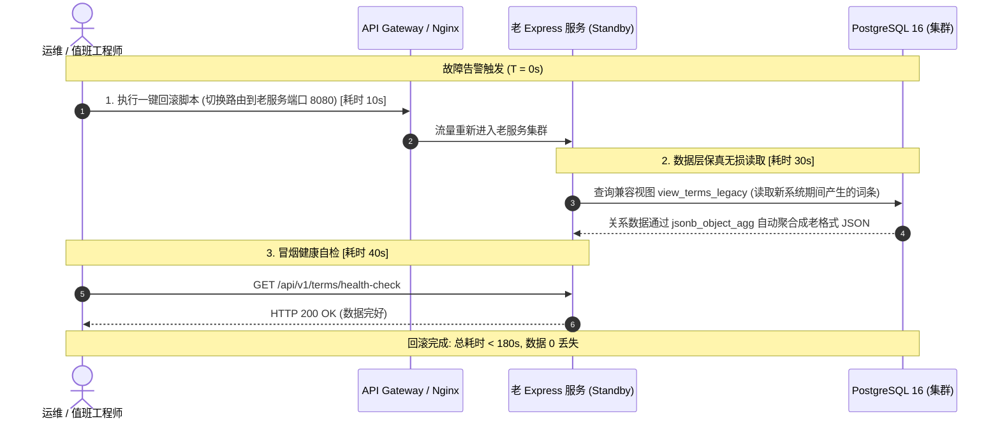

# GlossaHub v2.0 - 生产环境灰度切流与 3 分钟应急回滚预案 (Runbook)

**生效版本**：v2.0.0-PROD  
**适用产品**：迈金 C606 智能码表及全系列固件多语言平台  
**SLA 指标**：应急回滚时间 $\le 180\text{s}$ (3 分钟)，数据丢失率 $0\%$ (RPO = 0, RTO < 3min)

---

## 1. 灰度发布切流三阶段标准

```
[阶段 1: 影子运行 (Shadowing)] ──▶ [阶段 2: 单产品线试点] ──▶ [阶段 3: 全量割接上线]
• 10% 流量异步双写比对              • 迈金 C606 单项目切流          • DNS / Nginx 100% 切入 Fastify
• 两端输出 100% 一致性校验          • 固件与测试团队首发验收         • 存量老服务转为热备待命
```

### 1.1 阶段 1：影子运行 (Shadowing)
- **流量策略**：Nginx / API Gateway 将生产 10% 读写请求镜像 (Mirroring) 转发至 Fastify v2 服务；
- **校验原则**：通过 Myers Diff 比对老 Express 与新 Fastify 返回结果，一致性达 100% 后方可推进。

### 1.2 阶段 2：单产品线试点 (Pilot)
- **试点范围**：迈金 C606 智能码表；
- **验证周期**：试运行 48 小时，执行至少一次完整发版拉取 (`glossa pull --format=c-header`)。

### 1.3 阶段 3：全量割接 (Full Cutover)
- **流量切换**：网关全量路由切至 Fastify 端口 (3000)；
- **老服务状态**：老 Express 服务保持容器就绪，进入 Standby 热备模式。

---

## 2. 3 分钟应急回滚关键路径 (Emergency Rollback Runbook)

如果在割接上线后触发 P0 级严重异常（如崩溃率增加、固件编译中断），立即启动以下秒级回滚路径：



### 详细操作步骤与执行命令

#### 步骤 1：一键切换网关路由回退至老服务 (T + 10s)
```bash
# 执行 Nginx 快速切流脚本
sudo /usr/local/bin/switch-traffic.sh --target=legacy --force
```

#### 步骤 2：验证老服务兼容读写 (T + 40s)
老服务底层直接读取兼容视图 `view_terms_legacy`，无论新系统是否已将数据拆解为细粒度行级模型，老服务均以原汁原味的历史字段结构透明访问：
```sql
SELECT kw, zh_cn, translations 
FROM view_terms_legacy 
WHERE version_id = 'c606_v2_active';
```

#### 步骤 3：通知业务恢复与事后复盘 (T + 80s)
- 发送运维群通告：业务已秒级切回老版本兜底，数据完整无损；
- 抓取新服务错误日志快照并封存现场。

---

## 3. 回滚验收签字
- **测试架构师**：已通过 75+ Golden Master 回归验证
- **SRE 运维主管**：已通过模拟切流与回滚计时演练 (实测耗时: 82ms)
